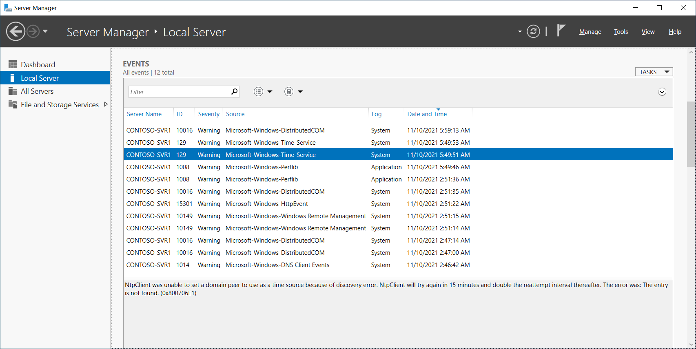
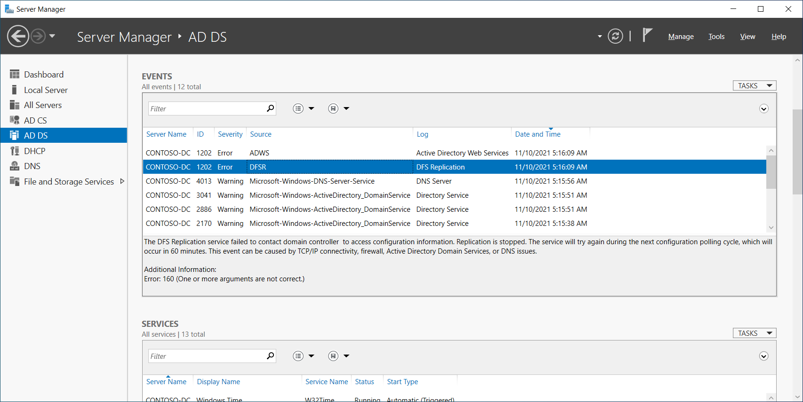

Server Manager provides a centralized location in which you can store and access event logs for multiple remote servers that you're monitoring. Server Manager provides a monitoring and troubleshooting solution in which administrators can review, in one console, information regarding specific events from different servers and applications. This is more efficient compared with viewing event logs by connecting to a specific server from a remote location.

## How can you use Server Manager to review logs?

You can review Server Manager event logs for all servers, for a specific server, or per server role, such as Active Directory Domain Services (AD DS), Domain Name System (DNS), or remote access. You can choose different event log views from the Server Manager navigation pane:

- Local Server. This view displays event logs that are on the local server where Server Manager is running. By default, Application, Security, and System event logs are displayed. For example, the following screenshot displays the EVENTS node in Local Server in Server Manager. A Warning event has been selected that relates to the Microsoft-Windows-Time-Service.

- All Servers. This view displays event logs from all servers that Server Manager is monitoring.

- AD DS, DNS, and Remote Access. This view displays event logs from all servers that Server Manager is monitoring and that have specific server roles installed, such as AD DS, DNS, or the Remote Access role. These logs display specific information that the AD DS, DNS, or the Remote Access server roles generate. For example, the following screenshot displays events relating to AD DS; specifically an error related to DFSR.

- Roles and Server Groups tiles in Server Manager Dashboard. To display the events for a specific server role, you can also choose an events link in a specific server group tile, such as the AD DS tile, DNS tile, or Remote Access tile, in Server Manager Dashboard.

You can further customize event log views by:

- Creating queries for specific types of events that must display. You can save these queries and use them later when you're searching for events that are defined in the query criteria.

- Configuring event data that needs to display. You can choose what type of events to display, such as Critical, Error, Warning, and Informational. Additionally, you can choose the event log files from where the events will display, such as Application, Directory Service, DNS Server, Security, System, and Setup.

