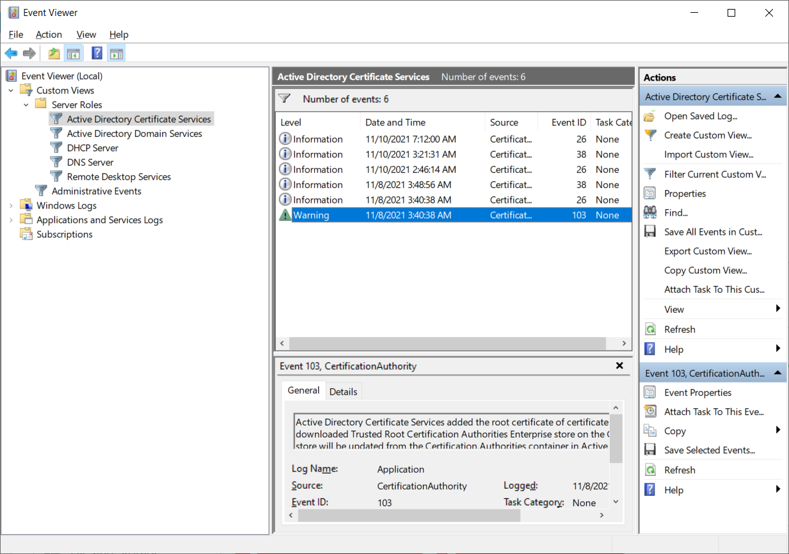

Event logs contain vast amounts of data and narrowing the set of events to just those events that interest you can be a challenge. Custom views allow you to query and sort just the events that you want to analyze. You can also save, export, import, and share these custom views.

## What are the predefined Server Roles custom views?

Windows Server Event Viewer provides custom roles based on the installed server roles. For example, as displayed in the following screenshot, the Server Roles custom views displayed are:

- Active Directory Certificate Services

- Active Directory Domain Services

- DHCP Server

- DNS Server

- Remote Desktop Services

There's also an Administrative Events custom view.

These custom views correspond to the installed roles on the server. Using these predefined role-based custom views enables administrators to quickly locate and review events that relate to a server role that might be experiencing issues. However, you might need or want to create additional custom views to suit your specific requirements.

## Create custom views

Event Viewer allows you to filter specific events across multiple logs and display all events that might relate to an issue that you're investigating. To specify a filter that spans multiple logs, you must create a custom view. You create custom views in the Action pane in Event Viewer.

You can filter custom views based on multiple criteria, including the:

- Time that the event logged.

- Event level, including errors or warnings.

- Logs from which to include events.

- Specific event IDs to include or exclude.

- User context of the event.

- Computer on which the event occurred.

