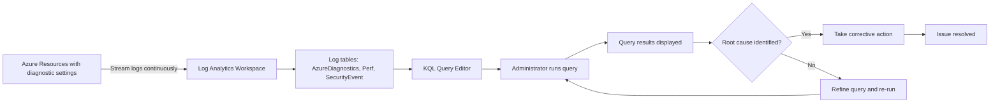

Metrics show you what happened—CPU spiked, memory usage climbed, disk I/O saturated—but they don't explain why. When your alert rule fires because a virtual machine's CPU exceeded 80% for 15 minutes, you need to investigate which processes consumed resources, whether the spike correlates with specific user activity, and if similar patterns occurred in the past. Log Analytics Workspace provides this diagnostic capability by collecting detailed event logs from your Azure resources and enabling you to search, filter, and analyze that data using Kusto Query Language (KQL).

## How Log Analytics Workspace collects diagnostic data

Log Analytics Workspace acts as a central repository for log data from across your Azure environment. Unlike metrics that capture numeric performance values at regular intervals, logs contain rich event records with timestamps, severity levels, resource identifiers, and descriptive messages explaining what occurred. When you enable diagnostic settings on a virtual machine, Azure sends operating system events, application logs, and security audit records to your Log Analytics Workspace. This happens automatically in the background—your VM continues running normally while the Azure Diagnostics extension streams log data to the workspace every few minutes.

:::image type="content" source="../media/log-analytics-workspace-central-repository.png" alt-text="Diagram showing how security audits record information to the Log Analytics Workspace.":::

The value of centralized logging becomes clear when you troubleshoot issues that span multiple resources. Suppose your AI training job failed unexpectedly. You check the virtual machine logs and find an out-of-memory error at 3:17 AM. You then query your storage account logs and discover that at 3:15 AM, the dataset download operation timed out due to network throttling. Finally, you check your virtual network logs and confirm that a firewall rule change at 3:10 AM inadvertently blocked outbound traffic to the storage endpoint. Without centralized logging, you'd need to check each resource individually, manually correlating timestamps across disconnected log files. With Log Analytics Workspace, you query all three log sources simultaneously and see the complete failure sequence in one result set.

## Writing effective KQL queries for infrastructure troubleshooting

Kusto Query Language provides the syntax for searching and analyzing log data in Log Analytics Workspace. You construct queries using a pipeline approach: start with a table containing the log records you want to examine, then apply filters, aggregations, and transformations to extract meaningful insights. A basic query structure looks like this: select a table (such as AzureDiagnostics or Perf), filter rows using the 'where' operator, and display results using 'take' or 'summarize'.

Consider a common troubleshooting scenario where you need to identify all error events from the past 24 hours. Your query starts with the AzureDiagnostics table, filters for records where the Level property equals 'Error', adds a time range filter for the past day, and returns the 100 most recent matches. This query runs in seconds even when your workspace contains millions of log records, because Log Analytics indexes log data by timestamp and resource properties, enabling fast retrieval.

As you investigate further, you aggregate data to identify patterns rather than examining individual events. You query the Perf table to calculate average CPU usage per hour over the past week, revealing that CPU consistently spikes every morning at 9:00 AM when batch processing jobs start. This pattern wasn't obvious from individual metric values, but the KQL summarize operator makes it visible by grouping CPU readings into hourly buckets and computing averages. With this insight, you adjust job scheduling to distribute workload more evenly throughout the day, preventing morning CPU saturation.

## Common query patterns for operations teams

Your infrastructure troubleshooting tasks follow predictable patterns, and learning a few core KQL query templates accelerates investigation workflows. When you need to find errors, you filter the AzureDiagnostics table for Level equals 'Error' and sort by TimeGenerated descending to see the most recent failures first. When you investigate performance degradation, you query the Perf table for specific counter names like '% Processor Time' or 'Available MBytes', then use the summarize operator with bin(TimeGenerated, 1h) to group readings into hourly intervals.

Security investigations require different query patterns that focus on authentication events and access attempts. You query the SecurityEvent table to find failed login attempts by filtering for EventID 4625, then count occurrences per user account to detect potential brute-force attacks. If you discover an account with 50 failed login attempts in 10 minutes, you immediately reset credentials and review recent successful authentications from that account to assess whether unauthorized access occurred.

:::image type="content" source="../media/security-investigation-require-query-pattern.png" alt-text="Diagram showing how security investigations require different query patterns that focus on authentication events.":::

These query patterns become even more powerful when you save them as functions in Log Analytics Workspace. After you've tested and refined a query for finding errors or detecting failed logins, you save it with a friendly name like 'FindRecentErrors' or 'DetectFailedLogins'. Your team members can then execute these saved queries without understanding KQL syntax, democratizing log analysis across your operations team and reducing the time from alert notification to root cause identification.

## Integrating log queries into operational workflows

Query results inform decisions only when they're accessible at the moment you need them. During an active incident, you run ad-hoc queries in the Log Analytics query editor to explore hypothesis and narrow down root causes. Between incidents, you embed saved queries into Azure dashboards alongside metric charts, providing a single-pane-of-glass view of both performance trends and recent error events. This integration means your operations team sees elevated CPU metrics and related error log entries side by side, eliminating the need to switch between tools and mentally correlate data from different sources.

For recurring investigations, you configure alert rules that automatically run KQL queries on a schedule and trigger notifications when results meet specific criteria. You create an alert rule that executes your 'DetectFailedLogins' query every 15 minutes and fires an alert if any user account shows more than 10 failed login attempts. This transforms reactive log analysis into proactive threat detection, with your security team receiving notifications about suspicious activity within minutes rather than discovering attacks hours later during manual log reviews.

Organizations that adopt query-driven troubleshooting report 50-70% reductions in mean time to resolution (MTTR) for infrastructure incidents, because log data reveals root causes faster than trial-and-error configuration changes. For AI infrastructure teams, this translates to fewer failed training runs, reduced compute waste from debugging incorrect configurations, and faster recovery when production services experience outages.

:::image type="content" source="../media/log-analytics-workspace-query-workflow.png" alt-text="Diagram showing how Azure resources with diagnostic settings enabled streaming logs continuously.":::

*Log Analytics Workspace query workflow for infrastructure troubleshooting and root cause analysis*

Alt text: Flow diagram showing Azure resources with diagnostic settings enabled streaming logs continuously to Log Analytics Workspace, where data is organized into tables including AzureDiagnostics, Perf, and SecurityEvent. An administrator accesses the KQL query editor, runs a query, and views results. A decision point evaluates whether the root cause is identified: if yes, the administrator takes corrective action leading to issue resolution; if no, the administrator refines the query and re-runs it, creating a feedback loop until the root cause is found.

## Additional resources

- [Log Analytics Workspace overview](/azure/azure-monitor/logs/log-analytics-workspace-overview) - Architecture, data retention policies, and workspace design best practices
- [Kusto Query Language tutorial](/azure/data-explorer/kusto/query/tutorial) - Comprehensive KQL syntax reference with examples for filtering, aggregation, and time-series analysis
- [Log Analytics query examples](/azure/azure-monitor/logs/example-queries) - Library of pre-built queries for common infrastructure monitoring and troubleshooting scenarios

## Enhancement suggestions

- Screenshot of Log Analytics Workspace query editor showing a sample KQL query in the query pane (AzureDiagnostics | where Level == 'Error' | order by TimeGenerated desc | take 100) with the Run button highlighted, and a results table below displaying columns for TimeGenerated, ResourceName, Level, and Message, with 15 error records visible
- Three-minute video tutorial demonstrating how to write and execute a KQL query in Log Analytics Workspace: navigate to the workspace from the Azure portal, open the Logs page, write a query to find recent errors, run the query, interpret the results table, and export results to CSV for further analysis
- Interactive KQL query builder where learners select a troubleshooting scenario from a dropdown (find errors, track CPU trends, detect failed logins), view a pre-filled query template, modify filter values, run the query against sample log data, and see dynamically generated results with explanatory annotations highlighting key columns and values

## Accessibility notes

For the query editor screenshot, describe the layout: query editor pane at top with editable text field, toolbar with Run button and time range selector, results pane below showing a data table. Describe table structure: four columns labeled TimeGenerated, ResourceName, Level, and Message, with 15 rows of error records. Specify that TimeGenerated shows timestamps in descending order, Level column contains the text 'Error' for all rows, and Message column displays descriptive error text. For the workflow diagram, explain each process step and decision point, noting that arrows represent chronological progression and the feedback loop represents an iterative troubleshooting approach where query refinement continues until root cause identification.
