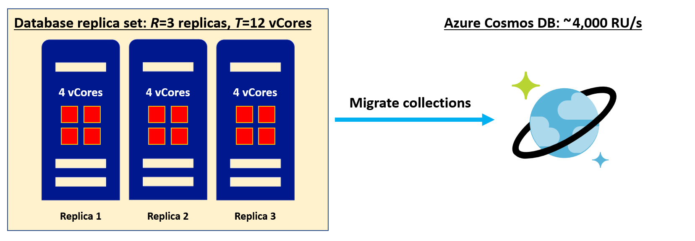
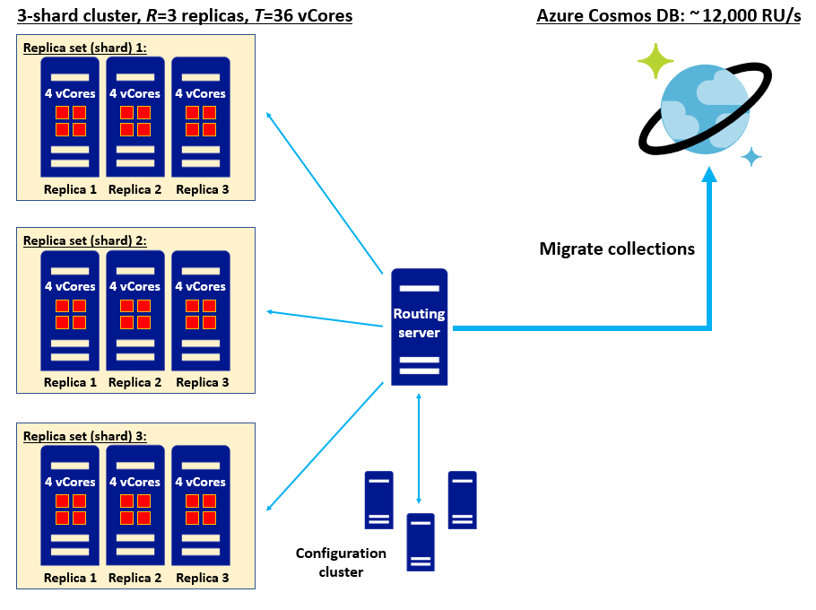
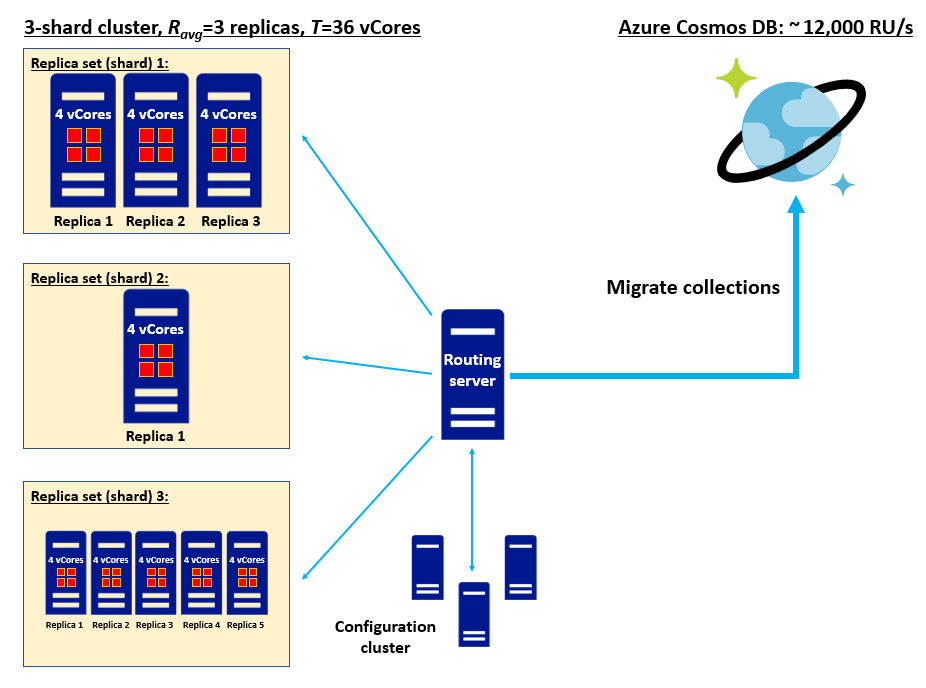

When migrating from a database environment were all you know is the total number of vCores, we will need to figure out a way to convert those vCores into Request Units. Remember that [Request Units][/azure/cosmos-db/request-units] or RUs, are how throughput capacity is provisioned on a database or collection in Azure Cosmos DB. This conversion will allow us to capacity plan and estimate the required RUs needed once our collections are migrated to an Azure Cosmos DB environment. Each collection we migrate will be stored in an Azure Cosmos DB collection consisting of a sharded cluster with a 4x replication factor.

## Estimating Provisioned Request Units per second (RU/s)

We'll use the following formula to give us a starting point on RU/s estimate from vCores.

```
[Provisioned RU/s] = C*T/R
```

- ***T***: Total vCores in your existing database data-bearing replica set(s).
- ***R***: Replication factor of your existing data-bearing replica set(s).
- ***C***: Recommended provisioned RU/s per vCore, or 1000 RU/s/vCore for Azure Cosmos DB API for MongoDB v4.0

    > [!TIP]
    > For R, we recommend plugging in the average replication factor of your database replica sets; if this information is not available then R=3 is a good rule of thumb.

Let's use this formula to do some sample calculations.

- Suppose you want to estimate the RU/s for a single replica set migration.

    > [!div class="mx-imgBorder"]
    > [](../media/2-single-replica-migration.png#lightbox)

    Plugin in the numbers to the formula you would get:

    ```
    [Provisioned RU/s] = (1,000 RU/s/vCore) * (12 vCores) / (3) = 4,000 RU/s
    ```

- Suppose you want to estimate the RU/s for a cluster of homogeneous replica sets migration.

    > [!div class="mx-imgBorder"]
    > [](../media/2-homogeneous-replica-migration.png#lightbox)

    Plugin in the numbers to the formula you would get:

    ```
    [Provisioned RU/s] = (1,000 RU/s/vCore) * (36 vCores) / ((3+3+3)/3) = 12,000 RU/s
    ```

- Suppose you want to estimate the RU/s for a cluster of heterogeneous replica sets migration.

    > [!div class="mx-imgBorder"]
    > [](../media/2-heterogeneous-replica-migration.png#lightbox)

    Plugin in the numbers to the formula you would get:

    ```
    [Provisioned RU/s] = (1,000 RU/s/vCore) * (36 vCores) / ((3+1+5)/3) = 12,000 RU/s
    ```

Finding the Request Unit estimate will be an important step in anticipating the scale of your Azure Cosmos DB data estate after migration.

[Request Units in Azure Cosmos DB](/azure/cosmos-db/request-units)