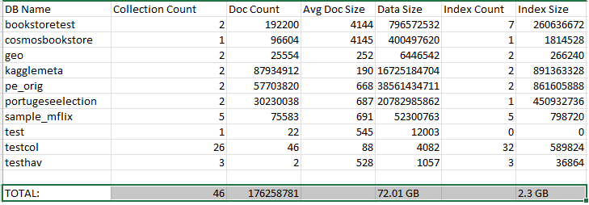

There are several ways to migrate an existing MongoDB database and application to an Azure CosmoDB API for MongoDB account. To ensure a smooth migration process, we should first do some up-front planning and decision-making about the migration process before you actually move any data. In this unit, we'll look at some of those pre-migration steps in more detail.

## Overview of the pre-migration

Our initial decision-making process will be referred as *pre-migration*.

The goal of this pre-migration is to:

- Ensure that you set up Azure Cosmos DB to fulfill your application's requirements.
- Plan out how you'll execute the migration.

Our pre-migration is broken down into the following four steps or stages.

1. **Pre-migration discovery** - Discover your existing MongoDB resources and create a data estate spreadsheet to track them.
1. **Pre-migration assessment** - Assess the readiness of your existing MongoDB resources for data migration.
1. **Pre-migration mapping** - Map your existing MongoDB resources to new Azure Cosmos DB resources
1. **Pre-migration logistics planning** - Plan the logistics of migration process end-to-end, before you kick off the full-scale data migration.

Following these four steps will ensure a successful migration. Let's discuss these stages in more detail below.

> [!NOTE]
> The [Database Migration Assistant](https://github.com/AzureCosmosDB/Cosmos-DB-Migration-Assistant-for-API-for-mongodb) (DMA) will help you with the ***Discovery*** and ***Assessment*** stages of the planning.

## Pre-migration discovery

Our first step will be to create a ***data estate migration spreadsheet***.  This spreadsheet will:

- Include a comprehensive list of the existing resources (databases or collections) in your MongoDB data estate.
- Help you to plan migration from end-to-end.
- Should be used as a tracking document throughout the migration process.

While you can do a manual discovery, in this unit, we'll recommend that you use the [Database Migration Assistant](https://github.com/AzureCosmosDB/Cosmos-DB-Migration-Assistant-for-API-for-mongodb) (DMA) to help you with the discovery. This tool is easy to use and will do much the work for you.

The DMA will create the estate migration sheet programmatically. We'll use the [Azure Data Studio](/sql/azure-data-studio/download-azure-data-studio) to easily [install and use](https://github.com/AzureCosmosDB/Cosmos-DB-Migration-Assistant-for-API-for-mongodb#how-to-run-the-dma) the DMA tool. Just run it from any machine that has access to your source MongoDB environment.

The DMA will output the following files that you can use as the data estate migration spreadsheets.

- **workload_database_details.csv** - Shows the database-level view of the source.
- **workload_collection_details.csv** - Shows a collection-level view of the source.

The spreadsheets would be similar to the one below.

> [!div class="mx-imgBorder"]
> [](../media/3-database-migration-assistant-spreadsheet.png#lightbox)

## Pre-migration assessment

Once you've completed your discovery, you need to find out what features your current MongoDB environment uses that might not be supported by the [current MongoDB version](/azure/cosmos-db/mongodb/feature-support-42) Azure Cosmos DB for MongoDB supports. You also need to keep in mind the Azure Cosmos DB [limits and quotas](/azure/cosmos-db/concepts-limits#per-account-limits). Once you make this assessment, you'll be able to address those findings as needed during rest of the migration planning.

Again, we'll use the DMA to help us collect the data needed from this stage. The DMA will run against the resources from the source MongoDB and list the required and recommended changes needed to proceed with the migration.  This data will be written to the **assessment_result.csv** file.

## Pre-migration mapping

The discovery and assessment were all about our MongoDB Source, now it's time to move to our Azure Cosmos DB side in these next two stages. Let's start with the capacity planning.

### Capacity planning

We can do some capacity planning by one of two ways.

- **Convert vCores to RUs**. - If the only information we know is the number of servers or the number of vCores in our current MongoDB environment, we can convert those vCores to RUs.  In the previous unit, *[Convert vCores to RUs](/training/modules/migrate-mongodb-database-to-azure-cosmos-db/2-virtual-core-request-units)*, we went in more detail on how to estimate Request Units using vCores or vCPUs.
- **Using the** ***Azure Cosmos DB capacity planner***. If we have a very good idea on how much data we have, and the number of CRUD operations we do per second, we could use the capacity calculator to estimate the number of RU/s we'll need. In the previous module, we discuss this subject in detail under the *[Capacity estimation using the Azure Cosmos DB Capacity Calculator][/training/modules/get-started-mongodb-api-azure-cosmos-db/5-capacity-estimation-use-calculator]* unit.

    > [!NOTE]
    > You can also use the *[Azure Cosmos DB capacity calculator](https://cosmos.azure.com/capacitycalculator/)* to estimate the cost of ownership of your new Azure Cosmos DB resource.

### Estimating throughput

As we discussed in the Capacity planning section above, we can use the *[Azure Cosmos DB capacity calculator](https://cosmos.azure.com/capacitycalculator/)* to estimate the RU/s we'll need, or we can estimate the RUs by converting the vCores to RUs before the migration. But once the data is in Azure Cosmos DB how can we determine the real cost of our queries?

Once our data is in an Azure Cosmos DB collection, we can further understand the cost of our queries by using MongoDB Shell, and using the ***getLastRequestStastistics*** command to get the request charge. We'll first run our query in the MongoDB Shell and immediately after we would run the following command to get those RU statistics.

```javascript
db.runCommand({getLastRequestStatistics: 1})
```

One more way we can review the performance of our queries is using Azure Monitor. We'll cover this subject in more detail in the next Module ***Replication and Monitoring an Azure Cosmos DB for MongoDB account***.

### Plan the Azure Cosmos DB data estate

Time to use our workload detail spreadsheets we created with the DMA. We now need to map each MongoDB resource to a new Azure Cosmos DB resource. To do so, we should:

- Map every MongoDB database to an Azure Cosmos DB database.
- Map every MongoDB collection to an Azure Cosmos DB collection.
- If possible keep the same resource names.
- Determine if you'll use sharded or unsharded collections in Azure Cosmos DB. Sharding helps you scale horizontally, which is critical to the performance of many workloads.  Remember, that unsharded collections have a limit of 20 GB per collection.
- If you're using sharded collections, Azure Cosmos DB is all about performance. This is accomplished by using the correct shard key that will best benefit your workloads. That said, our Azure Cosmos DB shard key might not be the same collection shard key you used in the MongoDB environment.

    > [!NOTE]
    > Shard key is the single most important setting for optimizing the scalability and performance of Azure Cosmos DB, and data modeling is the second most important. Both of these settings are immutable and cannot be changed once they are set; therefore it is highly important to optimize them in the planning phase.

- Azure Cosmos DB has two collection types of its own – shared and dedicated throughput.

    > [!NOTE]
    > Shared vs dedicated throughput is another critical, immutable decision which it is vital to make in the planning phase.

    > [!NOTE]
    > Collections which require predictable performance should have dedicated throughput rather than shared throughput. Collections using shared throughput should have roughly equal request and storage needs.

### Some decisions are permanent

Immutable decisions. It's time to make several of your design decisions, not only because we need to plan the migration correctly, but also because we won't be able to change some of those configurations once the resources are created. To help us make the right choices that we can't change, we should:

- **Choose the best Shard key** - Once we create our collection, we won't be able to change our shard key, so we need to choose the right one from the start. Once we pick the shard key for our collection, Azure Cosmos DB will manage the horizontal growth of our collection. In the previous module, we delved in detail into this subject under the ***Models and Shard keys*** unit. If you would like to read more on this subject, refer to the articles [Partitioning and horizontal scaling in Azure Cosmos DB](/azure/cosmos-db/partitioning-overview) and [Choosing a Partition Key](/azure/cosmos-db/partitioning-overview#choose-partitionkey) article. Remember that Sharding is also known as Partitioning.
- **Choose the right model** - Again, we discussed this subject in more detail in the previous module's ***Models and Shard keys*** unit. For more information, see the [Data modeling in Azure Cosmos DB](/azure/cosmos-db/sql/modeling-data) article.
- **Choose between dedicated and shared throughput for each resource that you will migrate** - For more information, see the [Optimize provisioned throughput cost in Azure Cosmos DB](/azure/cosmos-db/optimize-cost-throughput#optimize-by-provisioning-throughput-at-different-levels) article.

    > [!TIP]
    > If your would like to review a real world example of how to model and partition your data refer to the *[How to model and partition data on Azure Cosmos DB using a real-world example](/azure/cosmos-db/sql/how-to-model-partition-example)* article.

## Pre-migration logistics planning

We've collected, mapped and modeled our Azure Cosmos DB resources, its time to plan the actual execution of the migration itself.

### Execution Logistics

We need to answer a few questions.

- **Who is doing the Migration**? - Depending on the size of the migration, you would need to assign one or more individuals to not only do the migration of the resources but also monitor the migration progress of every resource you're migrating.
- **What tools are you going to use to do the Migration**? - We can use many tools to perform the migration either online or offline. These tools range from the native MongoDB tools to Azure services like Azure Data Migration Service (DMS), Azure Data Factory (ADF) or Azure Databricks and Spark. In the next two sections, we'll go into more detail on what tools we can use to migrate a MongoDB database to Azure Cosmos DB.
- **In what order should we migrate the resources**? - Prioritizing what to migrate first will allow you to keep your migration on schedule. A good practice is to prioritize migrating those resources which need the most time to be moved; migrating these resources first will bring the greatest progress toward completion. Since these are usually your larger resources with the most data, migrating these first can additionally pinpoint any migration problems early on.
- **How will you monitor the migration process**? - You need to work with your team on what the monitoring process is so that you have a comprehensive view of how the high-priority migrations are going.

## Supported migration scenarios

The best choice of MongoDB migration tool depends on your migration scenario.

The compatible tools for each migration scenario are shown below:

| Source | Destination | Process Recommendation |
| :--- | :---: | :--- |
| ***Offline*** <br>• MongoDB on-premise cluster <br>• MongoDB IaaS VM cluster <br>• MongoDB Atlas cluster  | Azure Cosmos DB Mongo API | • <10-GB data: MongoDB native tools <br>• < 1-TB data: Azure DMS <br>•  > 1-TB data: Spark |
| ***Online*** <br>• MongoDB on-premise cluster <br>• MongoDB IaaS VM cluster <br>• MongoDB Atlas cluster  | Azure Cosmos DB Mongo API | <br>• < 1-TB data: Azure DMS <br>• > 1-TB data: Spark + Mongo ChangeStream |
| • Need to change schema during migration <br>• need more flexibility than aforementioned tools | Azure Cosmos DB Mongo API | • ADF is more flexible than DMS, it supports schema modifications during migration and supports the most source/destination combinations. <br>• DMS will be better in terms of scale, for example faster migrations. |
| JSON file |  Azure Cosmos DB Mongo API | MongoDB native tools specifically ***`mongoimport`***. |
| CSV file |  Azure Cosmos DB Mongo API | MongoDB native tools specifically ***`mongoimport`***. |
| BSON file |  Azure Cosmos DB Mongo API | MongoDB native tools specifically ***`mongorestore`***. |

Given that you're migrating from a particular MongoDB version, the supported tools are shown below:

| Mongo source version | Azure Cosmos DB Mongo API destination version | Supported tools | Unsupported tools |
| :--- | :---: | :--- | :--- |
| < 2.x, > 4.0 | 3.2, 3.6, 4.0 | MongoDB native tools, Spark | DMS, ADF |
| 3.2, 3.6. 4.0 | 3.2, 3.6, 4.0 | MongoDB native tools, DMF, ADF, Spark | None |

## Post migration

In the pre-migration phase, spend some time detailing the post migration steps.

Steps to take:

- **Cutover your application** - You should be repointing your application to the Azure Cosmos DB environment.
- **Plan your post migration configurations** - Subjects like indexing, global distribution, and consistency should be planned. Note that these settings can usually be changed on the fly and will most likely change during the lifespan of your collections, but you should plan where those setting will sit right after the migration is done.

    > [!TIP]
    > For further information about post-migrations, see the *[Post-migration optimization steps when using Azure Cosmos DB's API for MongoDB](/azure/cosmos-db/mongodb/post-migration-optimization)* guide.

Migrating a MongoDB database isn't a point and click operation. You should spend some time planning for that migration. In the next couple of chapters, we'll discuss further the actual migration step itself.
