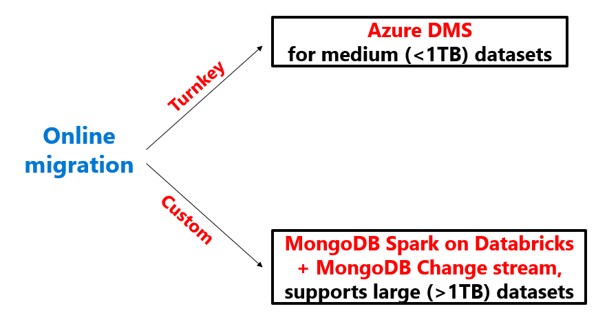

Not every migration will have the luxury of allowing much downtime. For those migrations that require minimal downtime, you might need to do an online migration.  Azure Cosmos DB API for MongoDB has two options to perform online migrations, Azure Database Migration Service (DMS) or MongoDB Spark on Azure Databricks.

With online migrations, businesses can migrate their databases to Azure while the databases continue to be operational. This means that migrations can be completed with minimum downtime for critical applications, retaining their service level availability and reducing the inconvenience to their end customers.

We can perform online MongoDB to Azure Cosmos DB migrations for: 

- MongoDB on-premise clusters
- MongoDB on IaaS VM clusters 
- MongoDB Atlas clusters.

If the source data size is smaller than 1 TB, we should perform this migration using Azure DMS. If the data size is larger than 1 TB, we should perform this migration using MongoDB Spark on Databricks + MongoDB Change stream.

> [!div class="mx-imgBorder"]
> 

Let's review some considerations for each of these migration options.

| Migration type | Solution | Considerations |
| :--- | :--- | :--- |
| Online | *[Azure Database Migration Service](/azure/dms/tutorial-mongodb-cosmos-db-online)* | • Makes use of the Azure Cosmos DB bulk executor library  • Suitable for large datasets and takes care of replicating live changes  •  Works only with other MongoDB sources |
| Online | *[Azure Databricks and Spark](/azure/cosmos-db/mongodb/migrate-databricks)* | • Full control of migration rate and data transformation   • Requires custom coding |

Now that we looked at online migration options, on the next unit we'll introduce offline migration options.
