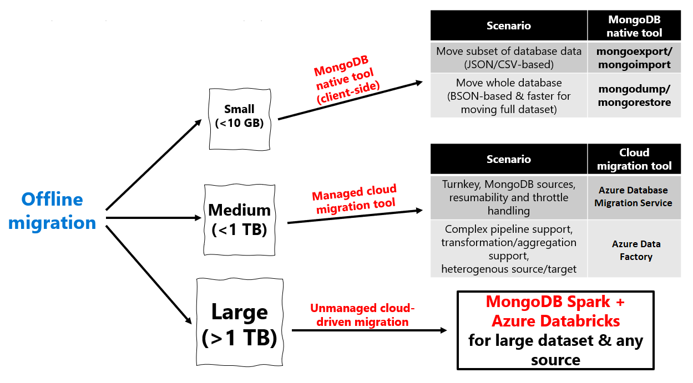

Offline migrations have more flexibility than that needed for an online migration. While online migrations might be chosen because on the minimal downtime, offline migrations usually give us a larger downtime window. This in turn, gives us a larger set of options to perform the offline migration. The tools for an offline migration range from MongoDB native-tools on the client side, to managed and unmanaged cloud migration tools.

Just like for online migrations, we can perform offline MongoDB to Azure Cosmos DB migrations for:

- MongoDB on-premise clusters
- MongoDB on IaaS VM clusters 
- MongoDB Atlas clusters.

 If the source data size is smaller than 1 TB, we should perform this migration using Azure DMS or ADF. If the data size is larger than 1 TB, we should perform this migration using MongoDB Spark on Databricks. However, we also have client side options for much smaller databases, so for databases less than 10 GB, you can use MongoDB native tools like mongexport/mongoimport and mogodump/mongorestore.

> [!div class="mx-imgBorder"]
> 

Let's review some considerations for each of these migration options.

| Migration type | Solution | Considerations |
| :--- | :--- | :--- |
| Offline | *[Azure Database Migration Service](/azure/dms/tutorial-mongodb-cosmos-db-online)* | • Makes use of the Azure Cosmos DB bulk executor library  • Suitable for large datasets and takes care of replicating live changes  •  Works only with other MongoDB sources |
| Offline | *[Azure Data Factory](/azure/data-factory/connector-azure-cosmos-db?tabs=data-factory)* | • Easy to set up and supports multiple sources  • Makes use of the Azure Cosmos DB bulk executor library  • Suitable for large datasets  • No checkpointing so restart will be needed if issues were triggered during the migration  • No dead letter queue could stop the entire migration process because of a few erroneous files  • Needs custom code to increase read throughput for certain data sources |
| Offline | *[Existing Mongo Tools  • mongodump  • mongorestore  • Studio3T)](/azure/cosmos-db/mongodb/tutorial-mongotools-cosmos-db)* | • Easy to set up and integration  • Needs custom handling for throttles |
| Offline | [Azure Databricks and Spark](/azure/cosmos-db/mongodb/migrate-databricks) | • Full control of migration rate and data transformation   • Requires custom coding |

Regardless if you need to do an online or an offline migration from MongoDB to Azure Cosmos DB, you should have plenty of options to cover all your migration needs. Azure Cosmos DB API for MongoDB got you covered.
