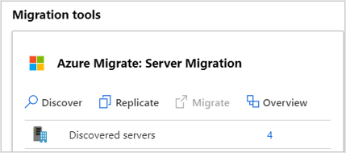

You’re ready to migrate your on-premises workloads to Azure. If you haven’t yet added the Azure Migrate Server Migration tool to the Azure Migrate project, you can do so now. The tool supports agentless migration of Windows and Linux VMs, which is appropriate as agentless migration is a requirement for your migration pilot.

Azure Migrate: Server Migration runs a lightweight Hyper-V VM appliance that discovers VMs and sends VM metadata and performance information to the tool. You’ve already set up the appliance during the discovery and assessment phase.

The Azure Migrate Server Migration service uses Azure Site Recovery as the underlying migration engine.

In this unit, you’ll look at how to deploy the Azure Site Recovery Provider on your Hyper-V host.

## Hyper-V replication components

Before migrating your VMs, you’ll set up your Hyper-V host with the components it needs to manage replication of your VMs and data. With agentless migration, you install components on the Hyper-V host only. You don’t need to install anything on the Hyper-V VMs.

The Microsoft Azure Site Recovery provider orchestrates replication for Hyper-V VMs. The provider also installs the Microsoft Azure Recovery Service agent which handles data replication. Data is uploaded to a storage account that you created as part of preparing your on-premises workloads for migration.

![Graphic showing the architectural components used by Azure Migrate to migrate Hyper-V VMs to Azure. The graphic shows servers representing the Hyper-V host and on-premises Hyper-V VMs. An arrow labeled as Data channel points from the Hyper-V VMs to a representation of an Azure cloud, showing the path of migration from on-premises to Azure. The data channel, also labeled as port 443 (the HTTPS protocol), notes that the data channel operates either through the public internet or an ExpressRoute with public peering. Icons representing the Azure Site Recovery Provider and Azure Recovery Services agent are shown as being deployed to the Hyper-V host. ](../media/6654-architectural-components.png)

You use a single setup file downloaded from the Server Migration tool in the portal to install both components on the Hyper-V host. 

The provider and agent communicate securely with Azure Migrate Server Migration across outbound HTTPS port 443. All communication is encrypted.

### Prepare the Hyper-V host server

In this task, you will register your Hyper-V host with the Azure Migrate: Server Migration service. As part of the registration process, you will deploy the Azure Site Recovery Provider on your Hyper-V host.

The Azure portal guides you through creating the resources that the Hyper-V host needs to replicate your VMs to Azure. From the Discover machines pane in Azure Migrate Server Migration, Set the target Azure region for the migration. You’ll use this region for subsequent migrations in the project, and once set it can’t be changed.

Next, click **Create resources**. This creates an Azure Site Recovery vault in the background, to hold data and configuration information for the VMs you’re migrating.

### Download replication components

Next, download the Hyper-V Replication provider and the registration key file on the Hyper-V host. The registration key is needed to register the Hyper-V host with Azure Migrate Server Migration.

1. In the Azure Migrate: Server Assessment panel, select **Discover** to open the Discover machines panel.
 
2. In the **Are your machines virtualized?** dropdown list, select **Yes, with Hyper-V**.

3. Copy the provider setup file and registration key file to the Hyper-V host running the VMs you want to replicate.

![Screenshot of the Discover machines blade in the Azure portal. The screenshot shows the Discover machines options for discovery of on-premises resources. The Are your machines virtualized setting is set to Yes, with Hyper-V. The Download link in Step 1 is highlighted with a red border. This is the link from where the Hyper-V replication provider is downloaded. A Download button is highlighted with a red border. This is the button used to download the registration key file for registering the Hyper-V host to Azure Migrate ](../media/6654-download-hyper-v-provider.png)

### Install the provider

Run the Azure Site Recovery Provider setup for Hyper-V, which also installs the Azure Site Recovery Services Agent on the host. In the Provider Setup wizard, opt in to use Microsoft Update and accept the default installation location for the Provider and agent.

### Register the Hyper-V host

When setup completes, the Registration wizard presents options to complete the registration of the Hyper-V host.

- Locate the registration key file you downloaded and associate it with the Azure Site Recovery vault that was created in the Azure Migrate project.

- Specify how the provider connects from the host to the internet. To keep it simple for the pilot, you’ll connect directly to Azure Site Recovery without a proxy server. 

Click **Finish** to close the Registration wizard. Return to the Discover panel in Azure Migrate Server Migration and finalize the registration, which is now enabled.

Once registration is complete, close the Discover machines panel.

It can take up to 15 minutes after finalizing registration until discovered VMs appear in Azure Migrate Server Migration. As VMs are discovered, the **Discovered servers** count increases.

