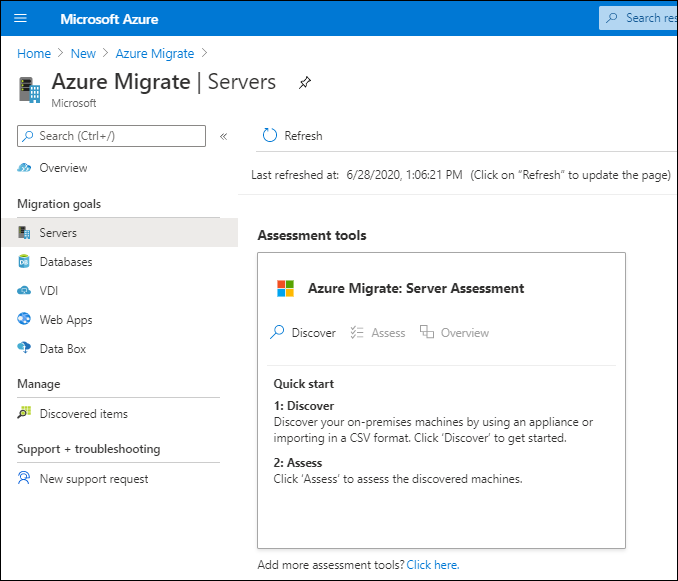
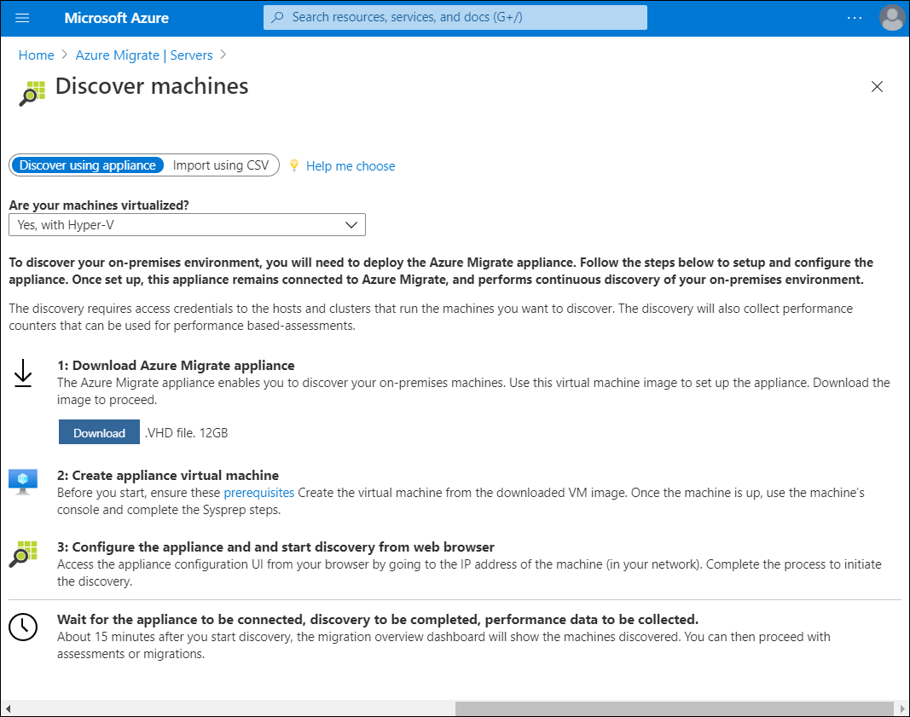
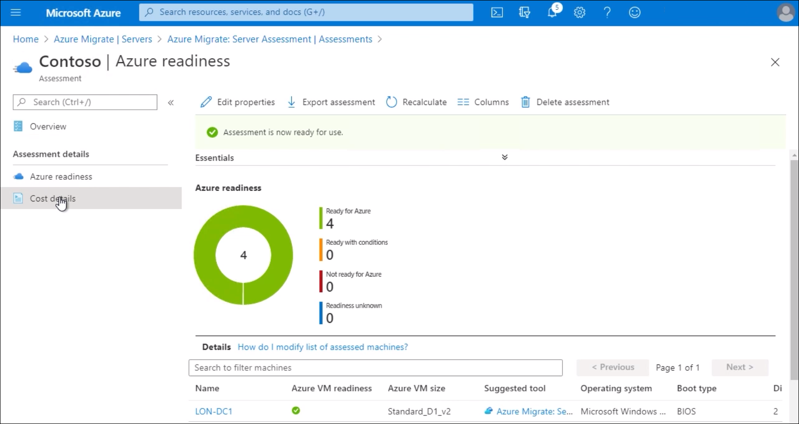

The IT staff at Contoso can use the Azure portal to perform server discovery and assessment in their environment. After this is complete, Azure Migrate will make appropriate migration recommendations regarding the size of the VMs they must provision.

## How the assessment works

When you use Azure Migrate, the assessments it produces are created within a project that you create in the Azure portal. Before you create a project, you should group your VMs according to the types of workloads they support.

> [!TIP]
> Grouping the VMs enables you to potentially migrate these groups together.

For example, you might group all servers that run a common application. After you've defined any necessary VM groups, you must create your project. After you create a project, Azure Migrate requires you to complete two steps to produce an assessment:

1. Discover your VMs.
1. Create assessments.

### Discover machines

To perform an agentless discovery, you use the Azure Migrate: Server Assessment tool. This tool guides you through downloading a lightweight collector appliance.

> [!NOTE]
> This appliance carries out the discovery of machines in your environment.

After the download, you must:

1. Import and start the collector appliance.
1. Complete its configuration.
1. Connect it to your Azure Migrate project.

> [!NOTE]
> You can download a collector appliance for VMware or Hyper-V environments.

After it's running, the collector gathers data about:

- VM cores
- Memory
- Disk sizes
- Network adapters

> [!TIP]
> The collector can also gather performance data, such as processor and memory usage, disk usage and throughput, and network output.

After data collection is complete, the collector pushes the data to your Azure Migrate project. You can then review the detailed information about your environment.

If you want more details about how your VMs relate to each other, you can install agents to collect that data. Azure Migrate prompts you to install the Microsoft Monitoring Agent and Dependency Agent on each of your VMs.

### Create an assessment

After you have completed the discovery and data collection phase, Azure Migrate assesses your environment's readiness to be migrated to Azure. In the Azure portal, select the **Assessments** section, and then select **Create assessment**. Azure creates an assessment using default settings.

> [!TIP]
> You can change these settings later by editing the assessment's properties.
