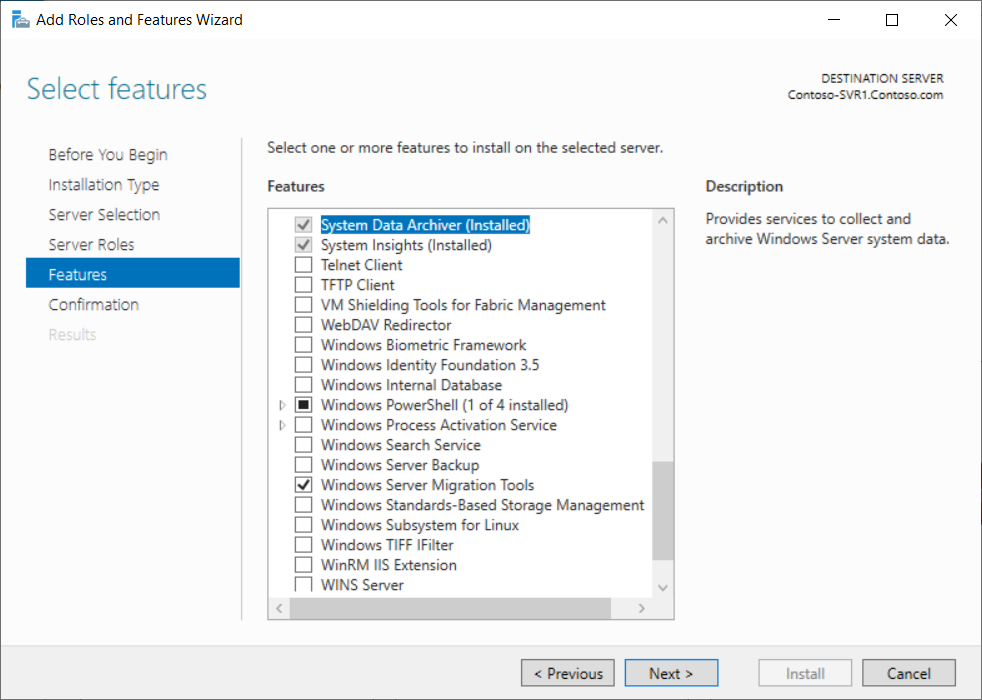

To perform a migration by using Windows Server Migration Tools, you must install the required cmdlets on both the source and destination servers.

For a computer running Windows Server 2019 or Windows Server 2022, you must install the Windows Server Migration Tools feature. You can install this feature by using graphical tools such as Windows Admin Center or Server Manager.

> [!TIP]
> Alternatively, you can also install Windows Server Migration Tools by using Windows PowerShell: `Install-WindowsFeature Migration`

## Install and prepare the migration tools

Installing and preparing the Windows Server Migration Tools consists of the following high-level steps:

1. Install the tools on destination servers as part of Windows Server setup.

1. Create a deployment folder containing a copy of the tools on the destination server.

    > [!TIP]
    > The tools are located in `C:\Windows\System32\ServerMigrationTools`

1. Copy the deployment folder from destination server to source server.

1. Register Windows Server Migration Tools on the source server by using the **SmigDeploy.exe** tool included in the deployment folder.

The following screenshot depicts the administrator selecting the Windows Server Migration Tools feature in Server Manager.

### Prepare the source computer

If the source computer is running a version of Windows Server earlier than Windows Server 2016, you must create a deployment folder with installation files for the source server. To create a deployment folder, run **SmigDeploy.exe** from the `%Windir%\System32\ServerMigrationTools` folder on the destination server. When you run **SmigDeploy.exe**, you must specify the:

- Architecture of the source server.

- Operating system of the source server.

- Path to store the deployment folder.

The following example creates a deployment share for a 64-bit version of Windows Server 2008 R2 in C:\Deploy that's named SMT_WS08R2_amd64:

`SmigDeploy.exe /package /architecture amd64 /os WS08R2 /path C:\Deploy`

> [!TIP]
> For detailed information about SmigDeploy.exe switches, use the /? option.

On the source server, you must register the Windows Server Migration Tools by running **SmigDeploy.exe** with no options from the deployment folder. You must copy the deployment folder to a local drive on the source server or use removable storage.

> [!WARNING]
> The deployment folder can't be run from a network location. 

## Perform the migration

After the migration tools are installed, you can run them by using one of the following methods:

1. Run **Windows Server Migration Tools** as an administrator from the Windows Start screen.

1. Load the Windows Server Migration Tools snap-in into an elevated Windows PowerShell session.

1. On source computers running earlier versions of Windows Server, run **Windows Server Migration Tools** under the **Windows PowerShell** folder, which is under the **All Programs** folder of the **Start** menu.

