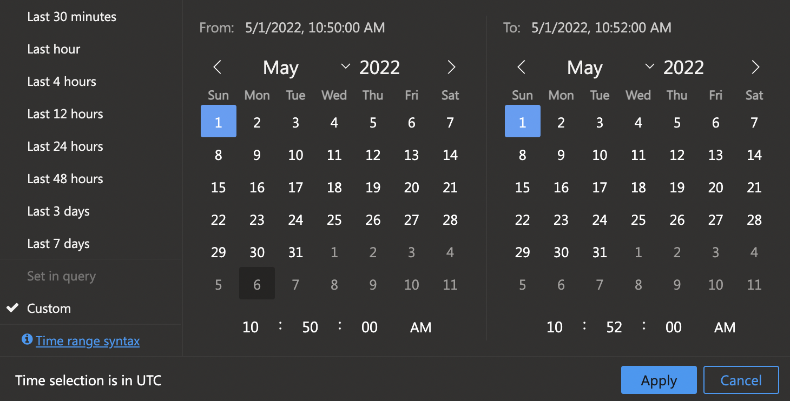

In this exercise, you'll use sample data from Azure monitoring logs to examine data using queries in Log Analytics. You'll practice simple Kusto queries to gain insights into what you can do with monitoring logs generated from your Azure App Service.

While you can use real data from your own Azure logs if you'd like, this exercise uses sample data to ensure you're working with an ample dataset. The queries are built around this sample dataset.

## Prerequisites

* An **Azure account** with an active subscription. If you don't already have one, you can sign up for a free trial at [https://azure.com/free](https://azure.com/free)

## Create a query

1. Open the [Log Analytics demo environment](https://portal.azure.com/#blade/Microsoft_Azure_Monitoring_Logs/DemoLogsBlade).

1. In the left pane, there are four tabs: **Tables**, **Queries**, **Functions**, and **Filter**. Select the **Tables** tab and expand the **Log Management** section to view the list of tables available in the dataset.You can hover over a table to see more information about it.

1. In the right-hand pane, copy and paste the following Kusto query then press **Run** to execute the query.

    `AppRequests | where Name contains "GET"`

1. You'll notice in the result list that query returned over 30,000 results. You can refine the query to reduce the result set. You can view details of any single record in the result set by selecting the expand icon on the far left of any record item.

1. Next, copy and paste the following query and press **Run** to see the results.

    `AppRequests | where Name contains "GET" | where TimeGenerated between (datetime(2022-05-01 10:50:00) .. datetime(2022-05-01 10:52:00))`

1. This query returns a much smaller result set, which can be easier to work with.

1. To visualize this result, select the **Chart** tab below the query editor pane. You'll see a visual representation of the query results.

## Group your results

You can organize your result list into row groups or aggregate values to more easily visualize your data.

1. Select the **Columns** button on the far right of the result list.

1. Using the results of the previous query, drag the **Success** field into the **Row Groups** target area below the column list. Your result list is now organized into to groups: true and false.

1. Drag the **DurationMs** field into the **Values** target area. Below the **DurationMs** column is a sum of the duration for the **true** group and another for the **false** group.

In the example above, you're setting the time element in the query. You also can set it on the query window so any query you write will be constrained to that timeframe.

1. Remove the time element from the query. Your query should look like the example below:

    `AppRequests
            | where Name contains "GET"`

1. Select the **Time Range** button above the query window.

1. In the pop-up that appears, select **Custom**

1. Set the "From" date to May 01, 2022 10:50:00 AM and the "To" date to May 01, 2022 10:52:00 AM

1. Run the query. The results for this query should return the same number as the query that included the time element.
    
    

1. Now change the query to the following and run the query
    `AppRequests | where Name contains "SmartRequest"`

1. The result list will contain different results but remain in the time frame set above.

## Visualize your data

You can visualize your data in various ways as well. Log Analytics will create bar charts, line charts, and pie charts depending on the type of data you want to visualize.

1. Select the **Queries** tab in the left pane.

1. Under the **Applications** section, double-click the **Top 10 countries by traffic** query to add it to the query editor and then select **Run**

1. Select the **Chart** tab in the query result pane to see a pie chart of the result.

1. Return to the query list and double-click the **Response time buckets** query to add it to the query editor.

1. Select **Run** to execute the query.

    >[!IMPORTANT]
    >The query editor will only run the selected query. You can have multiple queries in the editor but you must select the query to run it before selecting run to execute a particular query.

1. Log Analytics will create a horizontal bar chart visualizing the results.

When using log analytics with your own data, you can save queries and share them with teammates.
