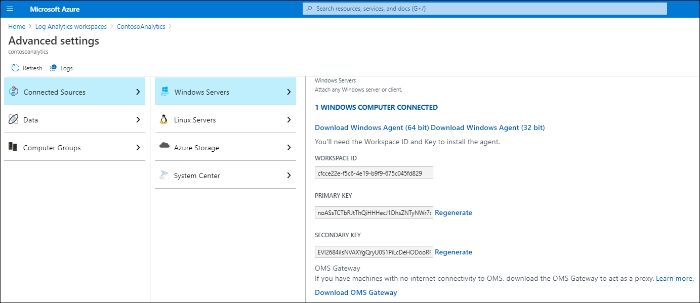

Contoso has a hybrid infrastructure; some compute workloads run as IaaS VMs in Azure, and others run on Windows Server VMs in Contoso datacenters. The process of monitoring on-premises Windows Servers using Azure Monitor is almost identical to the process of enabling monitoring on IaaS VMs.

## Implement Azure Monitor in hybrid scenarios

To leverage the benefits provided by Azure Monitor in hybrid scenarios, you must install the Log Analytics agent on your on-premises servers. To perform this task, use the following procedure:

1. On the target server, open the Azure portal.
2. From your **Log Analytics workspace** in the Azure portal, select **Advanced settings**.
3. Copy the **WORKSPACE ID** and **PRIMARY KEY** values. (You'll need them during installation.)
4. In the details pane, select **Download Windows Agent (64-bit)** or **Download Windows Agent (32-bit)** as required.

Next, run the **MMASetup-AMD64.exe** file and use the following instructions to install the agent:

1. On the **Welcome** page, select **Next**.
2. On the **License Terms** page, read the license agreement, and then select **I Agree**.
3. On the **Destination Folder** page, change or keep the default installation folder, and then select **Next**.
4. On the **Agent Setup Options** page, connect the agent to **Azure Log Analytics**, and then select **Next**.
5. On the **Azure Log Analytics** page, complete the following steps:
  1. Paste in the **Workspace ID** and **Primary key** (referred to as the *Workspace key*).
  2. From the **Azure Cloud** list, select either **Azure Commercial** or **Azure US Government**.
  3. On the **Ready to Install** page, review your choices, and then select **Install**.
  4. On the **Configuration completed successfully** page, select **Finish**.

The Log Analytics agent is designed to facilitate monitoring and management integration in hybrid environments, including those managed by Operations Manager. The Log Analytics agent also delivers data consumed by other Azure services, including Azure Security Center and Azure Automation.

The agent manages:

- Windows event logs
- Windows performance counters
- Specified file-based logs
- Logs associated with Azure Monitor
- Azure Automation monitoring and management solutions that you enable

You can configure these settings by selecting **Data** in the **Advanced settings** page of the appropriate Log Analytics workspace. Some of the Azure Automation monitoring and management solutions such as Update Management rely exclusively on a Log Analytics agent, while others such as Change Tracking and Inventory require you to also install the Dependency Agent. The primary purpose of the Dependency Agent is to identify details and dependencies for processes hosted on managed servers, and to collect network-related metrics.

> [!NOTE]
> Log Analytics is also referred to as the *Microsoft Monitoring Agent*.

### Log Analytics workspace

All the data collected by both Log Analytics and the Dependency Agent is uploaded automatically to your designated Log Analytics workspace (which optimally is in the region physically closest to the location hosting your on-premises datacenter). A *workspace* represents the administrative and security boundary of the Log Analytics environment. It also defines the scope of data collection, analysis, and visualization.

> [!NOTE]
> You can create multiple workspaces in the same Azure subscription.

Each workspace has a unique workspace ID and is associated with the primary and secondary keys that serve as its authentication mechanism. You must know both the ID and at least one of the two keys to join a system to the workspace.

When configuring the Log Analytics workspace, as part of its advanced settings you can specify types of data you intend to collect. This could include Windows event logs and performance counters, Microsoft Internet Information Services (IIS) logs, and custom logs.

You also have the option to create computer groups. Computer groups can serve as one of criteria of Log Analytics queries, enabling you to narrow down the scope of results to a subset of servers based on their group membership. Computer groups are based on information collected from target computers, including:

- Computers with membership in AD DS groups.
- Windows Server Update Services (WSUS) groups.
- Microsoft Endpoint Configuration Manager groups.

For on-premises servers that you onboard into Azure Monitor, data is continually collected by the locally installed agents, and then uploaded into a Log Analytics workspace in Azure Monitor. You can add monitoring solutions to each workspace. These monitoring solutions are the primary method of extending the service's core capabilities. To utilize this extensibility, you add any solution that is available in the Azure Marketplace to the workspace. Some solutions you can enable directly from the blades of the services implementing their core functionality. For example, Update management, and Change Tracking and Inventory are part of the Azure Automation pane.

> [!CAUTION]
> Keep in mind that adding a solution to the workspace deploys it to all managed computers that support the workspace. This in turn impacts the volume of collected data, which has both network bandwidth and pricing implications.

The Azure Monitor monitoring solutions build on the core functionality of the service by implementing additional log processing and analytics rules. These rules derive meaningful information from raw data collected from data sources. After data is uploaded to the Log Analytics workspace, the service processes its content by applying logic as defined by the solutions you added to the workspace.

### Windows Admin Center

You can also integrate Windows servers with Azure Monitor by using Windows Admin Center. Windows Admin Center simplifies implementation between the two by automatically creating a Log Analytics workspace if one doesn't already exist, and if needed a corresponding Azure Automation account. It also installs both the Log Analytics agent and the Dependency Agent on the target Windows server. In addition, Windows Admin Center will enable the Azure Monitor for VMs solution by default, also referred to as *Virtual Machine Insights*.

> [!NOTE]
> To set up Azure Monitor integration from the Windows Admin Center, you must first register Windows Admin Center with Azure.

Onboarding Windows servers into Azure Monitor by using Windows Admin Center automatically enables the Infrastructure Insights and Dependency Map solutions. These two solutions are collectively referred to as *Azure Monitor for VMs*.

You use Windows Admin Center to enable Azure Update Management. From Windows Admin Center, you can also configure alerts that will apply to all servers connected to the same Log Analytics workspace. To review and modify alert configurations, you can use the Azure portal.

## Additional reading

You can learn more by reviewing the following documents.

- [Connect Windows computers to Azure Monitor](https://aka.ms/agent-windows?azure-portal=true)
- [Collect data from a Windows computer in a hybrid environment with Azure Monitor](https://aka.ms/quick-collect-windows-computer?azure-portal=true)
