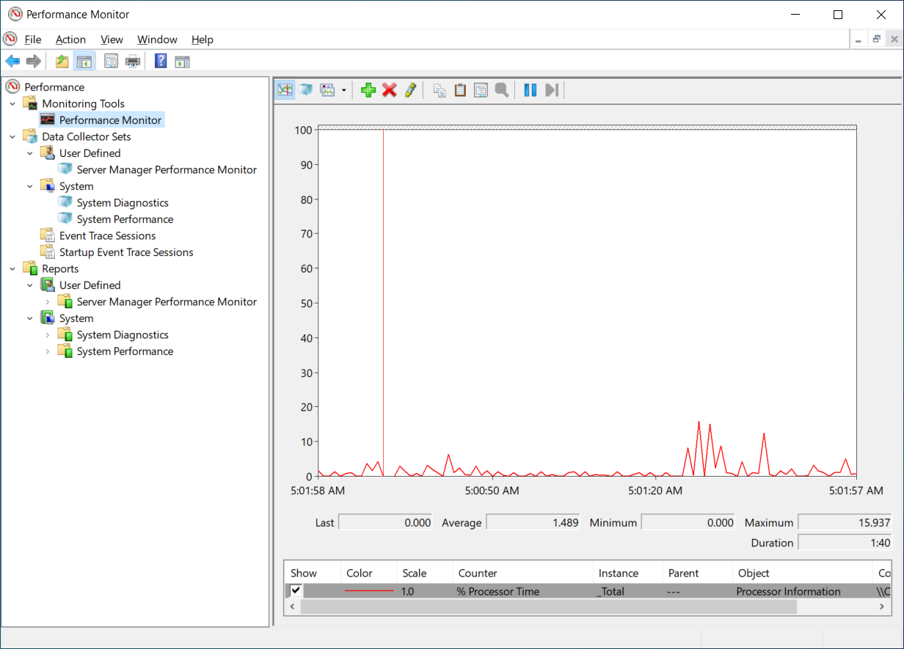
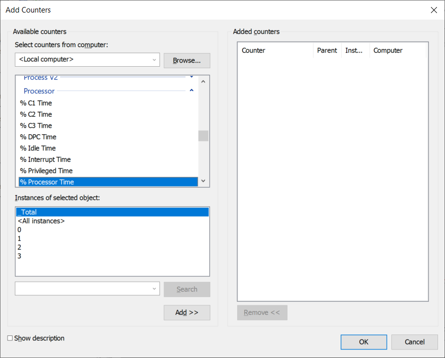

Performance Monitor is a Microsoft Management Console (MMC) snap-in that you can use to obtain system performance information. You can use this tool to:

- Analyze the performance effects that applications and services have on a computer.

- Obtain an overview of system performance.

- Collect detailed information for troubleshooting.

## What can you do with Performance Monitor?

Performance Monitor enables you to collect, measure, and analyze performance-related data from your Windows Server computers. The following graphic depicts Performance Monitor. Displayed in the navigation pane are:

- Monitoring Tools

- Data Collector Sets

- Reports

These are the three features of Performance Monitor.

- Monitoring Tools. This section contains Performance Monitor, which provides a visual display of built-in Windows performance counters, either in real-time or as historical data. Performance Monitor includes the following features:

  - Performance counters: Performance Monitor uses performance counters to measure a system's state or activity. The operating system includes some performance counters, and individual applications might include other performance counters. Performance Monitor requests the current value of performance counters at a specified time interval, which by default is one second. Add performance counters to Performance Monitor by copying the counters or by creating a custom data collector set.

  - Multiple graph views: Performance Monitor features multiple graph views that enable you to visually review performance log data.

  - Custom views: Create custom views in Performance Monitor and then export them as data collector sets for use with performance and logging features.

- Data collector sets. A data collector set is a custom set of performance counters, event traces, and system configuration data. After you create a combination of data collectors that describe useful system information, save them as a data collector set and then run and observe the results.

  - A data collector set organizes multiple data collection points into a single, portable component. Use a data collector set on its own, group it with other data collector sets, incorporate it into logs, or observe it in Performance Monitor.

  - Configure a data collector set to generate alerts when it reaches thresholds. You can also configure a data collector set to run at a scheduled time, for a specific length of time, or until it reaches a predefined size. For example, run a data collector set for 10 minutes every hour during working hours to create a performance baseline. You can also set a data collector to restart when the collection reaches a set limit so that Performance Monitor creates a separate file for each interval. Scheduled data collector sets collect data regardless of whether you start Performance Monitor.

  - Use data collector sets and Performance Monitor to organize multiple data collection points into a single component that you can use to review or log performance.

> [!TIP]
> Performance Monitor also includes default data collector set templates to help system administrators begin the process of collecting performance data.

  - In Performance Monitor, under the Data Collector Sets node, use the User Defined node to create your own data collector sets. Specify the objects and counters that you want to include in the set for monitoring. To help you select appropriate objects and counters, use the following templates provided for monitoring:

    - System Diagnostics. This template selects objects and counters that report the status of hardware resources, system response times, and processes on the local computer, along with system information and configuration data. The report provides guidance on ways to optimize the computer's responsiveness.

    - System Performance. This template generates reports that detail the status of local hardware resources, system response times, and processes.

    - WDAC Diagnostics. This template enables you to trace the debug information for Windows Data Access Components.

    - Basic. This template creates a simple collector that you can add to later. It includes a processor performance counter, a simple configuration trace, and a Windows kernel trace object.

- Reports. Use the Reports feature to observe and generate reports from a set of counters that you create by using data collector sets. Performance Monitor creates a new report automatically every time a data collector set runs.

## What are the common performance counters?

You add objects, counters, and their instances to Performance Monitor. These objects represent key resource components in your servers; for example:

- Memory

- Processor

- System

- Physical Disk

- Network Interface

Each object provides many distinct counters that record the values for different object performance indicators. For example, the Processor object provides 15 distinct counters. As displayed in the following graphic, some objects also enable you to record the values for different instances of the object. For example, the Processor object provides _Total, \<All instances\>, and a numbered instance for each processor core. Generally, you should start by gathering the _Total instance for your chosen counters.

> [!TIP]
> You can always be more specific in subsequent analyses. 

The following table describes the most commonly used counters.

| Counter| Usage|
| :--- | :--- |
| PhysicalDisk\% Disk Time| This counter measures the percentage of time the disk was busy during the sample interval. If this counter rises more than 85 percent, the disk system is saturated.|
| PhysicalDisk\Avg. Disk Queue Length| This counter indicates how many I/O operations are waiting for the hard drive to become available. If the value is larger than twice the number of spindles, the disk itself might be the bottleneck. If this counter indicates a possible bottleneck, consider measuring the Avg. Disk Read Queue Length and Avg. Disk Write Queue Length to determine if read or write operations are causing the bottleneck.|
| Memory\Pages per Second| This counter measures the rate at which pages are read from or written to the disk to resolve hard page faults. If the value is greater than 1,000 as a result of excessive paging, a memory leak might exist.|
| Processor\% Processor Time| This counter measures the percentage of elapsed time that the processor spends running a non-idle thread. If the percentage is greater than 85 percent, the processor is overwhelmed, and the server might require a faster processor.|
| System\Processor Queue Length| This counter indicates the number of threads in the processor queue. The server doesn't have enough processor power if the value is more than two times the number of central processing units (CPUs) for an extended period.|
| Network Interface\Bytes Total/Sec| This counter measures the rate at which bytes are sent and received over each network adapter, including framing characters. The network is saturated if more than 70 percent of the interface is consumed.|
| Network Interface\Output Queue Length| This counter measures the length of the output packet queue, in packets. Network saturation exists if this value is more than two.|

> [!NOTE]
> If your server is configured with solid state disks (SSDs), these disk counters are less relevant. It's unlikely that disk bottlenecks will occur in these configurations.

