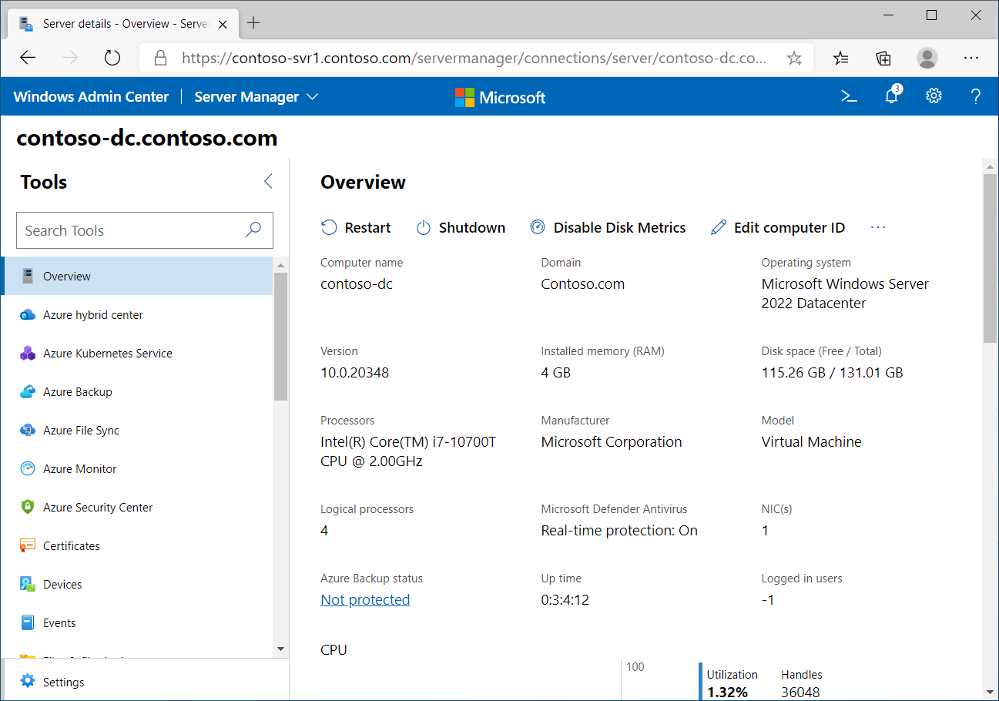

You can use Windows Admin Center to perform many of the same tasks that you might perform by using Server Manager. These include the following features:

- The **Overview** tab helps you observe current performance details similar to Task Manager.

- The **Performance Monitor** tab enables you to compare performance counters for Windows operating systems, apps, or devices in real time.

- The **System Insights** tab enables you to determine future capacity needs.

## Review the Overview tab in Windows Admin Center

You can use the following procedure to monitor the four core resources on a remote computer by using Windows Admin Center:

1. Open Windows Admin Center, and then sign in as necessary.

1. Select the appropriate remote server.

1. Select the Overview tab, and then in the details pane, scroll down and review the details for:

    - CPU

    - Memory

    - Ethernet

1. If you also want to monitor disk performance, you must enable disk metrics.

    > [!WARNING]
    > Enabling disk metrics can affect performance.

To monitor disk performance:

1. In the details pane, select Enable Disk Metrics on the menu bar.

1. When prompted, select Yes.

1. In the details pane next to Ethernet, you can observe the details for installed disks.

The following screenshot displays the Overview tab for a server computer.

> [!TIP]
> After you finish, disable disk metrics.

Remember that you are monitoring real-time statistics. For more meaningful data, collect data by using Performance Monitor.

## Use Performance Monitor

Use the following procedure to access Performance Monitor:

1. Open Windows Admin Center, and then sign in as necessary.

1. Select the appropriate remote server.

1. In the navigation pane, select Performance Monitor.

1. In the details pane, select Blank workspace.

1. Select Add counter, and then add the desired performance Objects, Instances, and Counters.

1. Choose the Graph type: Line, Report, Min-Max, and Heatmap.

1. To define the workspace name, time range, and other details, select Settings.

1. Save the workspace for future use.

> [!TIP]
> You can use Windows Admin Center to add the same objects, counters, and instances that you can add with Performance Monitor, which this module discussed earlier.

