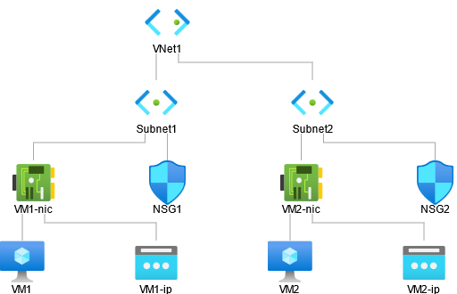
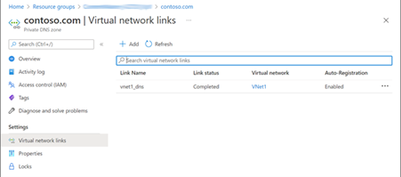

[!IMPORTANT]
You need your own [Azure subscription](https://azure.microsoft.com/free/?azure-portal=true) to complete the exercises in this module. If you don't have an Azure subscription, you can still read along.

You work for Contosto as a network engineer, and users are complaining that they cannot access VM1 or VM2. You have configured two Azure virtual networks: VNet1 and VNet2. They are connected with peering.

| **Virtual network**| **IPv4 network address**| **Subnet**| **IPv4 network address**|
| :--- | :--- | :--- | :--- |
| VNet1| 10.1.0.0/16| Subnet1| 10.1.1.0/24|
||| Subnet2| 10.1.2.0/24|
| VNet2| 10.2.0.0/16| Default| 10.2.0.0/24|

| **Virtual machine**| **Operating system**| **VNet and subnet**| **DNS domain**|
| :--- | :--- | :--- | :--- |
| VM1| Windows Server 2019| VNet1, Subnet1| contoso.com|
| VM2| Windows Server 2019| VNet1, Subnet2| contoso.com|
| VM3| Windows Server 2019| VNet2, default| contoso.com|

## Diagnosis

Use Nslookup on VM1 and VM2 and check you get the following results:

- vm1.contoso.com – success

- vm2.contoso.com – success

- vm3.contoso.com – can’t find

Nslookup on VM3 gives these results:

- vm1.contoso.com – can’t find

- vm2.contoso.com – can’t find

- vm3.contoso.com – can’t find

## Diagnosis

### Examine the IP configuration of the VMs

Connect to each VM using Remote Desktop. Open a command prompt window and type: ipconfig /all

The IP addresses are:

- VM1 = 10.1.1.4

- VM2 = 10.1.2.4

- VM3 = 10.2.0.4

The DNS server address is 168.63.129.16, which is the wire server.

### Test network connectivity

Use **ping** to test network connectivity between the three virtual machines.

All three VMs are able to ping each other, so network connectivity is good at the IP level (OSI Layer 3).

### Examine the Azure resource group

There are two VNets called VNet1 and VNet2.

There is a private DNS zone, which is contoso.com.

The private DNS zone has vm1 and vm2 automatically registered, but vm3 does not appear.

Go to **Settings** > **Virtual network links**. We see that the private DNS zone is linked to VNet1, but not to VNet2.

## Resolution

### Link the private DNS zone to VNet2

Navigate to the private DNS zone (contoso.com) and select the Virtual network links page. Add a new link.

- Link name: vnet2_dns

- [  ] I know the resource ID of virtual network – leave unchecked

- Subscription: <the name of your subscription>

- Virtual network: VNet2

- Configuration: [X] Enable auto registration

After you click OK, it may take a few minutes for the link to be created. Click Refresh occasionally to see the latest status. Wait until the link status says Completed.

### Inspect the DNS name table

Navigate to the Overview page and inspect the DNS name table.

VM1, VM2, and VM3 should appear. You may need to wait a short while for VM3 to appear. Click Refresh if necessary.

Nslookup on VM1 and VM2 should resolve vm3.contoso.com.

> [!TIP]
> If VM3 does not appear after several minutes, try restarting the VM.

Optionally, you can test pinging the VMs, using their DNS names.

- vm1.contoso.com

- vm2.contoso.com

- vm3.contoso.com
