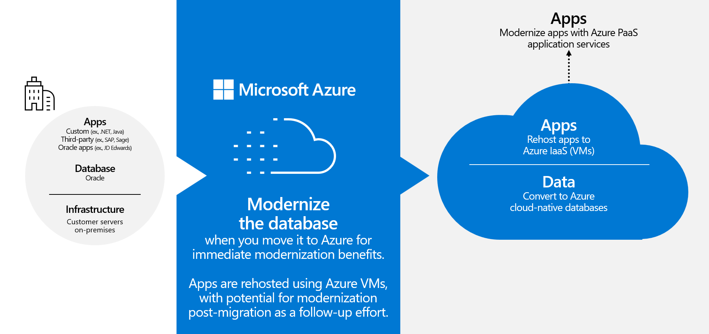
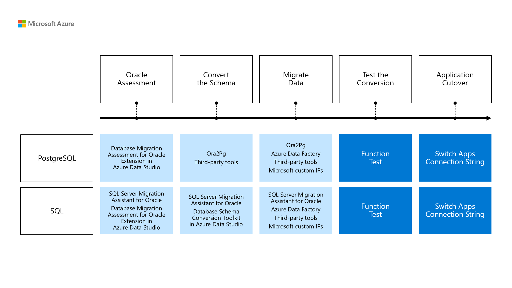

As you think through your options, you focus on three objectives:

- Ensure your database usage can scale up and down, based on demand.
- Make your workloads easier to manage.
- Continuously monitor your databases to help ensure that performance requirements are being met.

You're going to divide your migration into two parts: the database layer and the application layer. You want to migrate your data to a more flexible and easier-to-manage database technology, while reducing the need to track and manage Oracle licenses.

## Consider the application layer migration

Because your application servers are much less of a management burden than your database servers, you decide to proceed with a conventional infrastructure as a service (IaaS) [rehosting migration](/azure/cloud-adoption-framework/adopt/migrate-or-modernize#migrate-rehost) to Azure virtual machines (VMs) for your application code. In the future, you may consider an application layer [modernization](/azure/cloud-adoption-framework/modernize/modernize-strategies/application-modernization) effort to take advantage of managed PaaS services, such as [Azure App Service](/azure/app-service/overview) [or Azure Kubernetes Service](/azure/aks/intro-kubernetes), but that's beyond the scope of your immediate migration needs.

You realize, however, that as part of your application layer rehosting, your application code will likely need to be modified to work with the new database platform. As a result, you should plan for developer involvement to complete this process.

## Move to a managed database service

You could [rehost your database](/azure/cloud-adoption-framework/adopt/migrate-or-modernize#migrate-rehost) using an [Azure IaaS](https://azure.microsoft.com/solutions/azure-iaas/) model. This approach would minimize the time and complexity of your migration, but it doesn't help you meet your requirements. Rehosting would mean that you're still responsible for managing the VMs hosting your databases, including operating system and application patching, storage management, network configuration, and backups. You would also still be responsible for the licensing costs and maintenance of the Oracle software you run on these VM servers.

Instead, you think a better approach involves [replatforming](/azure/cloud-adoption-framework/adopt/migrate-or-modernize#modernize-replatform) your database servers to one of the Azure [platform as a service](https://azure.microsoft.com/resources/cloud-computing-dictionary/what-is-paas) offerings. From an IT management perspective, PaaS solutions offer significant advantages over traditional on-premises or VM-based IaaS hosting. PaaS products offer fully managed solutions, which means you don't need to worry about the underlying OS or database server software.

Using a PaaS database service allows you to focus less on managing your database infrastructure and more on developing your applications. The underlying infrastructure, networking, compute, and storage resources are all managed by Azure, which lets you take advantage of the enterprise-grade performance, scalability, and reliability capabilities of Azure when hosting your database workloads.

Moving to a PaaS approach can also offer cost and flexibility advantages over other cloud-hosting options. A key advantage of cloud-based PaaS solutions is that they allow you to scale your resource usage based on demand. This includes enabling autoscaling to help ensure that your applications meet your performance requirements without requiring intervention from your IT team.

PaaS solutions also include licensing costs as part of the service, so you no longer need to pay for or manage licenses separately.

## Understand your PaaS database migration options and tools

When considering a PaaS database solution for an Oracle database migration, you review the commonly used services and tools. There are two main options:

- [Azure Database for PostgreSQL](/azure/postgresql/flexible-server/overview) is a fully managed service based on the open-source PostgreSQL database system. Some similarities in query language functionality make it an attractive migration target for Oracle databases.

- [Azure SQL](/azure/azure-sql/azure-sql-iaas-vs-paas-what-is-overview) is a family of database services, and its two prominent options are [Azure SQL Database](/azure/azure-sql/database/sql-database-paas-overview) and [Azure SQL Managed Instance](/azure/azure-sql/managed-instance/sql-managed-instance-paas-overview). Both options are based on the SQL Server engine; SQL Database is optimized for cloud-native applications, and SQL Managed Instance has superior compatibility with existing SQL Server databases. Given that your team has strong capabilities in T-SQL, you are favoring Azure SQL Managed Instance for the migration you're considering.

The following diagram shows the process to convert and migrate an Oracle database to either option.

In addition to the choice of core database technology, you consider the various tools designed to help you in your migration:

- [Microsoft SQL Server Migration Assistant (SSMA) for Oracle](/sql/ssma/oracle/sql-server-migration-assistant-for-oracle-oracletosql) is a tool that helps automate migration tasks, such as migration assessment, schema and SQL syntax conversion, data migration, and migration testing, optimized for Azure SQL.

- [Database Migration Service Pack for Oracle](/azure-data-studio/extensions/database-migration-service-pack-for-oracle) is a set of [Azure Data Studio](/azure-data-studio/) extensions that facilitate the seamless migration of Oracle databases to Azure SQL Database and Azure SQL Managed Instance. It consists of two essential extensions:

    - [Database Migration Assessment for Oracle extension](/azure-data-studio/extensions/database-migration-assessment-for-oracle-extension) helps you assess your Oracle workload for migrating to either Azure SQL or Azure Database for PostgreSQL.
    
    - [Database Schema Conversion Toolkit](/azure-data-studio/extensions/dsct/database-schema-conversion-toolkit) helps to automate database schema conversion between different Oracle and Microsoft SQL schema formats.

- [Ora2Pg](https://ora2pg.darold.net/documentation.html#Ora2Pg-usage) is a Perl-based utility that helps migrate Oracle databases to PostgreSQL.

Third-party services, such as the following, can also help you plan and implement migrations:

- [Splendid Data](https://www.splendiddata.com/) offers tools, including the powerful [Cortex](https://www.splendiddata.com/cortex/) tool, to help manage and automate the migration of Oracle databases to PostgreSQL.

- [Newt Global](https://newtglobal.com/) helps organizations move Oracle databases to cloud-based PostgreSQL environments, targeting Azure in particular.

Other notable vendors that support modernizations to Azure include [Hexaware](https://hexaware.com/), [Brillio](https://www.brillio.com/), [Ispirer](https://www.ispirer.com/), and [Striim](https://www.striim.com/).

## Describe when a managed PaaS solution is right for your database migration

Replatforming by using a managed Azure PaaS database solution is generally a good approach when you:

- Want to minimize IT management load related to database hosting.
- Want to enhance hosting scalability and flexibility for your database workloads.
- Can update your application code to use the new database platform.
- Want to eliminate Oracle licensing.

Given your applications and priorities, this type of migration seems like the best way to meet your goals. Other workloads may not be a good fit for this option. To explore additional methods for migrating Oracle workloads, review [Migrate Oracle workloads to Azure IaaS virtual machines](/training/modules/oracle-workload-azure-iaas) and [Migrate an Oracle workload to Oracle Database@Azure](/training/modules/oracle-workload-azure-odaa).
