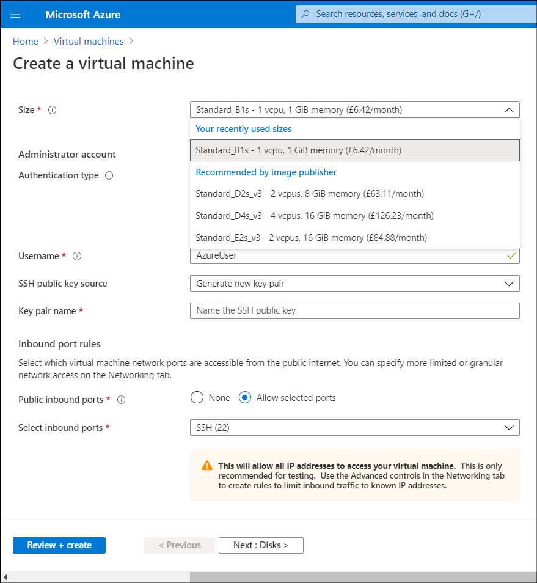

*Azure compute* is an on-demand computing service for running cloud-based applications. The service provides computing resources such as multiple-core processors, memory, and storage. It also provides serverless computing to run apps without requiring infrastructure setup or configuration. As part of the migration to the cloud, Contoso is investigating which workloads can be deployed on Azure VMs.

## Overview of Azure VMs

Of the available compute options, Azure VMs provide a high degree of flexibility and control. As an IaaS solution, Azure VMs operate in a similar way to Hyper-V VMs on Windows Server. You have complete control over the VM at the operating system level. However, as a result, you're also responsible for maintaining that operating system, including installing updates and backups. You can create both Windows VMs and Linux VMs from predefined templates, or you can deploy your own custom server images in the cloud.

Unlike with Azure Web Apps or Cloud Services, you can use custom operating system images. Azure VMs are most suited for:

- Highly customized apps that have complex infrastructure or operating system requirements.
- Hosting Windows Server or Linux apps and infrastructure services, such as AD DS, DNS, or a database management system (DBMS).
- Temporary deployments to accommodate proof of concept or development needs.

When you run Azure VMs, you pay for their compute resources on a per-second basis. The pricing depends on the VM size, the license of the operating system and any additional licensed software installed on it, and the Azure region where the VM resides. A running VM continuously requires Azure compute resources. Therefore, to avoid charges for these resources, you should place VMs in the **Stopped (Deallocated)** state whenever you're not using them.

> [!TIP]
> When you stop a VM through the Azure portal rather than through the operating system, the VM will be placed in a **Stopped (Deallocated)** state. This means you will stop paying for the VM compute costs. Shutting down an Azure VM from within the operating system results in only a **Stopped** state, which continues to incur VM compute charges.

> [!NOTE]
> There are additional VM-related charges associated with the cost of Azure Storage hosting VM disk files. These charges apply regardless of the state of the VM.

Although you don't have direct console access to Azure VMs, the Azure portal offers boot diagnostics functionality. You can use this functionality to review the console log and its screenshot. Azure also offers the serial console for Azure VMs, which provides text-based console access from the Azure portal to Windows VMs and Linux Azure VMs through the COM1 serial port, regardless of the operating system state.

One benefit of Azure VMs is their compatibility with on-premises Hyper-V VMs. This simplifies migrating your existing Hyper-V–based workloads to the cloud. To accomplish this, you can upload on-premises virtual hard disk (.vhd) files and create Azure VMs by using the uploaded disks. Alternatively, you can use solutions such as Azure Site Recovery that automate the upload of disk files and Azure VM provisioning. The compatibility between Azure VMs and on-premises Hyper-V VMs also simplifies integrating both environments, making Azure an extension of your existing datacenter.

## Deploy Azure VMs

Deploying VMs in Azure is different from deploying them in an on-premises Hyper-V environment. When you manage the hypervisor platform, you can configure all VM settings any way you like. In Azure, you select from a range of predefined configuration options corresponding to different VM sizes. The VM size determines characteristics such as the number and speed of its processors, amount of memory, maximum number of network adapters or data disks you can attach to it, and maximum size of a temporary disk.

> [!NOTE]
> A temporary disk of an Azure VM resides on the host where the VM runs. Its operating system and data disks reside in Azure Storage.

Azure offers a wide range of VM sizes to accommodate nearly any custom requirement. In addition, at any point, you can switch between different configurations, if your current configuration does not violate the constraints of the desired configuration. For example, you might need to remove an extra virtual network adapter, or a data disk attached to your VM before you scale it down to a smaller size.

> [!NOTE]
> If you change a VM's size, you must restart it.

In addition to size, a VM's performance and capabilities also depend on its tier. There are two tiers of Azure VMs: Basic and Standard.

## Basic tier

You can choose the Basic tier VMs for any non-production workloads that don't require features such as load balancing, autoscaling, or high availability, and for which you are willing to tolerate disk input/output (I/O) in the range of 300 Input/Output Operations Per Second (IOPS) per disk. In addition, the Basic tier VMs don't qualify for any Service Level Agreements (SLAs) pertaining to availability.

> [!TIP]
> Basic tier VMs are less expensive than the Standard tier VMs.

The Basic tier supports a small number of VM sizes, ranging from A0 to A4. The Basic_A0 designation represents the smallest size of the Basic tier. It offers a single central processing unit (CPU) core, 768 megabytes (MB) of memory, and a single data disk. The Basic_A4 designation represents the largest VM in the Basic tier, offering 8 CPU cores, 14 gigabytes (GB) of memory, and up to 16 data disks.

## Standard tier

Several standard VM sizes support Azure Premium Storage. *Azure Premium Storage* is a high-end offering that provides performance equivalent to that of solid-state drives (SSDs). You can easily distinguish these VM sizes because they include the letter S in the VM size designation. All VM sizes support standard storage, which offers a performance equivalent to magnetic disks. On the Standard tier VMs, standard storage delivers 500 IOPS per disk. On the Basic tier VMs, standard storage delivers 300 IOPS per disk.

> [!NOTE]
> Most VMs in Azure are part of the Standard tier offering.

## VM sizes in Azure

Each VM size is represented by a combination of one or more letters and numbers. The leading letter (or, in some cases, letters and a number) designates a collection of VM sizes &ndash; referred to as *VM series* or *VM family* &ndash; that share common configuration characteristics.

These configuration characteristics typically include:

- CPU type
- CPU-to-memory ratio
- SSD-based or hard-disk drive (HDD)–based temporary disk
- Support for Premium Storage

Each VM series includes multiple VM sizes, which differ in:

- Number of CPU cores
- Amount of memory
- Size of the temporary disk
- Upper limit on the number of network adapters and data disks.

VM sizes that support Premium Storage also differ regarding their maximum aggregate disk I/O performance.

VM sizes are grouped into the categories described in the following table.

|Category|Description|
|----------------------------|------------------------------------------------------------|
|**General purpose**|This category offers a balanced CPU-to-memory ratio, making it most suitable for testing, development, and hosting small-to-medium databases or web servers. This category includes Av2, Dv2, Dv3, DSv2, and DSv3 series VM sizes.|
|**Confidential compute**|Azure confidential computing VMs are designed to protect the confidentiality and the integrity of your data and code while it's processed in the cloud.|
|**Compute optimized**|This category offers a high CPU-to-memory ratio, making it most suitable for compute-intensive workloads without extensive memory requirements. Typically, these are medium-size traffic web servers or application servers, network appliances, or servers handling batch processing. This category includes F, Fs, and Fsv2 series VM sizes.|
|**Memory optimized**|This category offers a high memory-to-CPU ratio, making it most suitable for memory-intensive workloads without extensive compute requirements. Typically, these are workloads that keep the bulk of their operational content in memory, such as database or caching servers. This category includes Dv2, DSv2, Ev3, Esv3, M, G, and GS series VM sizes.|
|**Storage optimized**|This category offers high-performance disk I/O, most suitable for big data processing with both SQL and NoSQL database management systems. This category consists of the Ls VM sizes.|
|**GPU**|This category offers graphics processing unit (GPU) support, with thousands of CPU cores. This typically is ideal for implementing workloads such as graphic rendering, video editing, crash simulations, or deep learning. This category includes NC, NCv2, NCv3, NV, and ND series VM sizes.|
|**High performance compute**|This category offers VMs with the fastest CPUs and optional high-throughput Remote Direct Memory Access (RDMA) network interfaces. This category includes H series VM sizes.|

### Generation 2

You can also provision Generation 2 Azure VMs. Generation 2 VMs use the new Unified Extensible Firmware Interface (UEFI)-based boot architecture, as opposed to the operating-system-based architecture used by Generation 1 VMs. With Generation 2 VMs, you can:  

- Build larger VMs (up to 12 TB).
- Provision operating system disks sizes that exceed 2 TB.

## Additional reading

Learn more by reviewing the following documents:

- [Sizes for virtual machines in Azure](https://aka.ms/Windows-VM-sizes-Azure?azure-portal=true)
- [Previous generations of virtual machine sizes](https://aka.ms/AA1zyb1?azure-portal=true)
