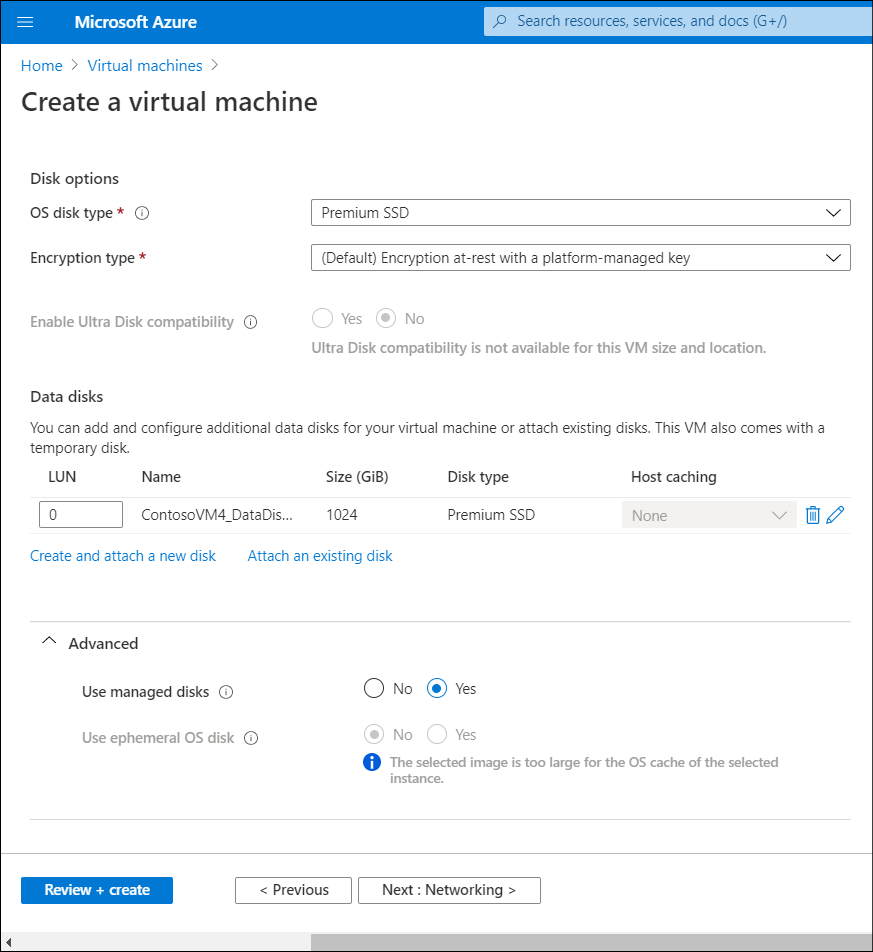

When deploying an Azure VM, Contoso IT staff must choose the type of disks that will host the operating system disk and optionally any data disks. In addition, each Azure VM will include temporary disks. The following table describes the characteristics of each of these types of disks.

|Type of disk|Description|
|----------------------|------------------------------------------------------------|
|Operating system disks|Each Azure VM has one operating system disk that contains the operating system drive. The maximum size of this disk is 2 terabytes (TB). On Azure VMs running Windows Server, the disk operating system is labeled as drive C.|
|Data disks|The maximum number of data disks you can attach to the Azure VM is dependent on the Azure VM size. Disks are a maximum size of 32 TB, unless you're using Ultra SSD storage. On Azure VMs running the Windows operating system, you can assign any available drive letter (starting with F), or mount the disk without assigning a drive letter.|
|Temporary disks|You can have one temporary disk per Azure VM. The disk size is dependent on the size of the Azure VM. On VMs running Windows Server, these drives are labeled as drive D. These disks provide temporary, non-persistent storage, and by default, host the paging file. The temporary disk resides on the host where the Azure VM runs.|

## Choose appropriate disk storage

Azure offers two primary tiers of Azure Storage—Standard and Premium—both of which are capable of storing Azure VM disk files. In both cases, Azure VM disks take the form of .vhd files stored as page blobs, because page blobs are optimized for random read-write access.

Premium Storage vs. Standard Storage:

- Premium Storage offers superior performance, equivalent to what SSD technology provides.
- Standard Storage provides performance similar to commodity magnetic disks, referred to typically as *hard disk drives* (HDD).

All Azure VM sizes support Standard Storage. A large number of Azure VM sizes also support Premium Storage.

> [!TIP]
> You can easily distinguish Premium Storage by the letter *S* in the Azure VM size designation.

## Unmanaged and managed disks

All Azure VM disks reside in Azure Storage accounts. An Azure Storage account is a logical namespace that, depending on its type, is capable of hosting different types of objects, including blobs, tables, queues, and files. When deploying an Azure VM, you must choose the type of disks that will host the operating system disk, and optionally, data disks. You can use unmanaged or managed disk types.

### Unmanaged disks

The use of unmanaged disks involves potentially significant administrative overhead. You must decide how many storage accounts you will create, then create those accounts, then decide how you will distribute .vhd disk files across them. You must also manually implement resiliency provisions by ensuring that when provisioning two or more Azure VMs into the same availability set, their respective storage accounts don't reside in the same storage stamp.

> [!NOTE]
> A Storage Stamp is a cluster of several racks of storage nodes with each rack built out as a separate fault domain with redundant networking and power supply.

### Managed disks

You can eliminate this administrative overhead by using managed disks. With this approach, the Azure platform controls Azure VM disk files placement and hides the complexity associated with managing Azure Storage accounts. Managed disks include the following benefits:

- Far higher number of disks per subscription
- Built-in resiliency for disks attached to Azure VMs in the same availability set
- Support for Azure VMs deployed into availability zones
- Granular, disk-level Role-Based Access Control (RBAC) permissions
- Support for server-side and Azure Disk Encryption
- Support for conversion between Standard and Premium storage tiers
- Ability to create an Azure VM from a custom image stored in any storage account in the same region and the same subscription

> [!NOTE]
> With unmanaged disks, you must store Azure VM disks in the same storage account as the image.

> [!CAUTION]
> Make sure you choose the disk type you want to use at the time of Azure VM deployment. While you can convert Azure VM unmanaged disks to managed disks, this requires stopping and deallocating all VMs in the availability set. In addition, there is no support for converting managed disks to unmanaged disks.
