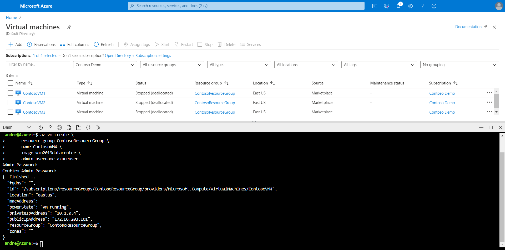

Contoso IT staff have discovered that deploying Azure VMs differs from deploying on-premises physical or virtual computers in several ways. These differences are primarily because of the unique characteristics of the public cloud operational model. Azure VMs also have some distinct features that distinguish them from computers residing in on-premises datacenters. In particular:

- When deploying Azure VMs, you cannot specify arbitrary processing, memory, or storage parameters. Instead, you select from a list of predefined configuration options that represent a range of different VM series and sizes. The VM series and size determine characteristics such as:
  - Number and type of processors
  - Amount of memory
  - Maximum number of network adapters and data disks you can attach to it
  - Support for SSD storage and its type (Standard SSD versus Premium SSD)
  - Maximum size of a temporary disk

  > [!NOTE]
  > While this list might seem constraining, considering the substantial number of available Azure VM series and sizes, you should be able to find the proper fit for the majority of your workloads. In addition, if your workload requirements change, you have the option to change the currently assigned size.

- The use of predefined sizes implies limits on the compute, storage, and network resources available to individual Azure VMs.
- Azure VMs, just as with other cloud-based resource types, are inherently more agile than on-premises virtual or physical computers. You can provision and scale them on an as-needed basis.  

## Deployment methods

To deploy Windows Server on Azure VMs, you can use any of the methods described in the following table.

|Method|Explanation|
|---------------------------------------|------------------------------------------------------------|
|The Azure portal|This method is most straightforward because it provides a wizard-driven interface with default settings that represent the most common configuration options. For example, for Azure VMs based on Windows Server images, using the Azure portal gives you the option to automatically configure a network security group (NSG) rule allowing Remote Desktop Protocol (RDP) connections. However, this method has limited flexibility. For example, it doesn't support custom images or attaching additional NICs during provisioning. This method is also not ideal for deploying large numbers of Azure VMs.|
|Azure PowerShell|This method offers automation and full flexibility, including support for multiple NICs and custom images.|
|Azure CLI|This method is equivalent to using Azure PowerShell in terms of flexibility and automation capabilities. The difference is merely the preference of the person performing the deployment.|
|Azure Resource Manager templates|This method provides full flexibility and the best performance for large Azure VM deployments.|
|Windows Admin Center|This method enables you to create an Azure VM with custom settings  by using Storage Migration Service or by using Storage Replica. The process of creating a custom Azure VM from Windows Admin Center has a number of prerequisites. First, you need to register Windows Admin Center with Azure. Next, you must sign in by using an account with an Azure RBAC role sufficient to provision Azure VMs. In addition, you must have an existing Resource Group that will host the Azure VM resources and an Azure virtual network with a subnet to which the new Azure VM will be connected.|

For example, to deploy a Windows Server 2019 Azure VM called **ContosoVM4** by using Azure CLI, you would run the following commands:

```Azure CLI
az vm create \
    --resource-group ContosoResourceGroup \
    --name ContosoVM4 \
    --image win2019datacenter \
    --admin-username azureuser
```

[](../media/m8-add-shell-1.png#lightbox)

## Additional reading

You can learn more by reviewing the following document:

- [Sizes for Windows virtual machines in Azure](https://aka.ms/Windows-VM-sizes-Azure?azure-portal=true).

> [!NOTE]
> If you want to try creating a Windows Server VM, try the following sandboxed exercise: [Create a Windows virtual machine](https://aka.ms/3-exercise-create-a-vm?azure-portal=true).
