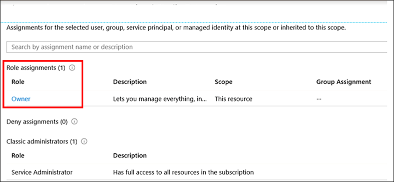

You’ve decided to use the Azure Migrate: Server Migration tool for the migration pilot. Your next task is to ensure that you meet all the prerequisites for the Azure Migrate deployment.
Before beginning the migration, you need to prepare Azure to interact with the on-premises environment.

In this unit, you’ll review the Azure permissions needed for an Azure Migrate deployment. As you already created an Azure Migrate project for discovery and  assessment, you’ll review and ensure you have met any prerequisites that Azure needs for the migration.

## Assign Azure permissions

You’ll need to set up permissions to:

- Create an Azure Migrate project
- Register the Azure Migrate appliance

Whether assessing your on-premises environment or migrating your workloads, you create an Azure Migrate project. Your Azure account needs permissions to create the Azure Migrate project.

### Verify permissions to create the project

In Azure portal, open the subscription and check that the account you plan to use for the Azure Migrate project has **Owner** or **Contributor** permissions.

The business unit that owns the subscription has already assigned you the Owner role, which is why you were able to create the project for the VM discovery and assessment phase.

### What is the Azure Migrate appliance?

As part of the discovery and assessment phase, Azure Migrate: Server Assessment creates a single virtual machine, called a migration appliance, that runs in your on-premises environment. The appliance collects data about your on-premises Hyper-V VMs that you plan to migrate and Azure Migrate uses that data to assess your environment.

When creating an Azure Migrate project, you enable the Azure Migrate: Server Assessment tool for machine discovery and assessment. To set up the appliance, you download a compressed Hyper-V VHD file, which you then configure and register with the Azure Migrate project.

### Appliance registration process

Registering the appliance enables it to push the metadata collected during discovery and assessment to the Azure Migrate project. To do this, Azure Migrate creates two Microsoft Entra apps during appliance registration.

- The first app communicates with Azure Migrate service endpoints.
- The second app is used by the appliance to create an Azure Key Vault, which stores Microsoft Entra app information and appliance configuration settings. (For VMware virtual machine migration, download an OVA file instead.) 

When you register the appliance, these resource providers are registered with the subscription chosen in the appliance:

- Microsoft.OffAzure
- Microsoft.Migrate
- Microsoft.KeyVault

Registering a resource provider configures your subscription to work with the resource provider. Not only do you need **Owner** or **Contributor** role to create an Azure Migrate project, but also to configure and register the appliance.

### Assign permissions to register the appliance

To register the appliance, the Azure account needs permissions for Azure Migrate to create the Microsoft Entra apps. A tenant/global administrator can assign the required permissions in either of two ways:

- Grant permissions to users in the tenant to create and register Microsoft Entra apps.
- Assign the Application Developer role (that has the permissions) to the account.

The apps need only enough access permission to create and register the AD apps, and don’t inherit permissions for any other actions on the subscription. You can revoke the permissions once discovery is set up.

Your global administrator has granted permissions by navigating in Microsoft Entra ID to **Microsoft Entra ID** > **Users** > **User Settings** and setting **App registrations** to **Yes**.

## Finalize setting up Azure prerequisites

Remember to review your assessment and analyze your on-premises workloads. Consider network bandwidth, database performance, and storage capacity, and compare them to their Azure equivalents. Address any mismatches and ensure the migrated workloads will meet all the needs of your system. For example, if you need to dynamically scale your apps to meet changing requirements, you can use the built-in Azure Autoscale feature.

In the next unit, you’ll focus on preparing your on-premises environment for the migration pilot.

### Set up an account for VM discovery

The small subset of applications you’ve selected to migrate to Azure for the pilot run on a single Hyper-V host. You’ve purposefully constrained the scope of the pilot to learn as much as possible before deploying a fuller migration of your on-premises estate.

When creating the assessment, Azure Migrate also needs permissions to discover on-premises VMs. You set up a single account for the Hyper-V host and VMs you want to include in the discovery. You can set the account up to be a domain or local user account with Administrator permissions on the host.

You can also choose to create a local user account without Administrator permissions that the Azure Migrate service uses to communicate with the Hyper-V host. Instead, you would add the user account to the following groups:

- Remote Management Users
- Hyper-V Administrators
- Performance Monitor Users

### Allocate storage and networking resources

In the migration process, Azure Migrate creates only the VMs, their network interfaces, and their disks. So, before you can migrate your VMs, you must create all other required resources in advance.

First create a new Azure storage account that Azure Migrate: Server Migration uses to store virtual machine data during migration. For the migration pilot, you’ll create a general purpose storage account that uses locally-redundant storage (LRS) replication. 
You’ll also need to create a new Azure virtual network that your migrated virtual machines will use when they are migrated to Azure. You specify this network when you configure the migration in the Azure Migrate project.

Before you migrate, assign the Virtual Machine Contributor role to your Azure account so that you can: 

- Create a VM in the selected resource group.
- Create a VM in the selected virtual network.
- Write to an Azure managed disk.
