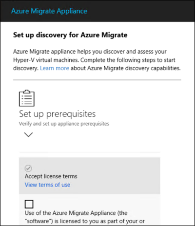
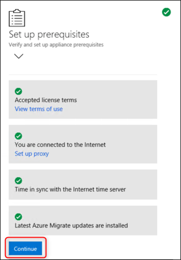
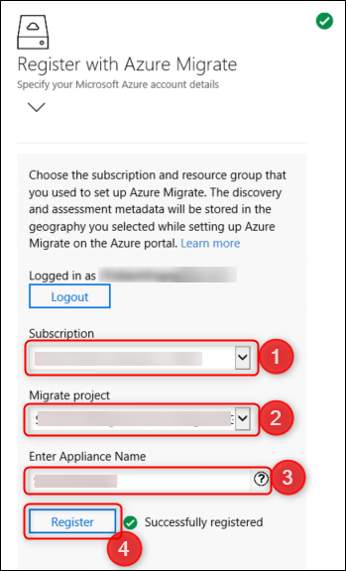

During the assessment phase you used the Azure Migrate Server Assessment tool to discover and assess VMs in your on-premises Hyper-V environment. As part of the process, Azure Migrate uses a lightweight Hyper-V VM called the Azure Migrate appliance.

You don’t have to perform an assessment when you create an Azure Migrate project, however it is recommended you do so. Even if you choose to skip the assessment and proceed directly to migration, you must still download and set up the appliance. 

In this unit, you’ll learn how to download, create, and configure the appliance VM. You’ll also learn how to register the appliance with the Azure Migrate project.

## Work with the Azure Migrate appliance

The Hyper-V host should be running Windows Server 2012 R2 or later and should have sufficient space to allocate RAM, CPU, and storage. When deploying the Azure Migrate appliance, you’ll create a network switch that the appliance uses to communicate with the Hyper-V host.

### Download the migration appliance

When you first deploy an Azure Migrate project, you select the tools you’ll use to assess and migrate your on-premises VMs. Azure Migrate: Server Assessment lets you discover and assess resources for either a VMware or Hyper-V environment. 

From the Azure Migrate project, you can download the appliance that you’ll set up and connect to Azure Migrate. 

1. In the Azure Migrate: Server Assessment panel, select **Discover** to open the Discover machines blade. 
2. In the **Are your machines virtualized?** dropdown list, select **Yes, with Hyper-V**.

Azure Migrate presents the link for the VHD file with which you can create a new virtual machine on your Hyper-V host server.

### Confirm the ZIP file is secure

Before deploying the appliance VM, verify the zipped file is secure. Run the following PowerShell command:

`Get-FileHash -Path ./AzureMigrateAppliance_v2.19.11.12.zip -Algorithm SHA256`

The command generates a hash for the zipped VHD file. The hash should match these settings.

> |**Algorithm**|**Hash value**|
> |-|-|
> |MD5|29a7531f32bcf69f32d964fa5ae950bc|
> |SHA256|37b3f27bc44f475872e355f04fcb8f38606c84534c117d1609f2d12444569b31|

### Create the appliance VM

After verifying the zipped VHD file is secure, extract the zipped file. Using Hyper-V Manager, import the VHD file. Specify a virtual network switch for the VM to use and create the Azure Migrate appliance VM.

Before starting the appliance, configure network subnets in your existing on-premises environment so that the appliance can obtain the appropriate IP address. The appliance also connects to specific Azure URLs during discovery and assessment. Azure documentation lists the [URL](https://docs.microsoft.com/azure/migrate/migrate-appliance#url-access) and [port access](https://docs.microsoft.com/azure/migrate/migrate-support-matrix-hyper-v#port-access) requirements for the appliance VM. Review the list and make sure those are in place before deploying the appliance.

### Configure the appliance VM

Next, configure the appliance VM and register it with the Azure Migrate project. When you set up the appliance for the first time, you’re ready for discovery and assessment. Deploying and setting up the appliance also prepares Azure Migrate for the migration phase.

In Hyper-V Manager, connect to the appliance VM and when requested, provide a password for the built-in administrator account. When the appliance VM is running, open a browser on a computer that can connect to the appliance.

Type the URL **https://appliancename-or-IPAddress:44368**. This opens the appliance web app, where you configure the appliance for use. You first verify and set up appliance prerequisites and then register the appliance with Azure Migrate.

Accept the license terms

The appliance web app steps through the process of configuring the appliance. Internet connectivity and computer time synchronization verification should pass automatically. Wait while the app installs latest Azure Migrate updates. You may be prompted for administrator credentials and to restart the management app.

When you’ve completed setting up the prerequisites, select **Continue** to proceed to appliance registration.

### Register the appliance VM

Next, register the appliance with Azure Migrate.

Click **Login**. The appliance web app opens a separate browser tab where you enter the Azure subscription credentials. Return to the appliance web app tab and then:

1. Select the subscription in which the Azure Migrate project was created
2. Select the project
3. Specify a name for the appliance
4. Click **Register**.

From this point, the appliance web app steps through the remainder of the process to get discovery and assessment underway. You’ve already completed your assessment and are ready to begin the migration.