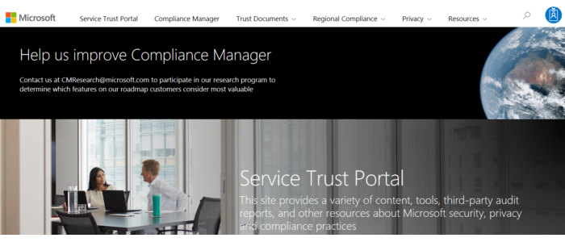

The **Service Trust Portal** (STP) hosts the Compliance Manager service, and is the Microsoft public site for publishing audit reports and other compliance-related information relevant to Microsoft’s cloud services. Service Trust Portal users can download audit reports produced by external auditors and gain insight from Microsoft-authored reports that provide details on how Microsoft builds and operates its cloud services.

Service Trust Portal (STP) also includes information about how Microsoft online services can help your organization maintain and track compliance with standards, laws, and regulations, such as:

- ISO
- SOC
- NIST
- FedRAMP

Service Trust Portal is a companion feature to the Trust Center, and allows you to:

- Access audit reports across Microsoft cloud services on a single page.
- Access compliance guides to help you understand how can you use Microsoft cloud service features to manage compliance with various regulations.
- Access trust documents to help you understand how Microsoft cloud services help protect your data.
 
**Accessing the Service Trust Portal**

To access some Service Trust Portal materials, you must sign in as an authenticated user with your Microsoft cloud services account (either an Azure AD organization account or a Microsoft account), and then review and accept the Microsoft Non-Disclosure Agreement for Compliance Materials.

Existing customers can access the Service Trust Portal at the [Service Trust Portal](https://aka.ms/STP?azure-portal=true) webpage, with one of the following online subscriptions (trial or paid):

- Microsoft 365
- dynamics-365 365
- Azure
