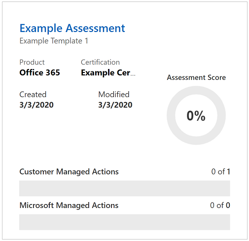

[Compliance Manager](https://docs.microsoft.com/microsoft-365/compliance/meet-data-protection-and-regulatory-reqs-using-microsoft-cloud?azure-portal=true) is a workflow-based risk assessment dashboard within the Trust Portal that enables you to track, assign, and verify your organization's regulatory compliance activities related to Microsoft professional services and Microsoft cloud services such as Office 365, Dynamics 365, and Azure.

Compliance Manager provides the following features:

+ Detailed information provided by Microsoft to auditors and regulators, as part of various third-party audits of Microsoft 's cloud services against various standards (for example, ISO 27001, ISO 27018, and NIST).
 
+ Information that Microsoft compiles internally for its compliance with regulations (such as HIPAA).

+ An organization's self-assessment of their own compliance with these standards and regulations.

+ Enables you to assign, track, and record compliance and assessment-related activities, which can help your organization cross team barriers to achieve your organization's compliance goals.

+ Provides a Compliance Score to help you track your progress and prioritize auditing controls that will help reduce your organization's exposure to risk.

+ Provides a secure repository in which to upload and manage evidence and other artifacts related to compliance activities.

+ Produces richly detailed reports in Microsoft Excel that document the compliance activities performed by Microsoft and your organization, which can be provided to auditors, regulators, and other compliance stakeholders.

Compliance Manager provides ongoing risk assessments with a risk-based scores reference displayed in a dashboard view for regulations and standards. Alternatively, you can create assessments for the regulations or standards that matter more to your organization.

As part of the risk assessment, Compliance Manager also provides recommended actions you can take to improve your regulatory compliance. You can view all action items or select the action items that correspond with a specific certification.

> [!div class="checklist"]
> * Compliance Manager is a dashboard that provides a summary of your data protection and compliance stature, and recommendations to improve data protection and compliance. The Customer Actions provided in Compliance Manager are recommendations only; it is up to each organization to evaluate the effectiveness of these recommendations in their respective regulatory environment prior to implementation. Recommendations found in Compliance Manager should not be interpreted as a guarantee of compliance.
