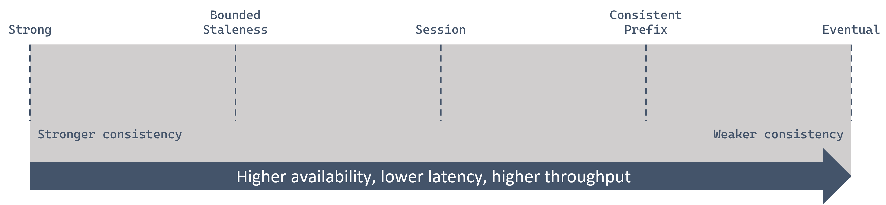

In the previous unit, we discussed how Azure Cosmos DB replicates its data to Azure Data Centers around the world. In this section we'll understand how the different consistency levels balance between availability, latency and throughput of the replicated data. 

## Understanding Consistency models

In a distributed database system, when data replicates over a wide area network to other regions to provide higher availability or lower read latency for users, tradeoffs must be made. The tradeoff will be made either on the data that is completely consistent across the database or in higher write latency as data is synchronously committed to the other regions.

Azure Cosmos DB offers a sliding scale of consistency with many options between the traditional strong and weak options provided by other data storage solutions.

[!div class="mx-imgBorder"]

Each of the five consistency levels is well-defined with clear tradeoffs when compared with each other:

| **Consistency Level** | **Description** |
| ---: | --- |
| **Strong** | Linear consistency. Data is replicated and committed in all configured regions before acknowledged as committed and visible to all clients. |
| **Bounded Staleness** | Reads lag behind writes by a configured threshold in time or items. |
| **Session** | Within a specific session (SDK instance), users can read their own writes. |
| **Consistent Prefix** | Reads may lag behind writes, but reads will never appear out of order. |
| **Eventual** | Reads will eventually be consistent with writes. |

### Strong consistency

Strong consistency guarantees that all read operations will return the most recent version of the item. Client applications will never read an outdated item due to latency or inconsistency. Write operations aren't fully committed until they're ready in all other regions.

This characteristic causes strong consistency to have the highest write latency as it must wait for commits to replicate across large geographical distances.

### Bounded Staleness consistency

Bounded staleness is similar to Strong consistency except that reads are allowed to lag behind writes up to a defined threshold. That threshold could be defined as:

- **K** versions of an item lag behind the writes.
- **T** time interval lag behind the writes.

Bounded staleness is a good compromise for applications that want low write latency but need to enforce consistency up to a reasonable threshold.

> [!TIP]
> Bounded staleness provides strong consistency guarantees within the region in which data is written.

### Session consistency

Session consistency provides read your own write guarantees within a single client session or where the session token is passed between the SDK and client. Otherwise, the consistency guarantee is relaxed to either Consistent Prefix or Eventual consistency.

Session consistency is a great option for applications where the end users may be confused if they can't immediately see any transaction they just made.

> [!NOTE]
> Session is a client-centric consistency model which is not natively supported by MongoDB.

### Consistent Prefix consistency

Consistent Prefix consistency allows for looser consistency and higher performance while guaranteeing that reads, which lag behind the writes, will appear in order written.

Consistent Prefix consistency is ideal for applications where the order of read operations matters more than the latency.

### Eventual consistency

Eventual consistency is the weakest form of consistency where reads lag behind writes and reads may appear out of order. However, eventual consistency will have the lowest write latency, highest availability, and potential for most read scalability compared to other options.

Eventual consistency is a good option for applications that don't require any linear or consistency guarantees.

## Consistency levels for Azure Cosmos DB API for MongoDB

The native MongoDB doesn't provide precisely defined consistency guarantees. Instead, native MongoDB allows users to configure the following consistency guarantees: a write concern, a read concern, and the isMaster directive - to direct the read operations to either primary or secondary replicas to achieve the desired consistency level.

When inserts, upserts and deletes are done in an Azure Cosmos DB API for MongoDB account, the MongoDB driver treats your write region as the primary replica and all other regions as read replicas. You can choose which region associated with your Azure Cosmos account as a primary replica.

While using Azure Cosmos DB’s API for MongoDB:

- The write concern is mapped to the default consistency level configured on your Azure Cosmos account.

- Azure Cosmos DB will dynamically map the read concern specified by the MongoDB client driver to one of the Azure Cosmos DB consistency levels that configures dynamically on a read request.

- You can annotate a specific region associated with your Azure Cosmos account as "Primary" by making the region as the first writable region.

### Mapping consistency levels

The following table illustrates how the native MongoDB write/read concerns are mapped to the Azure Cosmos consistency levels when using Azure Cosmos DB’s API for MongoDB:

| **MongoDB Write Concern** | **Default Consistency (set on the Cosmos DB account)** | **Region serving reads** | **MongoDB Read Concern** | **Cosmos Consistency Level A (dynamically set on a read request)** | **Guarantees offered by native MongoDB** | **Guarantees offered by Cosmos MongoDB API** |
| :--- | :--- | :--- | :--- | :--- | :--- | :--- |
| MAJORITY (W) | Strong | *IsMaster=true* | LOCAL, AVAILABLE | Bounded Staleness | Dirty Reads (Read Uncommitted) in steady state | Linearizable reads in the region where the write is performed |
| | | | | | Stale reads under split brain (network partitioning) | Bounded staleness in all other regions |
| | | | MAJORITY | Bounded Staleness | Linearizability in steady state | Linearizable reads in the region where the write is performed |
| | | | | | Stale reads under split brain (network partitioning) | Bounded staleness (time-bounded linearizability) in all other regions |
| | | | LINEARIZABILITY | Strong | Linearizability | Linearizability |
| | | | SNAPSHOT | Strong | Atomic reads across documents  | Linearizability |
| | | *IsMaster=false* | LOCAL, AVAILABLE | Consistent Prefix | Stale reads, dirty reads | Consistent Prefix |
| | | | MAJORITY | Strong | Stale reads | Linearizability |
| | | | LINEARIZABILITY/SNAPSHOT | Not Allowed | Not Allowed | Not Allowed |
| MINORITY (1 \< W \< Majority) | Bounded Staleness | *IsMaster=true* | LOCAL, AVAILABLE | Bounded Staleness | Dirty Reads in steady state | Linearizable reads in the region where the write is performed |
| | | | | | Stale reads under network partitioning | Bounded staleness (time-bounded linearizability) in all other regions |
| | | | MAJORITY | Bounded Staleness | Linearizability in steady state | Linearizable reads in the region where the write is performed |
| | | | | | Stale reads under network partitioning | Bounded staleness (time-bounded linearizability) in all other regions |
| | | | LINEARIZABILITY | Bounded Staleness | Linearizability | Linearizable reads in the region where the write is performed |
| | | | | | | Bounded staleness (time-bounded linearizability) in all other regions |
| | | | SNAPSHOT | Bounded Staleness | Linearizability | Linearizable reads in the region where the write is performed |
| | | | | | | Bounded staleness (time-bounded linearizability) in all other regions |
| | | *IsMaster=false* | LOCAL, AVAILABLE | Consistent Prefix | Stale reads, dirty reads | Consistent Prefix |
| | | | MAJORITY | Bounded Staleness | Stale Reads; Monotonic Reads | Bounded staleness configured via K and T along monotonicity |
| | | | LINEARIZABILITY/SNAPSHOT | Not Allowed | Not Allowed | Not Allowed |
| None (W=0) | Consistent Prefix | *IsMaster=true/false* | ANY | Consistent Prefix | Stale reads, dirty reads | Consistent Prefix |

If your Azure Cosmos account is configured with a consistency level other than the strong consistency, you can find out the probability that your clients may get strong and consistent reads for your workloads by looking at the [Probabilistically Bounded Staleness (PBS)](http://pbs.cs.berkeley.edu/) metric. This metric is exposed in the Azure portal, to learn more, see [Monitor Probabilistically Bounded Staleness (PBS) metric](/azure/cosmos-db/sql/how-to-manage-consistency?tabs=portal%2Cdotnetv2%2Capi-async#monitor-probabilistically-bounded-staleness-pbs-metric).

Probabilistically bounded staleness shows how eventual is your eventual consistency. This metric provides an insight into how often you can get a stronger consistency than the consistency level that you've currently configured on your Azure Cosmos account. In other words, you can see the probability (measured in milliseconds) of getting strongly consistent reads for a combination of write and read regions.
