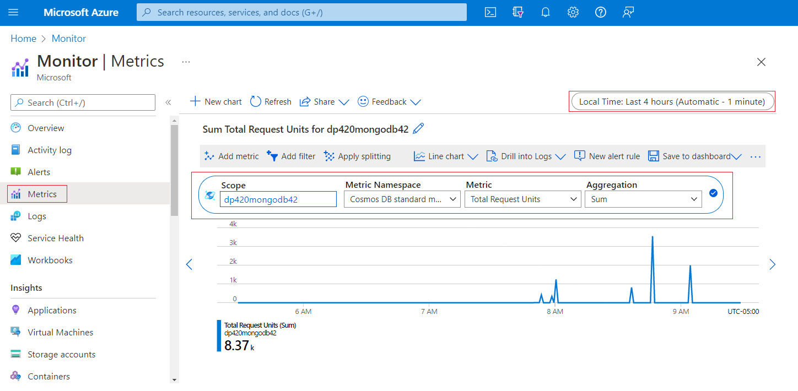
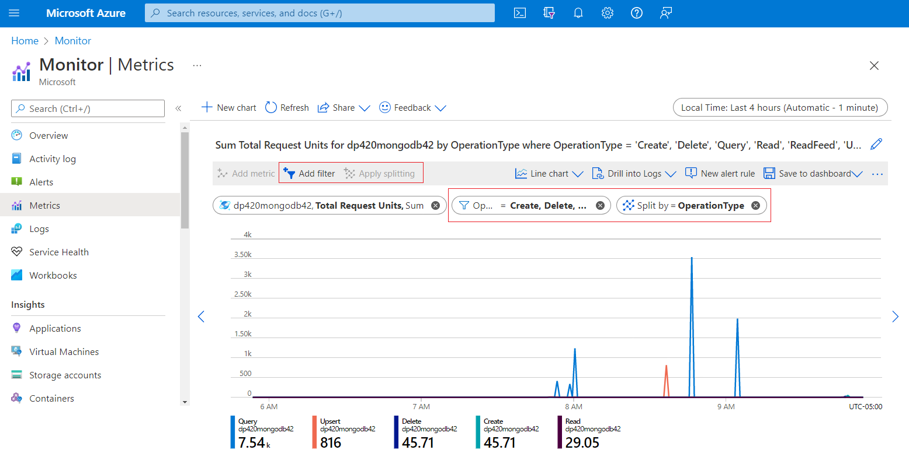
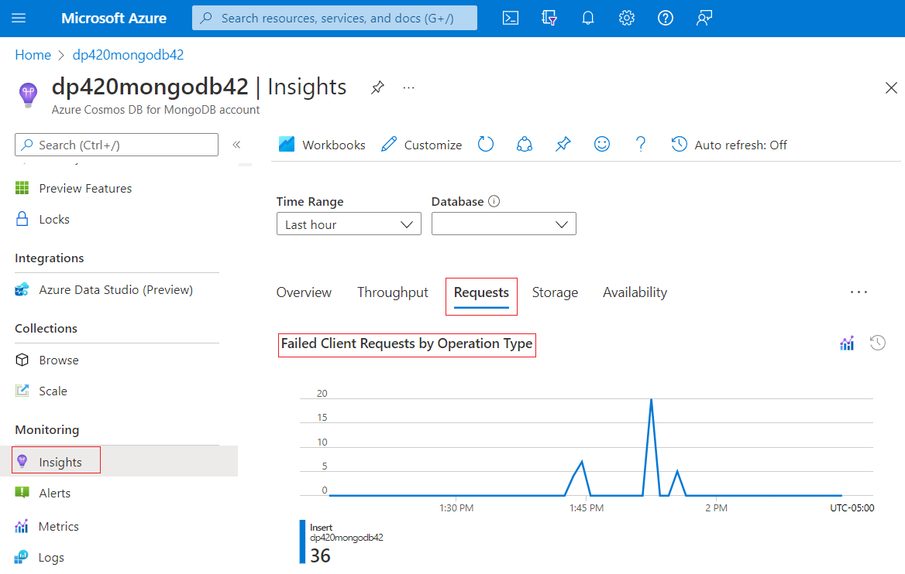
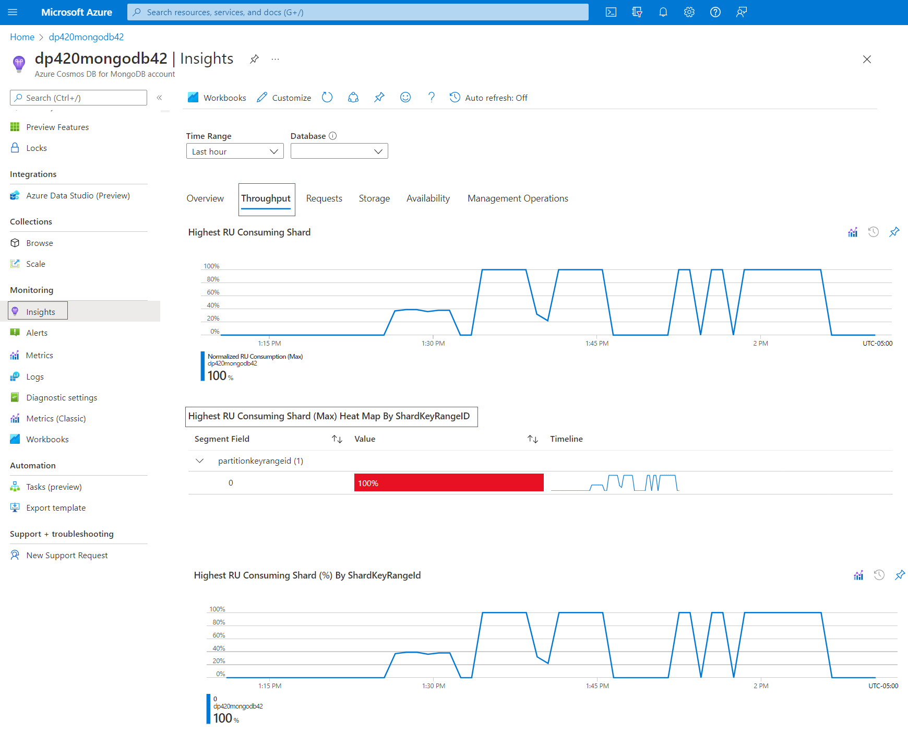

One of the most common administrative tasks for an Azure Cosmos DB account, is to monitor it for performance issues and events. In this unit we'll introduce Azure Cosmos DB monitoring using the Azure Monitor, Insights, Metrics and Logs.

## Understanding the Azure Monitor

Most applications using an Azure resource will create availability, performance, and operations metrics on both the application and Azure resource side. Azure Monitor is used to monitor the Azure resource availability, performance, and operations metrics.

Cosmos DB monitors its server-side counters using:

- **Azure Monitor to monitor metrics** - Azure Monitor collects Cosmos DB metrics by default. Metrics are collected every minute. The default retention period is 30 days. The collection includes throughput, storage availability, latency, consistency, and system level metrics. The dimension values for the metrics such as collection name are case-insensitive.
- **Azure Monitor to monitor diagnostic logs** - Telemetries such as events and traces are stored as logs.  For example, changing the throughput properties of a collection will be a logged event.  Queries can then be run against these logs to analyze the data collected.
- **The Azure Cosmos DB portal** - The throughput, storage availability, latency, consistency, and system level metrics can be found under the **Metrics** tab of the Azure Cosmos DB account.  The default retention period for these metrics is seven days.

In this module, the lesson will be limited to how Cosmos DB applies its monitoring using the Azure Monitor.  Azure Monitor for Cosmos DB can be used to:

    - Monitor data
    - Collection and routing
    - Analyze metrics
    - Analyze logs
    - Create Alerts
    - Monitor Azure Cosmos DB Programmatically 

Let's discuss these uses in a little more detail.

### Monitor data

The Overview page in the Azure portal for each Azure Cosmos database includes a brief view including the requests and hourly billing for the database.  This summary is just a small set of the metrics being collected by the Azure Monitor.  Besides the hourly billing and request metrics that the Cosmos Database Overview page displays, Azure Monitor collects other request metrics plus request units, storage, latency, availability, and Casandra API metrics.

### Collection and routing

By default Azure Monitor collects and stores Cosmos DB metrics automatically.  Azure Monitor can also route those metrics to other locations by using a diagnostic setting.  Unlike metrics, Resource Logs aren't collected and stored without first creating a diagnostic setting to route them.

### Analyze metrics

To analyze Cosmos DB metrics, use the metrics explorer by opening **Metrics** from the **Azure Monitor** menu in the Azure portal. To filter out the Cosmos DB metrics, pick  *Cosmos DB standard metrics* from the *Metric Namespace* pulldown.  Other filters can be added for the collection name, database name, operation type, region, and status code dimensions.

### Analyze logs

Azure Monitor Logs data is stored into tables.  Queries can be run against these tables to analyze their data. Azure Cosmos DB stores log data into the `AzureDiagnostics` and `AzureActivity` tables. To search the AzureDiagnostics table for Azure Cosmos DB entries, include a filter with the `resourceprovider` field equals to `MICROSOFT.DOCUMENTDB` in your queries. Additionally, Azure Cosmos DB also logs data to several resource-specific tables. 

> [!NOTE]
> Resource specific logs are also preferred because they are less expensive to collect. 

### Alerts

Azure Monitor can trigger alerts based on defined conditions.  These alerts can be set on metrics, logs, and the activity log. For example, you can get an alert when a collection or a database has exceeded the provisioned throughput limit.

## Using the Azure Monitor to measure throughput

Azure Monitor for Azure Cosmos DB provides the **Total Request Units** metric that can be used to analyze the request units consumed by the different Azure Cosmos DB operations. This metric can then be used to analyze those operations with the highest throughput.

By monitoring the *Total Request Unit* metric, we should be able to:

- Identify operations that are consuming more request units than others.
- Identify operations that are taking more cumulative request units in a given interval of time.

By identifying the operations with higher throughput, we can for example:

- Determine if these operations are insert and upserts, their index definition can be reviewed for over or under indexing-specific fields. We can then determine if we should include or exclude paths in their indexing policy.
- Modify the query to use and index with a filter clause.
- Use shard keys that will minimize the fan out of query into different shards.
- If possible, evaluate if a smaller result set would meet the query needs.

### View the Total Request Unit metrics

To view the **Total Request Units** metric, under Azure Monitor's Metrics

1. Search for *Monitor* and select ***Monitor***.
1. Select **Metrics** from the *Azure Monitor* left-hand menu.
1. Select the *Scope* in the *Select a scope* dialog.
    1. Select the correct subscription.
    1. Select ***Azure Cosmos DB accounts*** under *Resource types*.
    1. Expand the Resource Group where your Azure Cosmos DB account is in.
    1. Select your Azure Cosmos DB account
    1. Select the **Apply** button.
1. Under the *Metrics* column, select **Total Request Units** and the type of aggregation you need.
1. If needed, refine the *Time range* and **Time granularity** of the metric.

    > [!div class="mx-imgBorder"]
    > 

### Filter the Total Request Units further

By default, Azure Monitor will display the overall throughput of all Azure Cosmos DB operations the selected account does.  To better analyze the throughput, more granular filtering will be needed to find aggregate usage of the individual operation types, or to further compare the usage of multiple operation types at the same time. Using the **Add filter** and **Apply splitting** options will help us with those analyses.

Azure Monitor allows us to filter further by specific **CollectionName**, **DatabaseName**, **OperationType**, **Region**, **Status**, and **StatusCode**.  For example, we could add a filter by operation type to see the usage of our different Azure Cosmos DB operations.

> [!div class="mx-imgBorder"]
> 

## Observe rate-limiting events

Operations running in an Azure Cosmos DB API for MongoDB, might return a **16500** *status code error*. This error code, indicates that a **Request rate too large** exception has occurred. This exception means that Azure Cosmos DB requests are being rate limited.

> [!NOTE]
> In a production environment we ***shouldn't*** see any 16500 errors. In a production environment ***Server Side retries*** should always be enabled by default in your Azure Cosmos DB API for MongoDB account.

When provisioned throughput is used, the request units per second (RU/s) is set for the workload.  Operations (read, writes, queries) against the service consume request units(RUs). If in any given second the operations consume more RUs than the provisioned RU/s, Azure Cosmos DB will return a 16500 exception.

There are three main reasons why we get a 16500 exception:

- Request rate is large.
- The request didn't complete due to a high rate of metadata requests.
- The request didn't complete due to a transient service error.

Out of the three reasons listed, ***Request rate is large*** is the most common one. Azure Cosmos DB returns this exception when the RUs by operations on data exceed the provisioned RU/s.

The first step to research a **16500** exception is to review the **Failed Client Request by Operation Type** charts for occurrences of the *16500* exception. This chart can be found under the ***Requests*** tab of the *Insight* monitoring option in the Cosmos DB account page. Further filter the charts by *Time Range* and *Database* to your desired time span and database. For most applications, it's normal to have less than 5% of the request with *16500* exceptions.

> [!div class="mx-imgBorder"]
> 

If the percentage of *16500* exceptions is higher than 5%, it's possible that the exceptions are caused by a hot shard.

To verify if the database access is coming across a hot shard, in the Azure portal under the Azure Cosmos DB account, under  **Insights->Throughput**, review the **Highest RU Consuming Shard (Max) Heat Map By ShardKeyRangeID** charts.

> [!div class="mx-imgBorder"]
> 

> [!NOTE]
> Besides rate-limiting exceptions, some other exceptions can also be raised by Azure Cosmos DB. To review some of those exceptions, please see the *[Troubleshoot common issues in Azure Cosmos DB's API for MongoDB](/azure/cosmos-db/mongodb/error-codes-solutions#common-errors-and-solutions)* article.

Now that we've seen how to use the Azure Monitor tool to observe the Azure Cosmos DB account operations, in the next unit, let's query the *Azure diagnostic logs* to help us further monitor our Azure Cosmos DB account.
