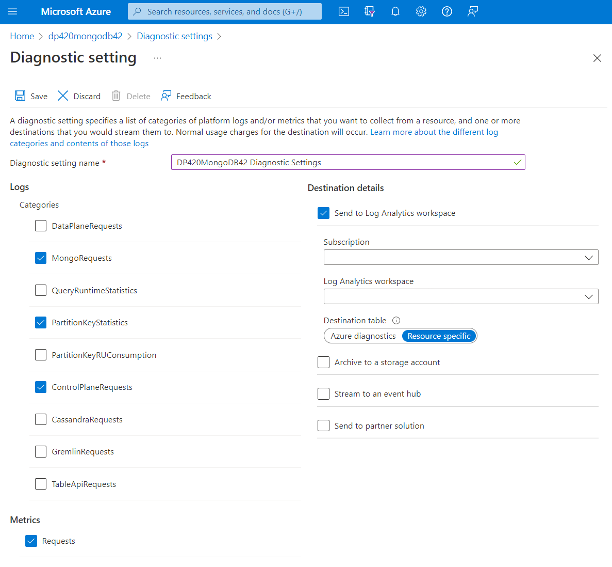

Azure resources produce Azure diagnostic logs, which provide detailed operational data of those resources. Diagnostics settings are use to collect those resource logs. In this unit, we'll learn how to use these logs to further help us monitor Azure Cosmos DB.

## Resource logs

While some logs like activity and platform metrics are collected automatically, diagnostic settings must be created to collect resource logs. These logs can be forwarded outside of Azure Monitor.  Enabling diagnostics settings in Azure Cosmos DB accounts can be forwarded to *Log Analytics workspaces*, *Event hubs*, and *Storage Accounts*.

Forwarding data to Log Analytics workspaces, writes the logs into tables that can be queried using the *Kusto Query Language* (*KQL*). So, to use the diagnostic data stored in these tables, knowledge on reading and writing *Kusto* queries is essential. These tables can be a generic legacy table called **Azure Diagnostics**, or the recommended **Resource-specific** tables.

## Create Azure Cosmos DB diagnostics settings

There are multiple ways to create the diagnostics settings, using the Azure portal, the REST API, PowerShell or Azure CLI.

To create the diagnostics settings using the Azure portal:

- Navigate to the Azure Cosmos DB account, and under the *Monitoring* section, choose **Diagnostic settings**.
- The status of Full-text query will be displayed as *enabled* or *disabled*. If it's disabled select the ***Go to Feature and enable*** button. Enable the feature and come back to *Diagnostic settings*. Select the ***Not Now*** button to continue.
- Either edit an existing diagnostic setting or choose **+ Add diagnostic setting** and choose the logs you wish to collect and the destinations to forward these logs to.
- **Save** the Diagnostic settings.

    > [!div class="mx-imgBorder"]
    > [](../media/5-monitor-diagnostics-settings.png#lightbox)

    > [!NOTE]
    > If you enable Full-text query, you will be able to see the queries themselves. These queries could expose some data coded in the query filters. For example, if you're filtering *where SSN == '123-45-6789'*, the string *'123-45-6789'* will appear in your Kusto query results. Obviously, the results of the query itself will not be returned in the diagnostic logs, just the query text.

The MongoDB API log categories are:

- **DataPlaneRequests** - This category logs back-end requests for operations that execute create, update, delete, or retrieve data within the account.
- **MongoRequests** - Logs user-initiated requests from the front end to serve requests to Azure Cosmos DB API for MongoDB. *When you enable this category, make sure to disable DataPlaneRequests*.
- **PartitionKeyStatistics** - This category logs logical shard key statistics in estimated KB. It's helpful when troubleshooting skew storage.
- **ControlPlaneRequests** - This category logs Azure Cosmos DB account control data, for example adding or removing regions in the replication settings.

## Troubleshoot issues with diagnostics queries

When Azure Cosmos DB diagnostics data is sent to Log Analytics, it's sent to either the **AzureDiagnostics** table or to **Resource-specific** tables. The preferred mode is to send the data to Resource-specific tables, as such, each log chosen under the diagnostics settings options will have its own table. Choosing this mode makes it easier to work with the diagnostic data, easier to discover the schemas used, and improve performance in latency and query times.

### AzureDiagnostics queries

If the legacy mode is chosen, the diagnostics data will be stored in the **AzureDiagnostics** table, so all *Kusto* queries will be executed against that table. Since multiple Azure resources could also be populating this table, include the filter ***ResourceProvider=="MICROSOFT.DOCUMENTDB"*** in your ***where*** clause, to only return Azure Cosmos DB entries. Additionally, to differentiate between the different logs you picked under *diagnostic settings*, add a filter on the ***Category*** column.  For example, to return documents for the *MongoRequests* log, include the where clause ***| where ResourceProvider=="MICROSOFT.DOCUMENTDB" and Category=="MongoRequests"***. Kusto is case-sensitive so make sure your column names are the right case. Let's review a couple of *Kusto* query examples using the **AzureDiagnostics** table.

- Query that returns the count and the total request charged of the different Azure Cosmos DB operation types in the last hour.

    ```kusto
    AzureDiagnostics 
    | where TimeGenerated >= ago(1h)
    | where ResourceProvider=="MICROSOFT.DOCUMENTDB" and Category=="DataPlaneRequests" 
    | summarize OperationCount = count(), TotalRequestCharged=sum(todouble(requestCharge_s)) by OperationName
    | order by TotalRequestCharged desc 
    ```

- Create a query that returns a timechart graph for all successful and rate limited request in the last hour.  The requests will be aggregated every 10 minutes.

    ```kusto
    AzureDiagnostics 
    | where TimeGenerated >= ago(1h)
    | where ResourceProvider=="MICROSOFT.DOCUMENTDB" and Category=="DataPlaneRequests" 
    | summarize requestcount=count() by statusCode_s, bin(TimeGenerated, 10m)
    | render timechart 
    ```

### Resource-specific Queries

Unlike the **AzureDiagnostic** queries, the resource-specific queries will be run against the different tables that were created for each log category chosen in the diagnostic setting dialog. To use these tables, prefix the table names in the list above with the string ***CDB***.  Let's review a couple of examples.

- Query that returns the count and the total request charged of the different Azure Cosmos DB operation types in the last hour.

    ```kusto
    CDBDataPlaneRequests
    | where TimeGenerated >= ago(1h)
    | summarize OperationCount = count(), TotalRequestCharged=sum(todouble(RequestCharge)) by OperationName
    | order by TotalRequestCharged desc 
    ```

- Create a query that returns a time-chart graph for all successful and rate limited request in the last hour.

    ```kusto
    CDBDataPlaneRequests 
    | where TimeGenerated >= ago(2h)
    | summarize requestcount=count() by StatusCode, bin(TimeGenerated, 10m)
    | render timechart 
    ```

Using Kusto to query the Azure diagnostic logs, allows you to create complex queries to better analyze how your Azure Cosmos DB database is working. To learn more about Kusto and its queries, see the [Kusto Query Language (KQL) overview](/azure/data-explorer/kusto/query/) article.
