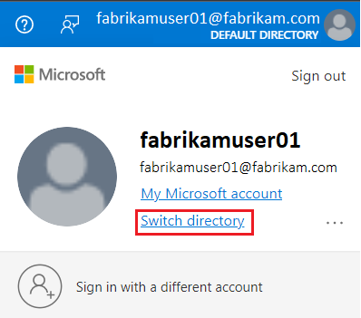

In this exercise, we monitor an Azure Cosmos DB account using both the Azure Monitor and Azure diagnostic logs.

This exercise can be completed using a Microsoft Learn *sandbox*, which provides a temporary Azure subscription. To activate the sandbox subscription, you must sign in using a Microsoft account. The sandbox subscription is automatically deleted when you complete this module. After the sandbox is active, [sign into the Azure portal using the credentials for your sandbox subscription](https://portal.azure.com/learn.docs.microsoft.com?azure-portal=true). Ensure you're working in the **Microsoft Learn Sandbox** directory - indicated at the top right of the portal under your user ID. If not, select the user icon and switch directory.

> [!TIP]
> If you prefer, you can use your own Azure subscription. To do so, [sign into the Azure portal using credentials for your subscription](https://portal.azure.com?azure-portal=true). Ensure you are working in the directory containing your subscription - indicated at the top right under your user ID. If not, select the user icon and switch directory.

## Monitor an Azure Cosmos DB for MongoDB account

In this exercise, we create an Azure Cosmos DB account, add some data to it, and run some queries to create some load we can monitor. We also force some rate-limiting exceptions to learn how to identify those types of errors. Let's first set up our environment.

### Prepare your development environment

If the Azure Cosmos DB account and environment where you're working on this lab isn't ready, follow these steps to do so. Otherwise, go to the ***Enable the Azure Cosmos DB Diagnostic Settings*** section.

1. In Azure Cloud Shell, copy and paste the following commands.

    1. *If you're using the Sandbox*, a resource group was created for you so run the following script.

        ```bash
        # Create an Azure Cosmos DB for MongoDB account and add the customer collection
        git clone https://github.com/MicrosoftLearning/mslearn-cosmosdb.git
        GitRepositoryRoot=$(pwd)
        bash "$GitRepositoryRoot/mslearn-cosmosdb/api-for-mongodb/04-monitor-cosmos-db-mongodb-account/init.sh"
        ```

    1. If you already have a resource group you want to use in your environment, replace the string ***YOURRESOURCEGROUPNAMEHERE*** for the name of your resource group. *If you aren't using the Sandbox, you need to run the ***az login*** command before running the following ***init*** bash script*.

        ```bash
        # Create an Azure Cosmos DB for MongoDB account and add the customer collection
        git clone https://github.com/MicrosoftLearning/mslearn-cosmosdb.git
        GitRepositoryRoot=$(pwd)
        # Replace YOURRESOURCEGROUPNAMEHERE for the name of your Resource Group
        bash "$GitRepositoryRoot/mslearn-cosmosdb/api-for-mongodb/04-monitor-cosmos-db-mongodb-account/init.sh" -r YOURRESOURCEGROUPNAMEHERE
        ```

    > [!Tip]
    > If you want to specify the location where you would like to create your database and storage objects, add a ***-l LOCATIONNAME*** parameter to the *init.sh* call.

    > [!NOTE]
    > This bash script will create the Azure Cosmos DB for MongoDB account and copy the customer collection into that account. *It can take 5-10 minutes to create this account* so it might be a good time to get a cup of coffee or tea.

1. Copy the returned string somewhere, we need it later in the lab.

1. Since we're using the Azure portal with the Sandbox, don't forget to switch the directory on the Azure portal to use the Resource Group created by the Sandbox.

1. ***Don't close out of the sandbox***. On a *different* browser window or *tab*, sign in to the Azure portal using the same account you connected to the sandbox with.

1. On the upper right hand corner of the Azure portal, verify the directory you're logged in to, if it points to the **Default Directory** or something different than the **Microsoft Learn Sandbox** directory continue to the next step, otherwise continue to the next section.

1. Select the user icon on the upper right hand corner besides your sign-in name. Select **Switch Directory**.

    > [!div class="mx-imgBorder"]
    > [](../media/6-switch-directory-login.png#lightbox)

1. Select the **Switch** button. You notice in the upper right hand corner that you should now be in the Microsoft Learn Sandbox directory.

    > [!div class="mx-imgBorder"]
    > [](../media/6-switch-directory.png#lightbox)

Let's continue with the lab.  

### Enable the Azure Cosmos DB Diagnostic Settings

Later in the exercise, we run some Kusto queries to look at some Azure Cosmos DB metrics. The problem is that these settings take a few minutes to be available. Let's prepare those settings now so we have them ready when we get to the Kusto section.

1. If needed, on the Azure portal, go to your newly created Azure Cosmos DB account.

1. First let's enable the managed identity for the Azure Cosmos DB account.

    1. Under the **Settings** section, select **Identity**.

    1. Select the **On** button under the **System assigned** tab.

    1. Select the **Save** button.

1. Now let's grant the proper role-based access control (RBAC) permissions to the managed identity we created.

    1. Under the account, select **Access control (IAM)**.

    1. Select the **+ Add** button and then **Add role assignment**.

    1. Under the **Role** dropdown, select **Log Analytics Contributor**.

    1. Under the **Assigned access to** dropdown, select **Azure AD user, group, or service principal**.

    1. Under the **Select** dropdown, search for the name of the managed identity we created.

    1. Select the **Save** button.

1. Under the Monitoring section, select **Diagnostic settings**.

1. We should see a message that full-text query is disabled. We need to enable it to be able to see the actual query text that was executed, otherwise Diagnostic Settings doesn't display the query itself.

    1. Select the **Go to Features and enable** button.
    1. Select the ***Diagnostics full-text query*** setting and select the **Enable** button.

        > [!NOTE]
        >  Enabling or Disabling this setting *can take 2-5 minutes to complete*.

        > [!NOTE]
        > If you enable Full-text query, you will be able to see the queries themselves. These queries could expose some data coded in the query filters. For example, if you're filtering *where SSN == '123-45-6789'*, the string *'123-45-6789'* will appear in your Kusto query results. Obviously, the results of the query itself will not be returned in the diagnostic logs, just the query text.

1. Go back to continue setting up the *Diagnostics settings*. This time, select the **Not now** button.

1. Select ***+ Add diagnostic setting*** to add a new *Diagnostic setting*.

1. Give the setting a name under the ***Diagnostic setting name*** textbox.

1. Under *Logs* Select the **MongoRequests**, **PartitionKeyStatistics**, and **ControlPlaneRequests** checkboxes.

1. Under *Metrics* select the **Requests** checkbox.

1. Under *Destination*:

    1. Select Send to **Log Analytics workspace** checkbox.

    1. Your **Subscription** and **Log Analytics workspace** options should populate, change them if necessary.

    1. Select the *Destination table* as **Resource Specific**.

1. Select **Save**.

1. You can close the Diagnostic setting page.

Let's continue with the Lab. Our Log Analytics tables should be ready when we get to that part of the Lab.

### Emulate rate-limiting exceptions

We do some changes to our Cosmos DB environment to trigger 16500 exceptions.

    > [!NOTE]
    > In a production environment we ***shouldn't*** see any 16500 errors. In a production environment ***Server Side retries*** should always be enabled by default in your Azure Cosmos DB for MongoDB account. You shouldn't have a reason to disable ***server side retries*** in a production environment, this is only done for illustration purposes.

1. If you needed, on the Azure portal, go to your Azure Cosmos DB account.

1. Let's check if the *server side retries* setting is disabled, which should be disabled by default since we created the database programmatically. We need this feature disabled to force some 16,500 exceptions, but in a production environment you might decide to enable this feature to reduce the number of 16,500 exceptions encountered by your applications.

    1. Under the Settings section, select ***Features***.

    1. If the ***Server Side Retry*** setting is set to **Enabled**, we need to disable it. To do so, select the *Server Side Retry* setting and then the **Disable** button.

        > [!NOTE]
        > Disabling or Enabling this setting *can take 2-5 minutes to complete*.

Lets try to reload our customer JSON collection that has 19-K documents. This load should fail every time since we disabled the server side retries. The script reduces the database RU/s to 400. This failure is exactly what we are looking for in this section of the exercise.

1. Go back to your Azure Cloud Shell.

1. Run the following bash commands.

    ```bash
    GitRepositoryRoot=$(pwd)

    cd "$GitRepositoryRoot/mslearn-cosmosdb/api-for-mongodb/04-monitor-cosmos-db-mongodb-account"

    python ./load-data2.py -d database-v1 -c customer
    ```

1. Running this last command should return an error, "***Request rate is large. More Request Units may be needed, so no changes were made. Please retry this request later***". Getting this error is perfectly fine because we set the condition to try to consume more RU/s than we provisioned.

1. Run the command 5 more times and ignore the errors.

Azure should collect all those exceptions and we can later find them in our logs. Time to undo some of our changes so we don't have anymore 16,500 exceptions.

On the Azure portal, we need to re-enable the server side retries.

1. On the Azure portal, go to the Azure Cosmos DB page.

1. Under the Settings section, select ***Features***.

1. If the ***Server Side Retry*** setting is set to **Disabled**, we need to enable it. To do so, select the *Server Side Retry* setting and then the **Enable** button.

    > [!NOTE]
    >  Enabling or Disabling this setting *can take 2-5 minutes to complete*.

Finally, we run a script to create a background workload. 

1. Go back to your Azure Cloud Shell.

1. Run the following script.

    ```bash
    cd "$GitRepositoryRoot/mslearn-cosmosdb/api-for-mongodb/04-monitor-cosmos-db-mongodb-account"
    
    python ./background.py -d database-v1 -c customer
    ```

1. Once the script starts running, leave the script running in the background and go to the next section.

## The Azure Monitor

We use the Azure Monitor to monitor our Azure Cosmos DB account.

> [!NOTE]
> The Azure Monitor could be a few minutes behind, so you might not see the event immediately as they happen.

Let's open the Azure Monitor and run a few scenarios.

1. On the Azure portal, search for **Monitor** and select it.

1. Select **Metrics**.

1. Select your Azure Cosmos DB account and **Apply**.

### Scenario 1 - Total Request Units

Let's monitor our **Total Request Units** to understand how our database is being used.

1. Under the Metric pulldown, select ***Total Request Units***. For now, leave the **Aggregation** as ***Sum***.

1. This graph should be showing us the last 24 hours of diagnostic data collected. However since our account isn't even an hour old, let's filter the time to the last hour. 
    1. On the upper right hand corner of the graph, select the **Local Time: Last 24 hours** button.

    1. Select **Last Hour** and the **Apply** button.

1. Now we can see our **Total Request Units** used every minute in the last hour. However, we should try to get more granular information. Let's find out what operations were consuming  these request units.

    1. Select **Apply Splitting**.
    1. Select **Operation Type**.
    1. Leave the other options defaulted and select the *checkmark* to finish editing.

1. Most likely your graph is skewed towards the **Create** operations, lets filter it out.

    1. Select **Add filter**.
    1. Under *Property*, select **Operation Type**.
    1. Under *Operator*, select **≠**.
    1. Under *Values*, select **Create**.

This result should look slightly better. Let's look at another example.

### Scenario 2 - Mongo Request

Let's monitor the counts of the different types of Mongo Request.

1. Select **+ New chart**.

1. Under the Metric pulldown, select **Mongo Requests**. Leave the *Aggregation* as **Count**, select the *checkmark* to finish editing.

1. Select **Apply Splitting**.

1. Select **CommandName** under *Values* and select the *checkmark* to finish editing.

### Scenario 3 - Mongo requests with rate-limiting events

Let's take a look at our final example. 

1. Select **+ New chart**.

1. Under the Metric pulldown, select **Mongo Requests**. Leave the *Aggregation* as **Count**, select the *checkmark* to finish editing.

1. Select **Apply Splitting**.

1. Select **CommandName** under *Values* and select the *checkmark* to finish editing.

1. Select **Add Filter**.

1. Select **ErrorCode** as the *Property*.

1. Select equals the Value **16500**.

In this result, we should see the six *Insert* request that we got errors for.

## The Azure Cosmos DB Insight Monitor reports

Let's use the Azure Cosmos DB Insight Monitor reports to get a better view on how our account is behaving.

1. On the Azure portal, go to the Azure Cosmos DB page.

1. Under the Monitoring section, select **Insight**.

1. Change the *Time Range* to the **Last Hour**.

1. Review the **Overview** tab graphs.

1. Review the Throughput tab. This tab should show us the usage of our account and help us identify any hot partitions.

1. Review the Requests tab. This tab shows us our rate-limited and other failures. It also shows how our requests break down by Operation types.

The insight reports give you an overview of the current state of your Azure Cosmos DB account. It provides you with a good set of metrics to quickly identify any uncommon patterns.

## Azure Diagnostic Logs

Our final subject is to run a few queries against the Azure diagnostic logs. These queries can really dig into your diagnostic data to uncover any issues that might be having. You can feed alerts or export the logs to other tools for further analysis. Let's take a look at a few scenarios.

> [!NOTE]
> To take advantage of Azure diagnostic logs stored in Log Analytics, you will need to be familiar with the Kusto Query Language (KQL). To learn more about Kusto and its queries, see the [Kusto Query Language (KQL) overview](/azure/data-explorer/kusto/query/) article.

1. On the Azure portal, go to the Azure Cosmos DB page.

1. Under *Monitoring* Select **Logs**.

1. You notice under the Tables tab, that the options we selected under our diagnostic settings, are converted into those tables. Lets' query a few scenarios.

    - Let's look at the Mongo Requests in the last 24 hours.

        1. Under the query pane, run the following script

            ```kusto
            CDBMongoRequests
            ```

        1. This query returns many operations. Furthermore it includes all the system operations. We need to modify the query slightly.

    - Let's first order this list by TimeGenerated descending so we can get the latest events first. Run the following script

        ```kusto
        CDBMongoRequests
        | order by TimeGenerated desc
        ```

    - That command still returns a considerable amount of data, lets list the different types operations that ran in the last 24 hours.

        ```kusto
        CDBMongoRequests
        | distinct OperationName
        ```

    - Let's get a count of the different types of operations.

        ```kusto
        CDBMongoRequests
        | summarize NumberOfTransactions=count() by OperationName
        ```

    - Let's get a count of the different types of operations that failed with a rate-limited exception.

        ```kusto
        CDBMongoRequests
        | where ErrorCode != 16500
        | summarize NumberOfTransactions=count() by OperationName
        ```

    - Let's get a count of the different types of operations that didn't fail with a rate-limited exception and that had a RequestChare greater than 100 RUs (Request Units).

        ```kusto
        CDBMongoRequests
        | where ErrorCode != 16500
        | where RequestCharge > 100
        | summarize NumberOfTransactions=count() by OperationName
        ```

    - Finally, let's display a time chart for the count of Mongo Request in the last 2 hours group by the error code and the aggregated runs every minute.

        ```kusto
        CDBMongoRequests 
        | where TimeGenerated >= ago(2h)
        | summarize requestcount=count() by ErrorCode, bin(TimeGenerated, 1m)
        | render timechart 
        ```

    These examples are just the tip of the iceberg of what queries can be run against the Azure Cosmos DB for MongoDB tables.

In this exercise, we were able to monitor Azure Cosmos DB using Azure Monitor, Azure Cosmos DB Insights, and Azure Diagnostic logs. To learn more on the Azure Monitor, see the [Azure Monitor overview](/azure/azure-monitor/overview) article.
