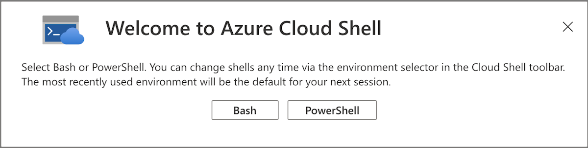

The easiest way to get started with Azure PowerShell is by trying it out in an Azure Cloud Shell environment. Azure Cloud Shell is an interactive, browser-accessible shell for managing Azure resources. It provides the flexibility of choosing the shell experience that best suits the way you work. Linux users can opt for a Bash experience, while Windows users can opt for PowerShell.

Cloud Shell enables access to a browser-based, command-line experience built with Azure management tasks in mind. You can use Cloud Shell to work untethered from a local machine in a way only the cloud can provide.

The main characteristics of Azure Cloud Shell are that it:

- Is a temporary environment; you can optionally mount an Azure file share for persistent storage, or run as an ephemeral session without storage.
- Offers an integrated graphical text editor based on the open-source Monaco Editor.
- Authenticates automatically for instant access to your resources.
- Runs on a temporary host provided on a per-session, per-user basis.
- Times out after 20 minutes without interactive activity.
- Optionally requires a resource group, storage account, and Azure file share for file persistence; can also run as an ephemeral session without storage.
- Uses the same Azure file share for both Bash and PowerShell.
- Is assigned to one machine per user account.
- Persists $HOME using a 5-GB image held in your file share, when a storage account is mounted.
- Has permissions that are set as a regular Linux user in Bash.

You can access Cloud Shell in several ways:

- Direct link. Open a browser and refer to [https://shell.azure.com](https://shell.azure.com).
- Azure portal. Select the Cloud Shell icon in the toolbar.
- Azure CLI or Azure PowerShell documentation pages on Microsoft Learn. Select the **Open Cloud Shell** button that appears with code snippets:

  ```powershell
  az account show
  Get-AzSubscription
  ```

  The **Open Cloud Shell** button opens Cloud Shell directly alongside the documentation using Bash (for Azure CLI snippets) or PowerShell (for Azure PowerShell snippets).

  To run the command:

  1. Use **Copy** in the code snippet.
  1. Use **Ctrl+V** (Windows/Linux) or **Cmd+V** (macOS) to paste the command.
  1. Select Enter.

- Azure mobile app. Use the Cloud Shell icon in the Azure mobile app.
- Visual Studio Code. Use the Azure Account extension to open Cloud Shell in a VS Code terminal.

## Selecting your preferred shell experience

To choose between Bash or PowerShell, refer to the Azure portal and select the Cloud Shell icon, as the following screenshot depicts.


*Figure 1: Azure Cloud Shell icon*

When prompted, select **Bash** or **PowerShell** as your shell environment, as the following screenshot depicts.



*Figure 2: Shell selection prompt*

After the first launch, you can use the **Switch to Bash** or **Switch to PowerShell** button in the Cloud Shell toolbar to switch between shells.

Microsoft manages Azure Cloud Shell, so it comes with popular command-line tools and language support. Cloud Shell also helps securely authenticate automatically, so that you can instantly access your resources through the Azure CLI or Azure PowerShell cmdlets. Cloud Shell also offers an integrated graphical text editor based on the open-source Monaco Editor.

Cloud Shell machines are temporary, but when you mount a storage account, Cloud Shell persists your files in two ways: through a disk image, and through a mounted file share named `clouddrive`. On the first launch, Cloud Shell lets you choose between mounting a storage account for persistent storage or starting an ephemeral session without one. If you mount storage, a single file share is used by both Bash and PowerShell in Cloud Shell and is automatically attached for all future sessions.
