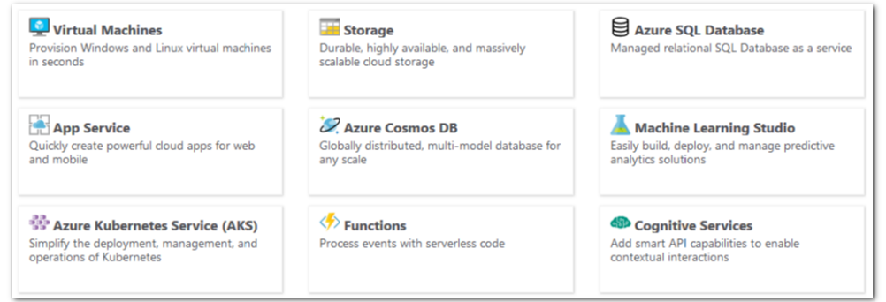

There are three main customer types on which the available purchasing options for Azure products and services is contingent, including:

- **Enterprise**. Enterprise customers sign an Enterprise Agreement with Azure that commits them to spending a negotiated amount on Azure services, which they typically pay annually. Enterprise customers also have access to customized Azure pricing.

- **Web direct**. Web direct customers pay public prices for Azure resources, and their monthly billing and payments occur through the Azure website.

- **Cloud Solution Provider**. Cloud Solution Provider (CSP) typically are Microsoft partner companies that a customer hires to build solutions on top of Azure. Payment and billing for Azure usage occurs through the customer's CSP.

Products and services in Azure are arranged by category, which have various resources that you can provision. You select the Azure products and services that fit your requirements, and your account is billed according to Azure's pay-for-what-you-use model.

> [!div class="checklist"]
> * For more information about purchasing Azure products and services, refer to [Explore flexible purchasing options for Azure](https://azure.microsoft.com/pricing/purchase-options?azure-portal=true).

---

At the end of each monthly billing cycle, the usage values will be charged to your payment method and the meters are reset. You can check the billing page in the Azure portal at any time to get a quick summary of your current usage and see any invoices from past billing cycles.

The key takeaway is that resources are always charged based on usage. For example, if you de-allocate a VM then you will not be billed for compute hours, I/O reads or writes or the private IP address since the VM is not running and has no allocated compute resources. However you will incur storage costs for the disks.

> [!Note]
>
> De-allocating a VM is not the same as deleting a VM. De-allocation means the VM is not assigned to a CPU or network in a datacenter. However, your persistent disks remain, and the resource is present in your subscription. It's similar to turning off your physical computer.
