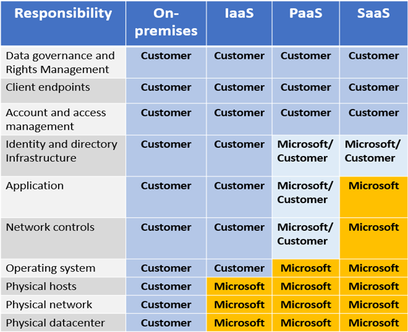

Organizations face many challenges with securing their datacenters, including recruiting and keeping security experts, using many security tools, and keeping pace with the volume and complexity of threats.

:::image type="content" source="../media/2-cloud-security.png" alt-text="Diagram that depicts the advantages of using cloud technology for security.":::

As computing environments move from customer-controlled datacenters to the cloud, the responsibility of security also shifts. Security of the operational environment is now a concern shared by both cloud providers and customers. By shifting these responsibilities to a cloud service like Azure, organizations can reduce focus on activities that aren't core business competencies. Depending on the specific technology choices, some security protections will be built into the particular service, while addressing others will remain the customer's responsibility. To ensure that the proper security controls are provided, a careful evaluation of the services and technology choices becomes necessary.

> [!Tip]
> ### Contoso Shipping - Security is a shared responsibility
>
> One of the first shifts Contoso Shipping makes is from on-premises data centers to infrastructure as a service (IaaS). With IaaS, you are leveraging the lowest-level service and asking Azure to create virtual machines (VMs) and virtual networks. At this level, it's still your responsibility to patch and secure your operating systems and software, as well as configure your network to be secure. At Contoso Shipping, you are taking advantage of IaaS when you start using Azure virtual machines instead of your on-premises physical servers. In addition to the operational advantages, you receive the security advantage of having outsourced concern over protecting the physical parts of the network.
> 
> Next, it is time to build your drone app in the cloud.  Moving to platform as a service (PaaS) outsources several security concerns. At this level, Azure is taking care of the operating system and of most foundational software like database management systems. Everything is updated with the latest security patches and can be integrated with Azure Active Directory for access controls. PaaS also comes with many operational advantages. Rather than building whole infrastructures and subnets for your environments by hand, you can "point and click" within the Azure portal or run automated scripts to bring complex, secured systems up and down, and scale them as needed. Contoso Shipping uses an app built on Azure for tracking telemetry data from drones and trucks — as well as a web app — which are both examples of PaaS.
> 
> With software as a service (SaaS), you outsource almost everything. SaaS is software that runs with an internet infrastructure. The code is controlled by the vendor but configured to be used by the customer. Like so many companies, Contoso Shipping uses Office 365, which is a great example of SaaS!

