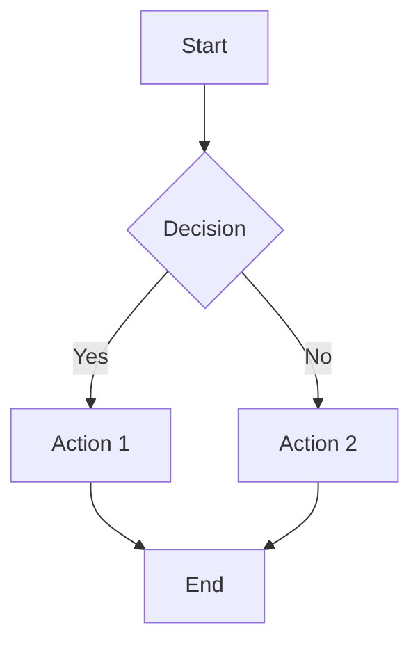
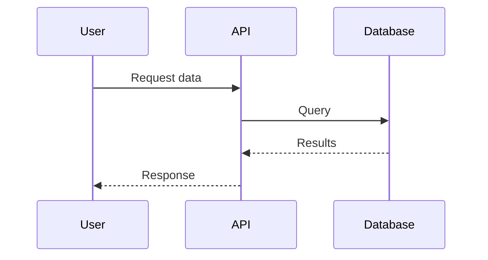
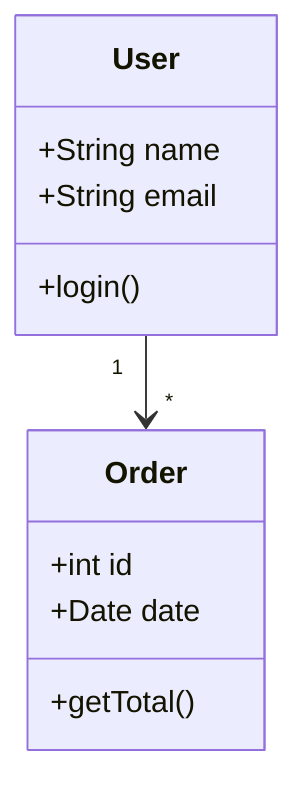
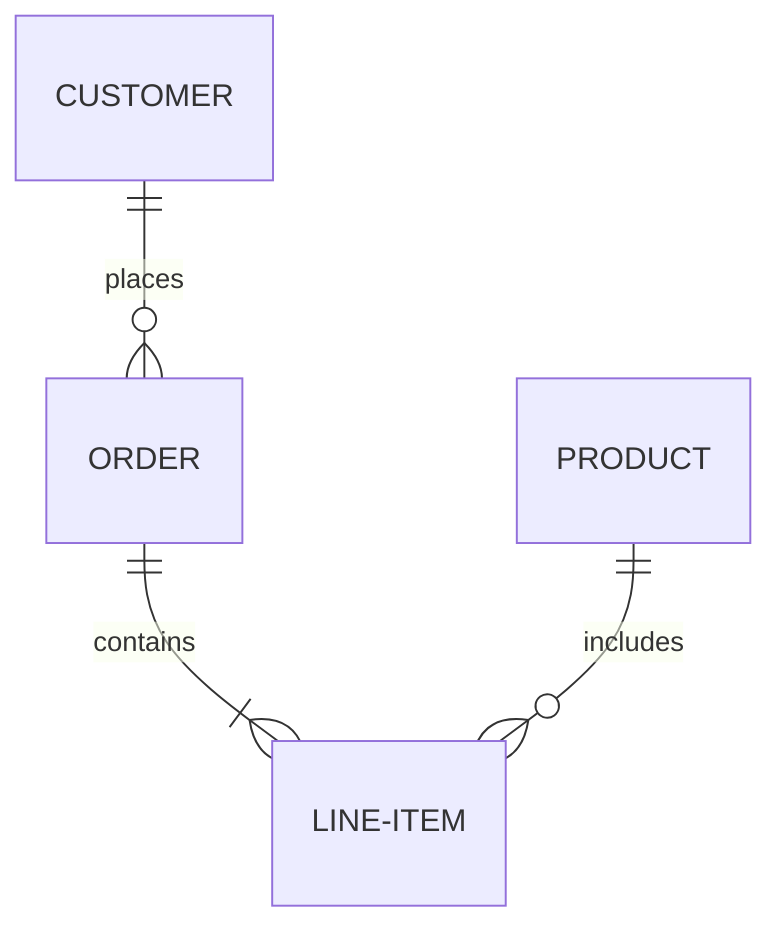
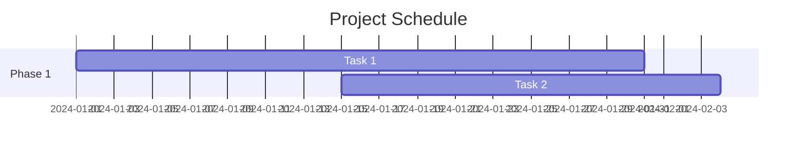

Azure DevOps provides integrated wiki functionality for creating and managing team documentation directly within your projects. Unlike external documentation tools, Azure DevOps Wikis live alongside your code, work items, and pipelines—making documentation accessible where your team already works.

:::image type="content" source="../media/project-wiki-2fd9a459.png" alt-text="Screenshot of Azure DevOps wiki with title and description example.":::

**Key characteristics:**

**Git-backed storage:** Wikis are stored in Git repositories, providing version control, branching, and merge capabilities for documentation.

**Markdown-based:** All wiki content uses Markdown syntax, making it easy to write, read, and merge like code.

**Access control:** Wikis inherit Azure DevOps security model with role-based permissions for viewing and editing.

**No automatic provisioning:** Unlike some project elements, wikis aren't created automatically—teams must explicitly create them when needed.

**Two wiki types:** Project wikis (dedicated wiki repository) and published wikis (existing code repository published as documentation).

## Wiki permissions and access control

Azure DevOps Wikis use the same permission model as other project resources, allowing fine-grained control over who can create, edit, and view documentation.

### Permission levels

**Create Repository permission:**

- **Required for:** Publishing code as wiki, creating new project wiki
- **Default holders:** Project Administrators group
- **Can be assigned to:** Other users or groups as needed
- **Why restricted:** Creating wikis creates new Git repositories consuming project resources

**Contributors group membership:**

- **Required for:** Adding pages, editing content, uploading attachments
- **Default holders:** Team members with write access to project
- **Capabilities:** Full edit rights, page creation, content updates
- **Best practice:** Most team members should have this level for collaborative documentation

**Stakeholders and readers:**

- **Permissions:** View wiki pages, search content, follow links
- **Limitations:** Cannot edit, create pages, or upload files
- **Use case:** External stakeholders, read-only team members, auditors

**Managing permissions:**

- Navigate to Project Settings → Repositories → wiki repository
- Configure branch policies for approval workflows
- Use Azure DevOps groups for consistent permission management
- Consider separate wikis for sensitive documentation with restricted access

## Creating wikis

Azure DevOps supports two approaches to creating wikis, each suited for different scenarios.

**Project wiki (dedicated repository):**

- **Purpose:** Create new wiki from scratch for project documentation
- **How it works:** Creates dedicated Git repository named `<projectname>.wiki`
- **Best for:** Documentation that doesn't belong in code repository, cross-cutting project information
- **Creation:**
  1. Navigate to Project → Overview → Wiki
  2. Select "Create project wiki"
  3. Azure DevOps creates wiki repository automatically
  4. Start adding pages immediately

**Published wiki (existing repository):**

- **Purpose:** Publish existing folder from code repository as wiki
- **How it works:** Designates specific folder in Git repository as wiki content
- **Best for:** Documentation living with code, versioned alongside software releases
- **Creation:**
  1. Create `/docs` or similar folder in code repository
  2. Add Markdown files to folder
  3. Navigate to Wiki → Publish code as wiki
  4. Select repository, branch, and folder path
  5. Provide wiki name

**Choosing approach:**

- Use **project wiki** for documentation independent of code (architecture, processes, guides)
- Use **published wiki** for documentation tied to code (API docs, component guides, versioned release notes)
- Can have both types simultaneously in same project

**Reference:** Detailed instructions: [Create a Wiki for your project](/azure/devops/project/wiki/wiki-create-repo) and [Publish a Git repository to a wiki](/azure/devops/project/wiki/publish-repo-to-wiki).

## Markdown fundamentals

Azure DevOps Wikis use Markdown for all content formatting. Markdown provides simple, readable syntax that renders as formatted HTML while remaining easy to edit and merge in version control.

**Why Markdown for technical documentation:**

**Plain text format:** No proprietary file formats—any text editor works, no special software required.

**Version control friendly:** Text-based format merges cleanly with Git, supporting branches and pull requests for documentation.

**Human readable:** Markdown source is readable even without rendering, unlike HTML or XML.

**Tool independence:** Not locked to specific editing software—write in any editor, render anywhere.

**Developer friendly:** Syntax familiar to developers, requires minimal learning, integrates with existing workflows.

**Common Markdown syntax:**

```markdown
# Heading 1

## Heading 2

### Heading 3

**Bold text** or **bold text**
_Italic text_ or _italic text_
**_Bold and italic_**

- Unordered list item
- Another item
  - Nested item

1. Ordered list item
2. Another item
   1. Nested ordered item

[Link text](https://example.com)


Inline `code` with backticks

\`\`\`language
Code block with syntax highlighting
function example() {
return true;
}
\`\`\`

> Blockquote for callouts or notes

| Column 1 | Column 2 |
| -------- | -------- |
| Data 1   | Data 2   |

---

Horizontal rule
```

**Attachments and multimedia:**

- **File attachments:** Drag-and-drop files directly into wiki editor
- **Images:** Upload images or reference from repository
- **Videos:** Embed videos using Markdown or HTML syntax
- **Supported formats:** Common image formats (PNG, JPG, GIF, SVG), videos (MP4, etc.)

## GitHub Flavored Markdown (GFM)

GitHub Flavored Markdown (GFM) is a formal specification extending CommonMark (base Markdown standard) with practical features for software documentation. Azure DevOps Wikis render GFM, providing these additional capabilities beyond basic Markdown.

### GFM extensions

**Task lists:**

```markdown
- [x] Completed task
- [ ] Incomplete task
- [ ] Another pending task
```

**Tables:**

```markdown
| Feature    | Supported | Notes                  |
| ---------- | --------- | ---------------------- |
| Tables     | Yes       | With alignment         |
| Task lists | Yes       | Interactive checkboxes |
```

**Strikethrough:**

```markdown
~~This text is crossed out~~
```

**Autolinks:**

- URLs automatically become clickable: https://example.com
- Email addresses automatically link: user@example.com

**Syntax highlighting:**

```markdown
\`\`\`python
def hello():
print("Hello, world!")
\`\`\`
```

**Emoji support:**

- Use emoji codes: `:smile:` renders as 😄
- Platform-specific rendering may vary

**Why GFM matters:**

- **Consistency:** Same Markdown works across GitHub, Azure DevOps, and many documentation platforms
- **Developer familiarity:** Developers already know GFM from README files and GitHub contributions
- **Enhanced features:** Task lists and tables improve documentation structure
- **Portability:** Documentation written in GFM migrates easily between platforms

## Mermaid diagrams

Mermaid provides text-based diagram syntax that renders as visual diagrams—solving the challenge of including diagrams in version-controlled documentation. Unlike binary image files (PNG, JPEG), Mermaid diagrams are plain text that merges cleanly in Git.

**Why Mermaid is essential:**

**Version control friendly:** Text-based diagrams diff and merge like code—see exactly what changed in diagram updates.

**No external tools:** Create diagrams directly in Markdown without separate diagramming software.

**Always current:** Diagrams live in documentation, encouraging updates when systems change.

**Collaboration ready:** Multiple people can edit diagrams without file format conflicts.

**Automatic rendering:** Azure DevOps and many platforms render Mermaid automatically.

:::image type="content" source="../media/mermaid-markup-dd1a8a0c.png" alt-text="Screenshot of Mermaid Markup showing the welcome to the project wiki Contoso text and graph showing A and B dependencies.":::

:::image type="content" source="../media/mermaid-rendering-f7d50b39.png" alt-text="Screenshot of Mermaid Rendering showing the welcome to the project wiki Contoso text and graph showing A and B dependencies.":::

**Common Mermaid diagram types:**

**Flowcharts (process flows):**



**Use for:** Algorithms, deployment processes, decision workflows

**Sequence diagrams (interactions):**



**Use for:** System interactions, API flows, authentication sequences

**Class diagrams (structure):**



**Use for:** Object models, database schemas, component relationships

**Entity Relationship diagrams (data models):**



**Use for:** Database design, data relationships, domain models

**Gantt charts (timelines):**



**Use for:** Project timelines, release planning, milestone tracking

**Best practices for Mermaid:**

- Keep diagrams simple—complex diagrams are hard to read and maintain
- Use consistent styling across project diagrams
- Include diagram legends when using custom notation
- Test diagram rendering in target platform
- Consider breaking large diagrams into smaller, focused views
- Add explanatory text around diagrams for context

**Reference:** Complete Mermaid syntax and examples: [Mermaid Introduction](https://mermaid-js.github.io/mermaid/)
