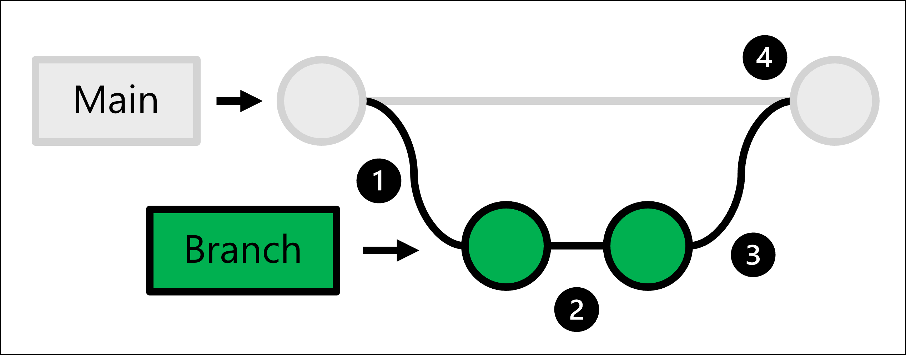

Many data scientists prefer working with Python or R to define machine learning workloads. You can have Jupyter notebooks or scripts to prepare data or train a model. 

Working on any code assets becomes easier when you use source control. **Source control** is the practice of *managing code and tracking any changes* your team makes to the code.

If you work with DevOps tools like **Azure DevOps** or **GitHub**, the code is stored in a so-called **repository** or **repo**. 

## Repository

When setting up the MLOps framework, a machine learning engineer is likely to create the repository. Whether you choose to use Azure Repos in Azure DevOps or GitHub repos, both use **Git repositories** to store your code. 

There are generally two ways to scope the repo:

- **Monorepo**: Keep all machine learning workloads within the same repo.
- **Multiple repos**: Create a separate repo for each new machine learning project.

Which approach your team prefers depends on who should get access to which assets. If you want to ensure quick access to all code assets, monorepos may suit your team's requirements better. If you want to only give people access to a project if they're actively working on it, your team may prefer to work with multiple repos. Keep in mind that managing access control can create more overhead.

### Structure your repo

Whatever approach you take, it's best practice to agree on the standard top-level folder structure for your projects. For example, you may have the following folders in all your repos:

- `.cloud`: contains cloud-specific code like templates to create an Azure Machine Learning workspace.
- `.ad/.github`: contains Azure DevOps or GitHub artifacts like YAML pipelines to automate workflows.
- `src`: contains any code (Python or R scripts) used for machine learning workloads like preprocessing data or model training. 
- `docs`: contains any Markdown files or other documentation used to describe the project.
- `pipelines`: contains Azure Machine Learning pipelines definitions.
- `tests`: contains unit and integration tests used to detect bugs and issues in your code.
- `notebooks`: contains Jupyter notebooks, mostly used for experimentation.

> [!NOTE]
> Training data should **not** be included in your repo. The data should be stored in a database or data lake. Azure Machine Learning can have direct access to a database or data lake by storing the connection information as a [datastore](/azure/machine-learning/how-to-access-data).

By having a standard structure that each project uses, data scientists and other collaborators will find it easier to find the code they need to work on.

> [!TIP]
> Find more [best practices for structuring data science projects](/azure/cloud-adoption-framework/scenarios/data-management/best-practices/data-science-best-practices).

To learn how to work with repos as a data scientist, you'll learn about **trunk-based development**.

## Trunk-based development

Most software development projects use Git as a source control system, which is used by both Azure DevOps and GitHub. 

The main benefit of using Git is the easy collaboration on code while also keeping track of any changes that are made. In addition, you can add **approval gates** to make sure only changes that have been reviewed and accepted will be made to the production code.

To accomplish the above, Git makes use of **trunk-based development** which allows you to create **branches**.

The production code is hosted in the **main** branch. Whenever someone wants to make a change:

1. You create a full copy of the production code by creating a **branch**. 
2. In the branch you created, you make any changes and test them. 
3. Once the changes in your branch are ready, you can ask for someone to review the changes.
4. If the changes are approved, you *merge* the branch you created with the main repo and the production code will be updated to reflect your changes.

