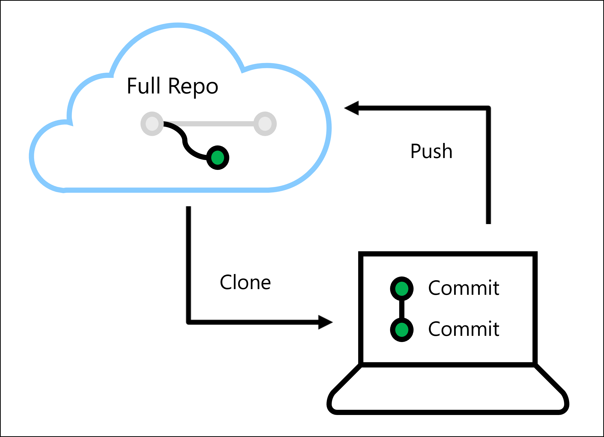
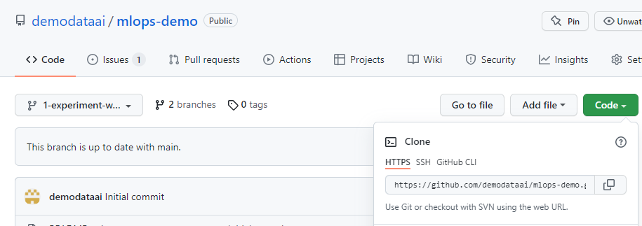
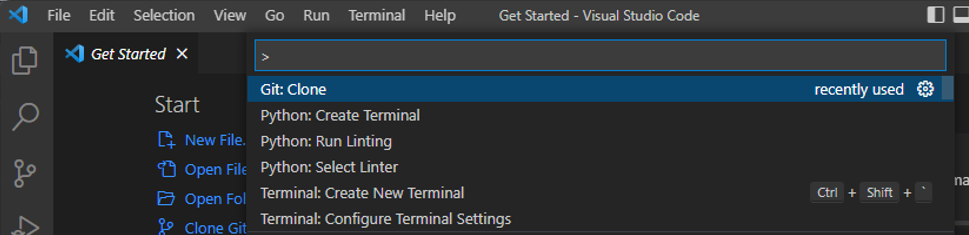
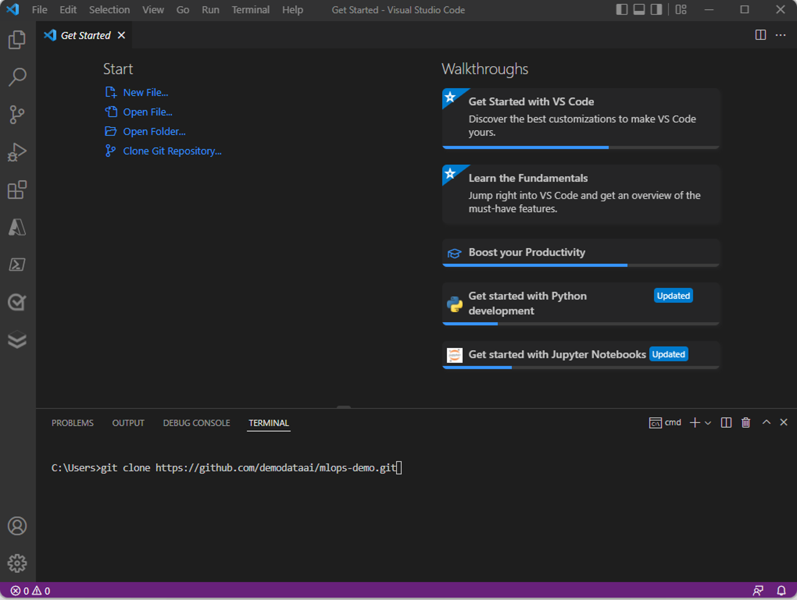
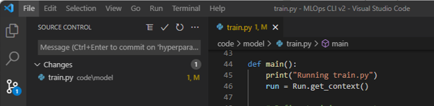
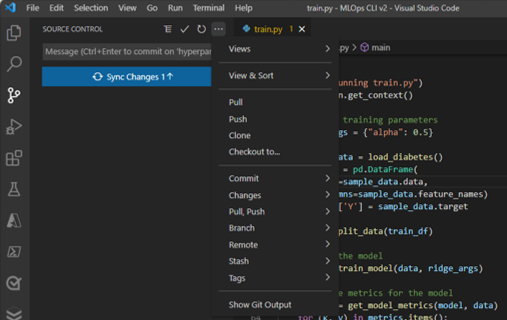

To ensure a model stays relevant, you may have to edit any of the assets within a machine learning project. 

For example, you may have to retrain a model with an improved training dataset. Or you may have to improve the model by choosing other hyperparameter values while training.

As a data scientist, whenever you want to go back to develop and improve the model, you want to ensure the model in production remains untouched. Therefore, when storing all code relevant for the machine learning project in a Git repo, you want to create a branch for development to isolate your work.

To work on the branch, you can clone the branch to your preferred IDE. You'll learn how you can clone the code and develop locally with **Visual Studio Code**. 

## Visual Studio Code

Whether you work with **Azure Repos** or **GitHub**, you'll work with Git-based repositories. You can edit code within Azure Repos or GitHub, but it's recommended to clone the repo and work in an IDE. A commonly used IDE is **Visual Studio Code**. 

> [!TIP]
> You can [download Visual Studio Code on Windows, Linux, and macOS](https://code.visualstudio.com/download).

One of the benefits of using Visual Studio Code is that it has an extension for **Azure Machine Learning**, enabling you to run the code on Azure Machine Learning compute instances and clusters from Visual Studio Code. You can also opt to run the code using your local device. Some machine learning workloads like computer vision models however, will require more compute power. 

When you want to develop your code locally, you'll follow along a typical development process when working with Git repos. The full repo is stored online, in a tool like Azure Repos or GitHub. 

> [!TIP]
> To work on Git repos locally, [download Git for Windows, Linux, or macOS](https://git-scm.com/downloads). 

## Development process

After installing Visual Studio Code and Git, you can work on a branch of the repo locally. To work with a Git repo, you'll have to use some common Git commands.

Let's assume your full repo is stored in Azure DevOps or GitHub, and you've created a branch off the main repo in one of the two tools. 

To get the URL of the repo, navigate to the repo's top level and select **Clone** in Azure Repos or **Code** in GitHub. Copy the HTTPS URL.

After opening Visual Studio Code, there are two ways to work with Git:

- Use the command palette (CTRL+SHIFT+P) for a more user-friendly approach.
- Use `git` commands in the integrated terminal (CTRL+SHIFT+`) for a command-line experience.

> [!Note]
> To work with a Git repo stored in Azure DevOps, sign in with your Azure account that has access to the repo. To work with GitHub, you'll need to provide your username and email with the `git config` command.

### Clone

To get a local copy, you'll have to **clone** the repo to your device using the repo's URL.

Or use the `git clone` command in the integrated terminal.

A local copy of the code will be stored on your device. Choose where you want to store the clone and wait until all files have been copied. When ready, you'll be prompted to navigate to the newly copied repo directly. Alternatively, you can open the local folder in Visual Studio Code to open the local copy. 

> [!NOTE]
> If you created a branch, verify that you're currently working in the branch and not the main repo. You can switch branches by using the `git checkout` command.

### Commit

Once you've cloned the repo to Visual Studio Code, you can edit the code. After modifying a file and saving it, you'll need to **commit** the change. 

In Visual Studio Code, you can open the **Source Control** tab to view all changes you've made so far. 

You can commit a change made to a file, like a Python script, by using the **Git: Commit** option in the command palette or by using the `git commit` command. 

For each commit, you'll add a message to clarify what you changed. In general, it's best to commit small changes and do it often. By writing clear committing messages, you'll make it easier for your team to understand your work.

### Push

Once you've made all your changes and committed them. You can **push** all commits. When you push all your commits, you'll update the repo stored in Azure Repos or GitHub to be identical to your local copy.

You can push all commits with the **Git: Push** option in the command palette, or the `git push` command in the terminal. 

Alternatively, you can also push changes using the **Source Control** pane. In Source Control, you'll also get an overview of how many commits will be pushed to your repo.

Ideally, you should verify your code before pushing it to the repo. To verify machine learning workloads, it's a best practice to do linting and unit tests locally.

> [!NOTE]
> If someone else has made a change to the repo while you've been working online, you can **pull** those changes to your local copy without losing your changes and commits. Git will check whether there are any clashes for you.
