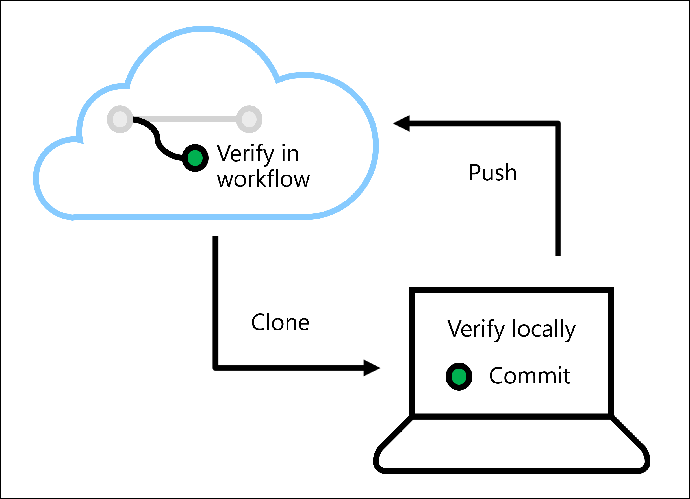
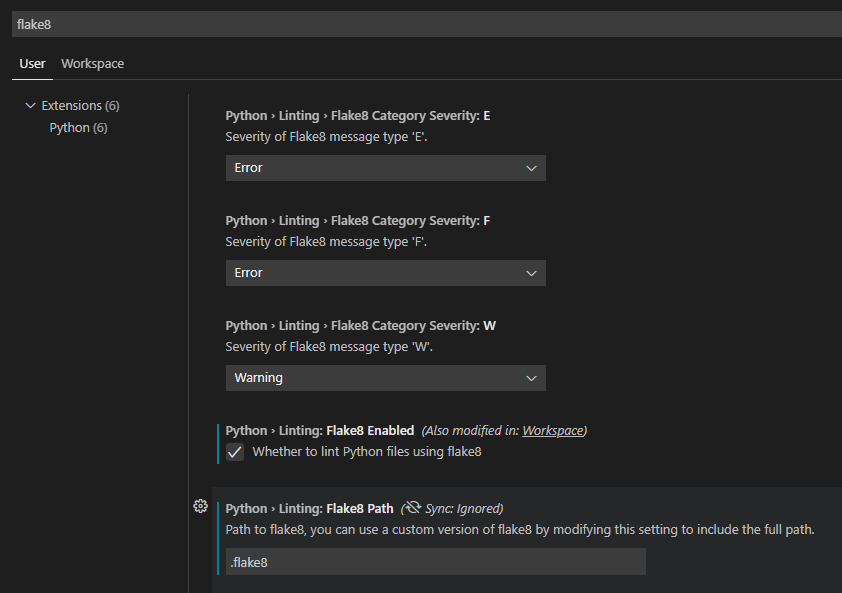
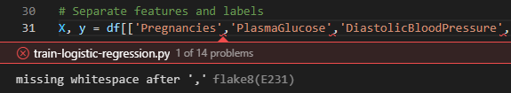
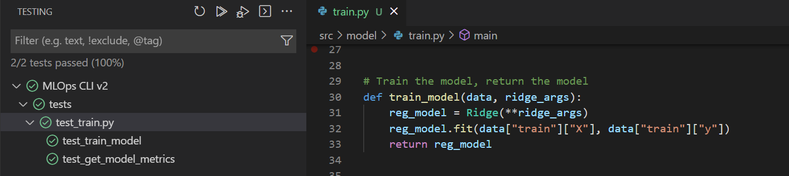

Whenever you change any code in your machine learning project, you want to verify the code and model quality. 

During continuous integration, you create and verify assets for your application. As a data scientist, you'll probably focus on creating scripts used for data preparation and model training. The machine learning engineer uses the scripts later in pipelines to automate these processes. 

To verify your scripts, there are two common tasks:

- **Linting**: Check for programmatic or stylistic errors in Python or R scripts.
- **Unit testing**: Check the performance of the content of the scripts.



By verifying your code, you prevent bugs or issues when the model is deployed. You can verify your code locally, by running linters and unit tests locally in an IDE like Visual Studio Code. 

You can also run linters and unit tests in an automated workflow with Azure Pipelines or GitHub Actions.

You'll learn how to run linting and unit tests in Visual Studio Code.

## Lint your code

The quality of your code depends on the standards you and your team agree on. To ensure that the agreed upon quality is met, you can run linters that will check whether the code conforms to the standards of the team. 

Depending on the code language you use, there are several options to lint your code. For example, if you work with Python, you can use either **Flake8** or **Pylint**.

### Use Flake8 to lint your code

To use Flake8 locally with Visual Studio Code:

1. Install Flake8 with `pip install flake8`.
2. Create a configuration file `.flake8` and store the file in your repo.
3. Configure Visual Studio Code to use Flake8 as the linter by going to your settings (`Ctrl+,`).
4. Search for `flake8`.
5. Enable Python > Linting > Flake8 Enabled.
6. Set the Flake8 path to the location in your repo where you stored your `.flake8` file.



To specify what your team's standards are for code quality, you can configure the Flake8 linter. A common method to define the standards is by creating a `.flake8` file that is stored with your code.

The `.flake8` file should start with `[flake8]`, followed by any of the configurations you want to use. 

> [!TIP]
> A full list of possible configuration parameters can be found in the [Flake8 documentation](https://flake8.pycqa.org/en/latest/user/options.html#full-listing-of-options-and-their-descriptions).

For example, if you want to specify that the maximum length of any line can't be more than 80 characters, you'll add the following line to your `.flake8` file:

```
[flake8]
max-line-length = 80
```

Flake8 has a predefined list of errors it can return. Additionally, you can make use of error codes that are based on the [PEP 8 style guide](https://peps.python.org/pep-0008/). For example, you can include error codes that refer to proper use of indentation or white spaces.

You can choose to either select (`select`) a set of error codes that will be part of the linter or select which error codes to ignore (`ignore`) from the default list of options.

As a result, your `.flake8` configuration file may look like the following example:

```
[flake8]
ignore = 
    W504,
    C901,
    E41
max-line-length = 79
exclude = 
    .git,
    .cache,
per-file-ignores =
    code/__init__.py:D104
max-complexity = 10
import-order-style = pep8
```

> [!TIP]
> For an overview of error codes you can refer to, review the [Flake8 Error list](https://pycodestyle.pycqa.org/en/latest/intro.html#error-codes)

When you've configured Visual Studio Code to lint your code, you can open any code file to review the lint results. Any warnings or errors will be underlined. You can select **View problem** to inspect the issue to understand the error.



### Lint with Azure Pipelines or GitHub Actions

You can also run the linter automatically with Azure Pipelines or GitHub Actions. The agent provided by either platform will run the linter when you:

1. Create a configuration file `.flake8` and store the file in your repo. 
2. Define the continuous integration pipeline or workflow in YAML.
3. As a task or step, install Flake8 with `python -m pip install flake8`.
4. As a task or step, run the `flake8` command to lint your code.

## Unit tests

Where linting verifies how you wrote the code, unit tests check how your code works. Units refer to the code you create. Unit testing is therefore also known as code testing.

As a best practice, your code should exist mostly out of functions. Whether you've created functions to prepare data, or to train a model. You can apply unit testing to, for example:

- Check that column names are right.
- Check the prediction level of model on new datasets.
- Check the distribution of prediction levels.

When you work with Python, you can use **Pytest** and **Numpy** (which uses the Pytest framework) to test your code. To learn more about working with Pytest, [learn how to write tests with Pytest](/training/modules/test-python-with-pytest/).

> [!TIP]
> Review a more detailed walkthrough of [Python testing in Visual Studio Code](https://code.visualstudio.com/docs/python/testing).

Imagine you created a training script `train.py`, which contains the following function:

```python
# Train the model, return the model
def train_model(data, ridge_args):
    reg_model = Ridge(**ridge_args)
    reg_model.fit(data["train"]["X"], data["train"]["y"])
    return reg_model
```

Assume you stored the training script in the directory `src/model/train.py` within your repo. To test the `train_model` function, you must import the function from `src.model.train`.

You create the `test_train.py` file in the `tests` folder. One way to test Python code is to use `numpy`. Numpy offers several `assert` functions to compare arrays, strings, objects, or items. 

> [!TIP]
> Learn more about [testing guidelines when using Numpy testing](https://numpy.org/doc/stable/reference/testing.html), and [Numpy's test support](https://numpy.org/doc/stable/reference/routines.testing.html).

For example, to test the `train_model` function, you can use a small training dataset and use `assert` to verify whether the predictions are *almost equal* to your predefined performance metrics.

```python
import numpy as np
from src.model.train import train_model

def test_train_model():
    X_train = np.array([1, 2, 3, 4, 5, 6]).reshape(-1, 1)
    y_train = np.array([10, 9, 8, 8, 6, 5])
    data = {"train": {"X": X_train, "y": y_train}}

    reg_model = train_model(data, {"alpha": 1.2})

    preds = reg_model.predict([[1], [2]])
    np.testing.assert_almost_equal(preds, [9.93939393939394, 9.03030303030303])
```

To test your code in Visual Studio Code using the UI:

1. Install all necessary libraries to run the training script.
2. Ensure `pytest` is installed and enabled within Visual Studio Code.
3. Install the **Python** extension for Visual Studio Code.
4. Select the `train.py` script you want to test.
5. Select the **Testing** tab from the left menu.
6. Configure Python testing by selecting **pytest** and setting the test directory to your `tests/` folder.
7. Run all tests by selecting the play button and review the results.



To run the test in an Azure DevOps Pipeline or GitHub Action:

1. Ensure all necessary libraries are installed to run the training script. Ideally, use a `requirements.txt` listing all libraries with `pip install -r requirements.txt`
2. Install `pytest` with `pip install pytest`
3. Run the tests with `pytest tests/`

The results of the tests will show in the output of the pipeline or workflow you run. 

> [!NOTE]
> If either during linting or unit testing, an error is returned, the CI pipeline may fail. It's therefore better to verify your code locally first, before triggering the CI pipeline.


