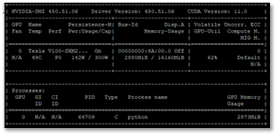
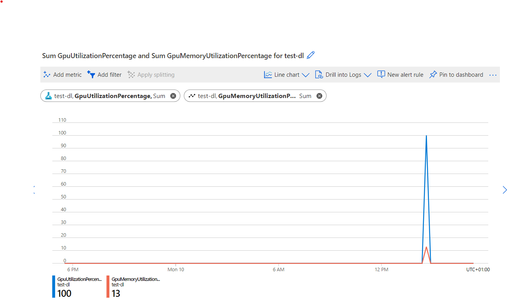

When you train compute-intensive models, choose the GPU compute that best fits your needs to optimally use your resources.

Recall the deep learning model you want to train to extract handwritten text from insurance forms. You expect to use a large dataset, and the model itself to be compute-intensive. You wonder what type of compute cluster would be best suited for your workload. 

You'll learn about the GPU types offered in Azure Machine Learning, and how you can monitor to find the optimal configuration.

## GPU types in Azure Machine Learning

When you create a compute instance or cluster in Azure Machine Learning, Azure virtual machines are created and maintained for you. 

Azure has a wide range of GPU optimized virtual machines sizes available that are part of the N-series family:

- The **NC-series** is used for high-performance computing and machine-learning workloads.
- The **ND-series** is used for training and inferencing scenarios for deep learning.  
- The **NV-series** is used for remote visualization workloads and other graphics-intensive applications. 

To use GPU compute, you have to use code that is configured to work with GPUs. A common mistake is to use code that doesn't make use of GPUs, which can result in many wasted resources. 

The most common GPU programming interface is **CUDA** (Compute Unified Device Architecture). To use CUDA in Azure Machine Learning, include it in the environment you use when you submit a job. Many of the curated environments that you can use when you train a compute-intensive model already include CUDA. 

When using frameworks or libraries that are designed to use GPUs, make sure you choose the appropriate GPU type. For example, if you use RAPIDs to process large amounts of data, you need to create a Tesla V100 GPU compute.

> [!TIP]
> Explore [the overview of curated environments](/azure/machine-learning/resource-curated-environments) to find the environment that you need.

## Decide which GPU type to use

To decide which compute to use for a job, think about the following factors:

- **Performance**: Think about the framework you use to train a model. Certain algorithms may deliver a need less time to train but come at a higher cost. GPU performance varies per workload but [a quick overview can be found on NVIDIA's website](https://developer.nvidia.com/deep-learning-performance-training-inference).
- **Cost**: Depending on your requirements, you may need to choose a model that either is more cost effective or performs better. To save on costs, you can make use of [reserved instances for virtual machines](https://azure.microsoft.com/pricing/reserved-vm-instances/) or [low-priority virtual machines](/azure/machine-learning/how-to-manage-optimize-cost).
- **Location**: Be aware of the availability of virtual machines per Azure region. If your data needs to remain within a certain region, it can affect your choice of model. 
- **GPU memory size**: Deep learning models benefit when a compute cluster has enough GPU memory available. Think about the memory requirements for the model you want to train. Requirements may include the size of the dataset and number of parameters. 

## Monitor to find optimal configuration

The only reliable way to find the optimal compute configuration is to run the workload and monitor the results. 

There are a wide range of command-line tools available to monitor how your GPU compute is performing. One of the most common command-line tools is the **NVIDIA System Management Interface (nvidia-smi)**, which can run at a defined interval. 

> [!TIP]
> Learn more about [how to use nvidia-smi to monitor your GPU compute](https://developer.nvidia.com/nvidia-system-management-interface).

To monitor the GPU consumption of an Azure Machine Learning compute cluster, you can use the **Azure Monitor**. An easy way to access it is through the Azure portal:

1. Navigate to [https://portal.azure.com](https://portal.azure.com). 
2. Go to your Azure Machine Learning resource.
3. Under **Monitoring**, select **Metrics**.
4. Create a new chart and explore the metrics for GPU utilization.

Within the Azure Machine Learning Studio, it's also possible to monitor the GPU usage for specific runs. 

Understanding how much GPU has been consumed during model training can help confirm whether the workload is making best use of the available resources. Ideally the runs are maximizing the available GPU and GPU memory and aren't constrained by throughput.

A common approach is to *start with a single GPU and node*. Next, you can scale up either with more GPUs by changing the size of your compute in Azure Machine Learning. You can also scale across nodes and process data in parallel. A distributed approach may improve performance, but requires more overhead so should only be done when significant improvements can be made.