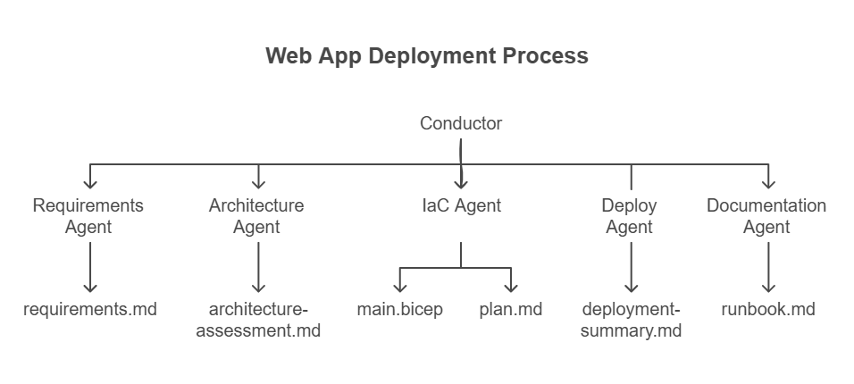

::: zone pivot="video"

>[!VIDEO https://learn-video.azurefd.net/vod/player?id=e4609956-4f60-43ae-bfba-b1f71fd00916]

> [!TIP]
> The video for this section is also available in text-based form below.

::: zone-end

::: zone pivot="text"

Agentic DevOps is the practice of using AI agents to automate and orchestrate operational workflows that traditionally required manual coordination. Rather than using AI as a reactive tool that responds to individual prompts, you define a system of specialized agents. These agents proactively execute multi-step pipelines, maintain context across stages, and produce versioned artifacts.

In an agentic DevOps model, the AI isn't just a coding assistant. It's an active participant in the workflow. Each agent has a defined role, access to specific tools, and domain knowledge that shapes its outputs. A coordinating agent manages the sequence, delegates tasks, and ensures that outputs from one stage are available to the next.

## Single-agent vs. multi-agent patterns

When you use an AI assistant to help with a single task, such as generating a Bicep template or writing a deployment script, you're working with a **single-agent pattern**. The agent has one job, one context, and one output. This works well for isolated tasks but breaks down when the workflow has several interconnected steps.

A **multi-agent pattern** distributes the workflow across several specialized agents, each focused on a specific domain:

| Agent role | Responsibility | Example output |
|---|---|---|
| Requirements agent | Parse a natural-language scenario into structured requirements | A requirements document with resource types, SKUs, and constraints |
| Architecture agent | Assess the requirements and recommend services, trade-offs, and design decisions | An architecture assessment with service recommendations |
| IaC generation agent | Generate infrastructure-as-code templates based on the architecture | Bicep or Terraform templates |
| Deployment agent | Execute the deployment and validate the results | A deployment summary with resource URIs and status |
| Documentation agent | Produce operational documentation from the deployment artifacts | A runbook or demo guide |

Each agent operates independently within its domain but contributes to a shared pipeline. The output of one agent becomes the input for the next.

## The conductor pattern

In a multi-agent system, someone (or something) needs to coordinate the workflow. The **conductor pattern** uses a top-level agent that:

1. Receives the user's initial request
2. Delegates each step to the appropriate specialized agent
3. Verifies that each step completed successfully before moving to the next
4. Handles errors and retries when a step fails

The conductor doesn't perform the actual work. It orchestrates. Think of it as the difference between a project manager and the individual engineers on a team. The conductor knows the workflow sequence and the dependencies between steps. The domain expertise lives in the specialized agents.

Here's how a conductor orchestrates an infrastructure deployment workflow:



## Artifact-based communication

Agents in a multi-agent system don't communicate directly through messages. Instead, they communicate through **artifacts**: files written to a shared location. Each agent reads the artifacts from previous stages and writes its own outputs for downstream agents to consume.

This approach has several advantages:

- **Transparency**: Every intermediate result is a readable file that you can inspect, modify, or override.
- **Reproducibility**: If a step fails, you can fix the artifact and rerun only the downstream agents.
- **Version control**: Artifacts are regular files that work with Git, giving you full change history.
- **Isolation**: Each agent runs in its own context window. It doesn't inherit accumulated errors or context drift from previous agents.

A typical artifact folder for an infrastructure deployment might look like this:

```
project/
├── requirements.md
├── architecture-assessment.md
├── architecture-diagram.png
├── implementation-plan.md
├── infra/
│   ├── main.bicep
│   └── main.bicepparam
├── deployment-summary.md
└── docs/
    └── runbook.md
```

## Real-world ops scenarios for agentic DevOps

The multi-agent pattern applies to many operational workflows beyond environment provisioning:

- **Compliance auditing**: A scanning agent discovers resource configurations. A policy agent evaluates them against organizational standards. A reporting agent generates remediation recommendations.
- **Incident response**: A monitoring agent detects anomalies. A diagnostic agent gathers logs and metrics. A remediation agent proposes or applies fixes.
- **Environment lifecycle management**: A provisioning agent creates environments. A monitoring agent tracks usage. A cleanup agent identifies and decommissions unused resources.
- **Configuration drift detection**: A baseline agent defines the expected state. A scanning agent compares actual state. A correction agent generates the changes needed to bring resources back into compliance.

In each scenario, the pattern is the same: specialized agents handle their domain, a conductor coordinates the sequence, and artifacts provide the shared state between steps.

The next unit examines the specific building blocks you use to create these workflows: agent definitions, skills, instructions, and prompts.

::: zone-end
