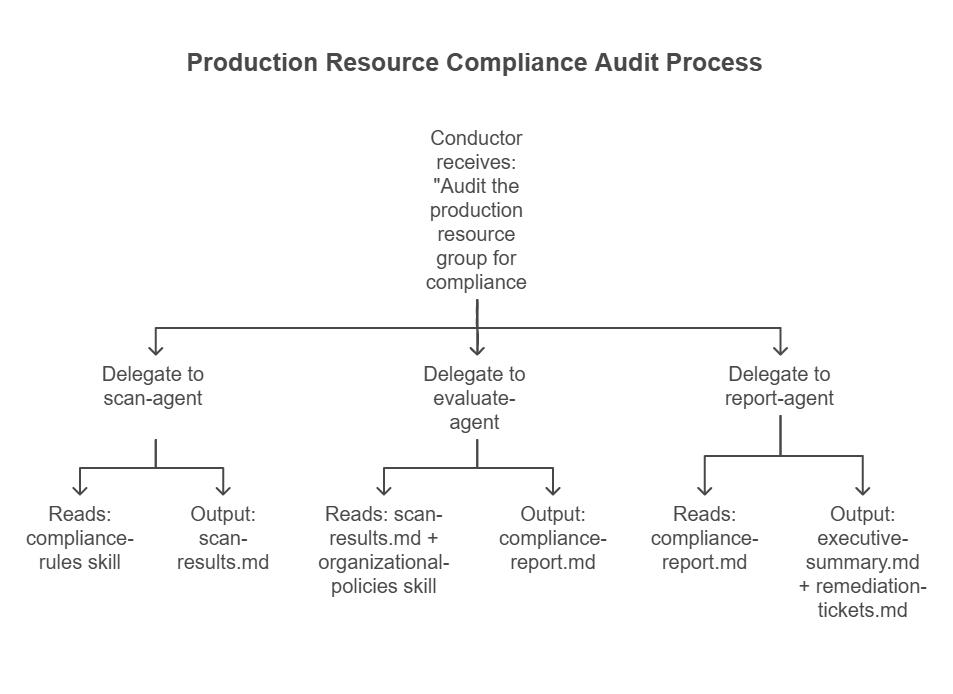

## Plan your agent pipeline

Designing a multi-agent workflow starts with mapping your existing operational process. Most infrastructure workflows follow a predictable pattern: gather requirements, make design decisions, generate artifacts, execute actions, and produce documentation. Each of these phases becomes a candidate for a specialized agent.

### Step 1: Map your current workflow

Before building agents, document the steps you perform today. For an environment provisioning workflow, this might look like:

1. Receive a request describing the desired environment
2. Assess which Azure services and SKUs fit the requirements
3. Design the network topology and security boundaries
4. Write Bicep or Terraform templates
5. Deploy the infrastructure and validate the results
6. Create documentation for the operations team

Each numbered step represents a potential agent. The human coordination between steps is what the conductor agent replaces. That coordination involves reading the output of one step and using it as input for the next.

### Step 2: Define agent boundaries

A well-designed agent has a **single responsibility**. It does one thing well and produces a clear output artifact. When deciding where to split agents, consider:

- **Domain expertise**: A requirements agent needs different knowledge than a Bicep generation agent. Separate agents let you load different skills for each domain.
- **Tool access**: A deployment agent needs terminal access to run CLI commands. A documentation agent needs file creation but not terminal access. Limiting tool access per agent reduces risk.
- **Failure isolation**: If the deployment step fails, you want to retry just the deployment, not the entire pipeline. Separate agents make this possible.
- **Reusability**: A documentation agent that produces runbooks from deployment artifacts can be reused across multiple workflows, not just environment provisioning.

### Step 3: Define the artifact contract

Agents communicate through files, so define what each agent produces and what downstream agents expect. This is your artifact contract:

| Pipeline stage | Agent | Input artifacts | Output artifacts |
|---|---|---|---|
| Requirements | requirements-agent | User prompt | `requirements.md` |
| Architecture | architecture-agent | `requirements.md` | `architecture-assessment.md` |
| IaC generation | bicep-agent | `architecture-assessment.md` | `infra/main.bicep`, `implementation-plan.md` |
| Deployment | deploy-agent | `infra/main.bicep` | `deployment-summary.md` |
| Documentation | docs-agent | All prior artifacts | `docs/runbook.md` |

This contract ensures that agents can evolve independently. You can replace the Bicep agent with a Terraform agent, and as long as the output includes the infrastructure templates the deploy agent expects, the pipeline continues to work.

### Step 4: Build the conductor

The conductor agent ties the pipeline together. Its definition includes all specialized agents in the `agents` array and its system prompt describes the workflow sequence:

```yaml
---
name: ops-conductor
description: Orchestrates infrastructure provisioning workflows
agents: [requirements-agent, architecture-agent, bicep-agent, deploy-agent, docs-agent]
tools: [readFile, createFile]
---
```

The conductor's system prompt specifies:

- The order in which to delegate tasks
- What artifacts to verify after each step
- How to handle failures (retry, skip, or stop)
- What information to pass to each subagent

Here's an example of how a conductor's system prompt might describe a handoff:

```markdown
## Workflow

1. Delegate to requirements-agent with the user's scenario description
2. Verify that requirements.md exists and contains structured requirements
3. Delegate to architecture-agent: "Assess the architecture based on requirements.md"
4. Verify that architecture-assessment.md exists
5. Delegate to bicep-agent: "Generate Bicep templates per architecture-assessment.md"
6. Verify that infra/main.bicep exists and compiles without errors
7. Delegate to deploy-agent: "Deploy the infrastructure from infra/"
8. Delegate to docs-agent: "Generate a runbook from all project artifacts"
```

### Step 5: Create shared skills

Review the domain knowledge that multiple agents need and extract it into shared skills. Common skills for ops workflows include:

- **Naming conventions**: Resource naming patterns that all agents follow when generating identifiers.
- **Security baselines**: Minimum security requirements applied during architecture assessment and IaC generation. This includes TLS versions, authentication methods, and network rules.
- **Approved services and SKUs**: A lookup table of which Azure services and tiers your organization has approved for different environments.
- **Compliance requirements**: Regulatory or organizational policies that affect architecture decisions and deployment configurations.

Each skill is a Markdown file that agents read as needed. The architecture agent reads the naming conventions and approved services skills. The Bicep agent reads naming conventions and security baselines. This overlap is intentional. Shared skills ensure consistency across the pipeline.

## Example: Compliance check pipeline

To illustrate how these design steps apply beyond provisioning, consider a compliance auditing workflow:



The same design principles apply: single responsibility per agent, artifact-based communication, shared skills for domain knowledge, and a conductor that coordinates the sequence.

## Practical considerations

When designing multi-agent workflows for ops tasks, keep these guidelines in mind:

- **Start small**: Begin with two or three agents for a well-understood workflow. Add agents as you identify clear boundaries.
- **Make artifacts human-readable**: Use Markdown for intermediate results. When something goes wrong, you need to read and edit the artifacts manually.
- **Version your agent definitions**: Store agent files, skills, and instructions in version control alongside your infrastructure code. Changes to agent behavior should go through the same review process as code changes.
- **Test individual agents first**: Before running the full pipeline, invoke each agent directly with sample inputs to verify its outputs meet your expectations.
- **Plan for human-in-the-loop**: Not every step should be fully automated from day one. Design your pipeline so that a human can review artifacts between stages and approve before the next agent runs.

The transition from traditional ops to agentic workflows is incremental. You don't need to automate everything at once. Start with the workflows where you spend the most time coordinating between steps, and gradually expand as you build confidence in your agent definitions and skills.
