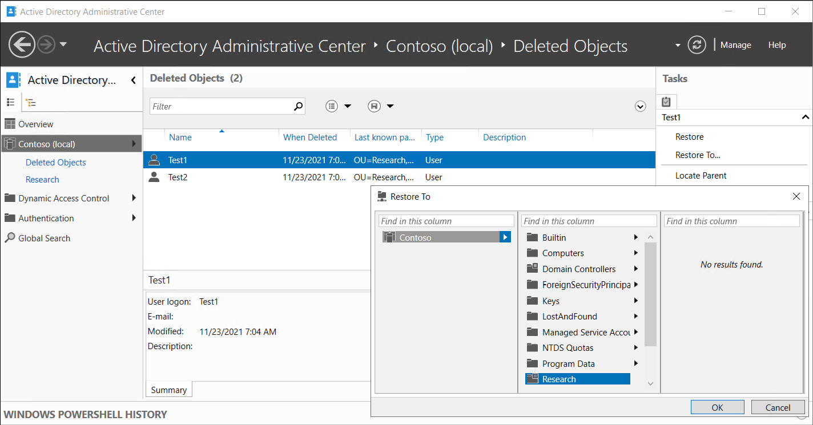

When you delete an object in AD DS, the object moves to the Deleted Objects container and loses many important attributes. Your recovery options depend on whether you have enabled the Active Directory Recycle Bin feature.

> [!TIP]
> You can extend the list of attributes that remain when you delete an object, but you can never retain linked attribute values, such as group membership.

If you have not enabled Active Directory Recycle Bin, you can reanimate a deleted object if it meets two conditions:

- It must not have reached the end of its tombstone lifetime (180 days by default).
- It must not have been scavenged by the garbage collection process (scavenging is a database cleanup process that removes stale records).

> [!NOTE]
> The AD DS database is self-maintaining. Every 12 hours, by default, each domain controller runs garbage collection. This accomplishes two tasks. First, it removes deleted objects that have outlived their tombstone lifetime. Second, the garbage collection process performs online defragmentation. 

To reanimate a deleted object, you can use the Ldp tool. Ldp.exe is a command-line tool that you use to perform Lightweight Directory Access Protocol (LDAP) searches against AD DS. You also can use it to perform maintenance on AD DS or Active Directory Lightweight Directory Services (AD LDS).

## Implement Active Directory Recycle Bin

Active Directory Recycle Bin simplifies the process for restoring deleted objects through authoritative restore and tombstone reanimation. With Active Directory Recycle Bin, you can restore deleted objects with full functionality without having to:

- Restore Active Directory data from backups

- Restart AD DS or reboot domain controllers

Active Directory Recycle Bin builds on the existing tombstone-reanimation infrastructure and helps you preserve and recover accidentally deleted Active Directory objects.

### How does Active Directory Recycle Bin work?

Enabling Active Directory Recycle Bin enables you to:

- Preserve all link-valued and non–link-valued attributes of the deleted Active Directory objects.

- Restore the objects to the same consistent logical state that they were in immediately prior to deletion.

For example, restored user accounts automatically regain all group memberships and corresponding access rights that they had immediately before deletion.

After you enable Active Directory Recycle Bin, when you delete an Active Directory object:

- The system preserves all the object's link-valued and non–link-valued attributes.

- The object becomes logically deleted.

- The deleted object:

  - Moves to the Deleted Objects container, and its distinguished name is obscured.

  - Remains in the Deleted Objects container in a logically deleted state throughout the duration of the deleted object lifetime.

Within the deleted object lifetime, you can recover a deleted object with Active Directory Recycle Bin and make it a live AD DS object again. The following screenshot displays two user objects, Test1 and Test2, in the Deleted Objects (2) folder in Active Directory Administrative Center. The administrator has initiated a restore to the Research OU for Test1.

The value of the msDS-deletedObjectLifetime attribute determines the deleted object lifetime. For an item deleted after you enable Active Directory Recycle Bin, the value of the legacy tombstoneLifetime attribute determines the recycled object lifetime. By default, this value is null, which means that the deleted object lifetime is set to the value of the recycled object lifetime. By default, the recycled object lifetime is also null.

> [!IMPORTANT]
> This means that the recycled object lifetime defaults to 180 days. 

You can modify these two values at any time. To modify these values, you can use Windows PowerShell. For example, to set tombstoneLifetime to 365 days, run the following command:

`Set-ADObject -Identity “CN=Directory Service,CN=Windows NT,CN=Services,CN=Configuration,DC=Contoso,DC=com” –Partition “CN=Configuration,DC=Contoso,DC=com” –Replace:@{“tombstoneLifetime” = 365}`

To set the deleted object lifetime to 365 days, run the following command:

`Set-ADObject -Identity “CN=Directory Service,CN=Windows NT,CN=Services,CN=Configuration,DC=Contoso,DC=com” –Partition “CN=Configuration,DC=Contoso,DC=com” –Replace:@{“msDS-DeletedObjectLifetime” = 365}`

### Enable Active Directory Recycle Bin

To enable Active Directory Recycle Bin, you can perform one of the following:

- From the Active Directory module for Windows PowerShell command prompt, use the `Enable-ADOptionalFeature` cmdlet.

- From Active Directory Administrative Center, select the domain, and then select **Enable Active Directory Recycle Bin** in the **Tasks** pane.

> [!NOTE]
> You can use Active Directory Recycle Bin to restore only items deleted after you turn on Active Directory Recycle Bin.

> [!WARNING]
> After you've enabled Active Directory Recycle Bin, you can't disable it.

