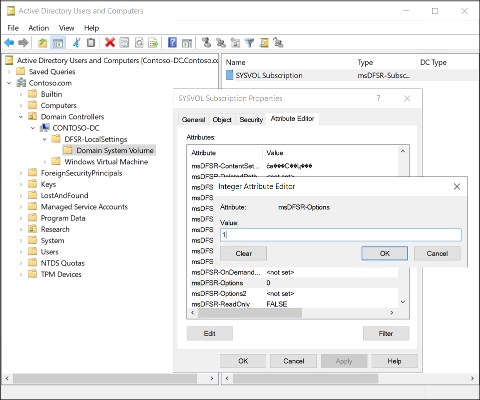

Group Policy settings are presented as Group Policy Objects (GPOs) in AD DS user interface tools, but a GPO is actually two components, described in the following table:

| Component| Description|
| :--- | :--- |
| Group Policy Container| The Group Policy container is an AD DS object that is stored in the Group Policy Objects container within the domain-naming context of the directory. Similar to all AD DS objects, each Group Policy container includes a globally unique identifier (GUID) attribute that uniquely identifies the object within AD DS. The Group Policy container defines basic attributes of the GPO.|
| Group Policy Template| The Group Policy template stores the settings, and is a collection of files stored in the SYSVOL of each domain controller in the `%SystemRoot%\SYSVOL\Domain\Policies\GPOGUID` path, where GPOGUID is the GUID of the Group Policy container. When you make changes to the settings of a GPO, the changes are saved to the Group Policy template of the domain controller from which the GPO was opened.|

> [!NOTE]
> By default, this is the domain controller that holds the primary domain controller (PDC) emulator operations master role. 
## What is Group Policy replication?

Group Policy containers and Group Policy templates are both replicated between all domain controllers in a single domain in AD DS. But these two elements use different replication mechanisms:

- The Group Policy container. Replicates in AD DS by using a directory replication agent.

- The Group Policy template in SYSVOL. Replicates by using Distributed File System Replication (DFS-R).

Because the Group Policy container and Group Policy template replicate separately, it is possible for them to become out of synchronization for a short time. Usually, this resolves itself.

## Describe how to rebuild and recover SYSVOL

If you delete items from SYSVOL, and replication occurs, those items are gone. In addition, if SYSVOL becomes corrupted, it has a significant and detrimental effect on Group Policy. This will severely impact your users. So, in either situation, you'll need to know how to recover SYSVOL.

Typically, you'll recover SYSVOL as part of a system state restore. But as with the restoration of AD DS, if there are additional domain controllers in your environment, you'll need to mark the restoration as authoritative. This is referred to as performing an authoritative synchronization of DFSR-replicated SYSVOL.

There are a number of ways to perform an authoritative restore of SYSVOL. After restoring your domain controller, you can:

- Edit the `msDFSR-Options` attribute

- Perform a system state restore using `wbadmin –authsysvol`

> [!TIP]
> If you have the option to restore a system state backup (that is, you are restoring AD DS to the same hardware and operating system instance) then using `wbadmin –authsysvol` is simpler. 
But if you need to perform a bare metal restore, then you need to edit the `msDFSR-Options` attribute.

### Perform an authoritative synchronization of DFSR-replicated SYSVOL

Use the following procedure to perform an authoritative synchronization of SYSVOL by editing the msDFSR-Options attribute:

1. Recover a domain controller to an earlier point in time.

1. Sign in as an administrator, and open **Active Directory Users and Computers**.

1. Enable both of the following from the **View** menu:

  - Advanced Features

  - User, Contacts, Groups, and Computers as containers

1. In your domain, expand **Domain Controllers**, expand the specific domain controller you restored, expand **DFSR-LocalSettings**, and then select **Domain System Volume**.

1. Right-click the **SYSVOL Subscription** object, and select **Properties**.

1. As displayed in the following screenshot, select the **Attribute Editor** tab, and scroll down and locate the **msDFSR-Options** attribute.

1. Double-click **msDFSR-Options**, enter **1**, and then select **OK**.

This change marks the instance of SYSVOL on the configured domain controller as authoritative.

