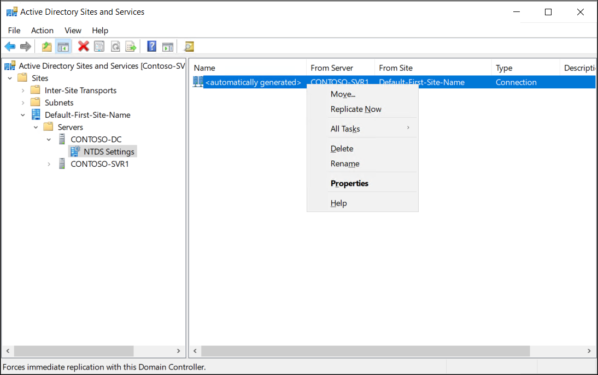
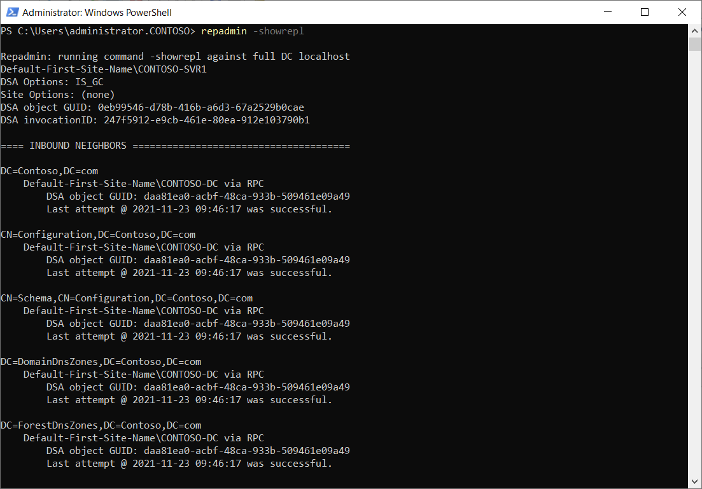
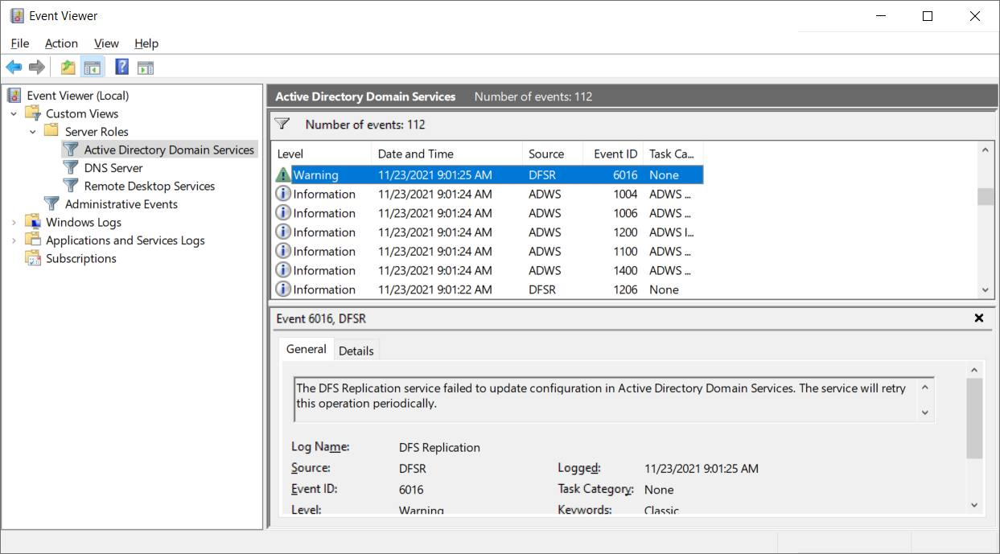

AD DS consists of several logical partitions. These directory partitions (also called a naming context), contain objects of a particular replication scope and purpose. There are four Active Directory partitions on each domain controller:

- Domain. This contains all the objects stored in a domain, including users, groups, computers, and Group Policy containers.

- Configuration. This contains objects that represent the logical structure of the forest (including information about domains), in addition to the physical topology, including sites, subnets, and services.

- Schema. This defines the object classes and their attributes for the entire directory.

- Application. Domain controllers also can host application partitions. You can use application partitions to limit replication of application-specific data to a subset of domain controllers.

Each domain controller maintains a copy (or replica), of several partitions:

- The configuration partition and schema partitions replicate to every domain controller in the forest.

- The domain partition for a domain replicates to all domain controllers within a domain, but not to domain controllers in other domains.

Therefore, each domain controller has at least three replicas: the domain partitions for its domain, configuration, and schema.

## How does replication work?

First of all, it's important to understand what's being replicated. When you think about the sort of changes that occur, you can begin to understand the impact of replication problems and failures. Common AD DS updates include:

- Adding new objects, such as users, computers, and groups

- Changing the properties of objects, such as updating a user password, or adding a member to a group

- Reconfiguring Group Policy settings

- Making AD DS schema changes, although these changes are infrequent

- Adding more domains to the AD DS forest, but again, that rarely happens after initial deployment

Most of these changes can be initiated at any domain controller in a domain. However, some changes require a designated AD DS single operations master role holder to be used. Therefore, for most operations, AD DS can be considered to be multimaster. This means you can make changes on any instance of a replicated partition. A means now exists to ensure that all other instances are synchronized to use the latest version of a given object.

> [!NOTE]
> Active Directory replication uses attribute-level changes to ensure fine granular control over object updates. This means that two administrators can edit different attributes of the same object simultaneously without creating a conflict. 

Active Directory replication ensures that all instances of all partitions are synchronized. It starts this process by building and maintaining a replication topology that ensures no two DCs are more than three hops apart. Generally, there's no need to manually make changes to the autogenerated topology.

## What are the available tools for troubleshooting?

You can investigate and resolve most Active Directory replication using one of two tools. These are:

- Active Directory Sites and Services

- The Repadmin.exe command-line tool

### Use Active Directory Sites and Services

This graphical tool enables you to:

- Determine the replication partners for a given domain controller

- Force replication from listed partner domain controllers

The following screenshot displays the context menu for a selected replication link to another domain controller. The **Replicate Now** option pulls changes across the link from the selected server.

If you're experiencing problems:

1. Open **Active Directory Sites and Services**, and then navigate to the appropriate site.

1. Select the problematic server, and then, in the **NTDS Settings** folder, select an appropriate Connection.

1. Right-click the selected Connection, and then select **Replicate Now**.

### Use Repadmin.exe

You can use the Repadmin.exe command-line tool to troubleshoot Active Directory replication. Using Repadmin, you can perform many troubleshooting tasks, including:

- Display the replication topology

- Trigger immediate replication

- Review replication queues

- Replicate single objects

- Verify the replication topology

- Synchronize a domain controller with all replication partners

The following table lists and describes some of the more commonly used Repadmin command parameters.

| Command parameter| Description|
| :--- | :--- |
| Repadmin -replicate| Triggers the immediate replication of the specified directory partition to a destination domain controller from a source domain controller.|
| Repadmin -replsummary| Identifies domain controllers that are failing inbound replication or outbound replication, and summarizes the results in a report.|
| Repadmin -showrepl| Displays the replication status when the specified domain controller last attempted to perform inbound replication on Active Directory partitions.|
| Repadmin -syncall| Synchronizes a specified domain controller with all replication partners.|

> [!TIP]
> You can review a full list of Repadmin syntax by following the link in the Summary unit of this module.

For example, as displayed in the following screenshot, you can use `Repadmin -showrepl` command to verify replication status.

### Review events in Event Viewer

Also consider reviewing AD DS logs in Event Viewer. You'll find the logs under the Server Roles node, as displayed in the following screenshot.

## Manage operation masters

Although AD DS is multimaster, there are certain operations can be performed only by a specific role, on a specific domain controller. A domain controller that holds one of these roles is an operations master. Five operations master roles exist.

> [!NOTE]
> By default, the first domain controller installed in a forest has all five roles. However, you can move these roles after building more domain controllers

The five operations master roles have the following distribution:

- Each forest has one schema master and one domain naming master.

- Each AD DS domain has one relative ID (RID) master, one infrastructure master, and one primary domain controller (PDC) emulator.

The operations master perform the following functions:

- Domain naming master. This is the domain controller that you must contact when you add or remove a domain or make domain name changes. If the domain naming master is unavailable, you won't be able to add domains to the forest.

- Schema master. This is the domain controller in which you make all schema changes. If the schema master is unavailable, you won't be able to make changes to the schema.

- RID master. Whenever you create an object in AD DS, the domain controller where you created the object assigns the object a unique identifying number known as a SID. To ensure that no two domain controllers assign the same SID to two different objects, the RID master allocates blocks of RIDs to each domain controller within the domain to use when building SIDs. If the RID master is unavailable, you might experience difficulties adding new objects to the domain.

- Infrastructure master. This role maintains interdomain object references, such as when a group in one domain has a member from another domain. If the infrastructure master is unavailable, domain controllers that are not global catalogs can't check universal group memberships or authenticate users.

- PDC emulator master. The domain controller that holds the PDC emulator master is the time source for the domain. The PDC emulator master is also the domain controller that receives urgent password changes. If the PDC emulator master is unavailable, users might have trouble signing in until their password changes have replicated to all the domain controllers. The PDC emulator master also plays a role in editing GPOs. When you open a GPO other than a local GPO for editing, the PDC emulator master stores the edited copy.

If one of the operations master is offline, then that can cause some problems. Generally, it’s the absence of the PDC emulator master that has the most immediate and most significant impact. If you experience problems with time sync, Group Policy editing, or user password updates, then check the status of the PDC emulator role holder.

> [!TIP]
> If necessary, you might need to seize the roles assigned to an unavailable domain controller.

