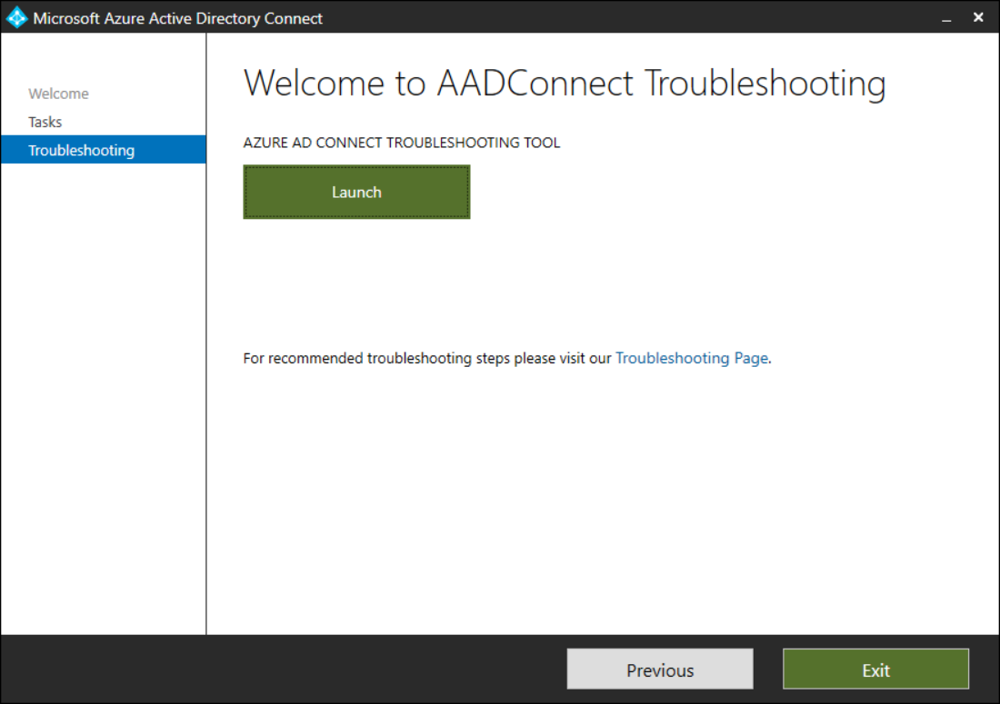
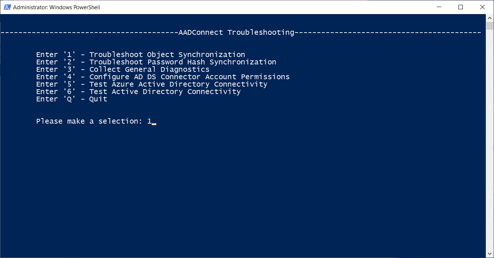
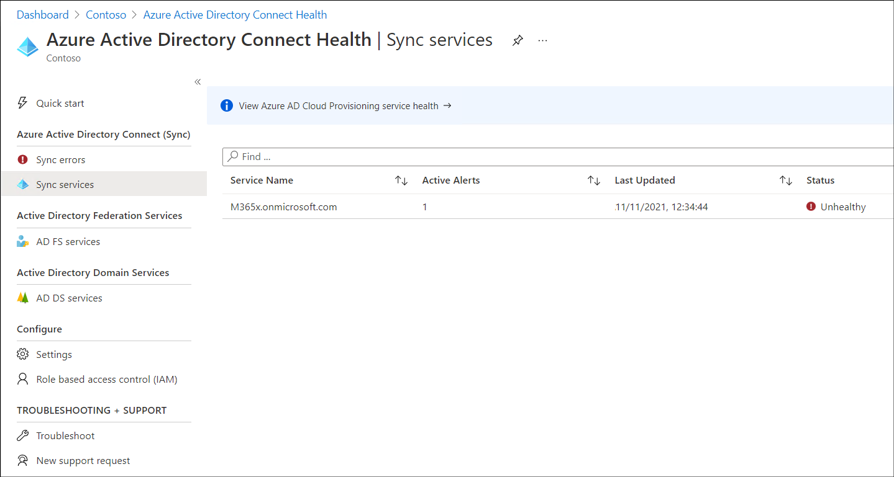
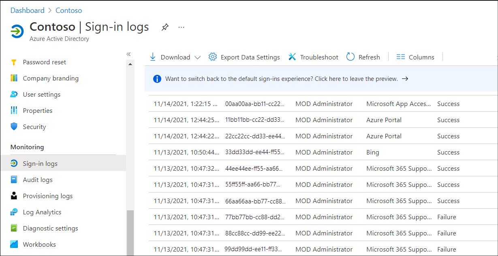

Microsoft Entra ID is part of the platform as a service (PaaS) offering and operates as a Microsoft-managed directory service in the cloud. It's not a part of the core infrastructure that customers own and manage, nor is it an IaaS offering. While this implies that you have less control over its implementation, it also means that you don't have to dedicate resources to its deployment or maintenance. With Microsoft Entra ID, you also have access to a set of features that are not natively available in AD DS, such as support for multifactor authentication, identity protection, and self-service password reset.

## What are the AD DS integration options?

Small organizations that don't have an on-premises directory such as AD DS can fully rely on Microsoft Entra ID as an authentication and authorization service. However, the number of these organizations is still quite small, so most companies search for a way to integrate on-premises AD DS with Microsoft Entra ID. Microsoft offers cloud-scale identity and access management via Microsoft Entra ID, which provides several options for integrating AD DS with Azure. These options are described in the following table.

| Options| Description|
| :--- | :--- |
| Extending on-premises AD DS to Azure| With this option, you host VMs in Azure that you then promote to be domain controllers in your on-premises AD DS.|
| Synchronizing on-premises AD DS with Microsoft Entra ID| Directory synchronization propagates user, group, and contact information to Microsoft Entra ID and keeps that information synchronized. In this scenario, users will utilize different passwords to access cloud and on-premises resources, and the authentication processes are separate.|
| Synchronizing AD DS with Microsoft Entra ID by using password hash synchronization| In this approach, on-premises AD DS synchronizes objects with Microsoft Entra ID, but also sends password hashes for user objects to Microsoft Entra ID. With this option, users can access Microsoft Entra ID–aware applications and resources by providing the same password as their current on-premises sign-in. For end users, this approach provides the same sign-in experience.|
| Implementing SSO between on-premises AD DS and Microsoft Entra ID| This option supports the largest range of integration features, and it allows a user to sign in to Azure after authenticating via the on-premises AD DS. The technology that provides this functionality is called federation, which you can implement by using Active Directory Federation Services (AD FS). AD FS relies on a set of federation servers and proxies, which take the form of the Web Application Proxy server role service. As an alternative to deploying AD FS, you can also use pass-through authentication technology, which provides almost the same results as AD FS. However, it does not use a Web Application Proxy and requires a less complex infrastructure than AD FS.|

> [!NOTE]
> The Microsoft Entra directory is not an extension of an on-premises directory. Rather, it's a copy that contains the same objects and identities. Changes made to these items on-premises are copied to Microsoft Entra ID, but changes made in Microsoft Entra ID are not replicated back to the on-premises domain.

## What is Microsoft Entra Connect?

Directory synchronization enables synchronization between on-premises AD DS and Microsoft Entra ID for users, groups, and contacts. In its simplest form, you install a Directory synchronization component on a server in your on-premises domain. You then provide an account with Domain Admin and Enterprise Admin access to on-premises AD DS, and another account with administrator access to Microsoft Entra ID, and let it run.

You can use Microsoft Entra Connect (Microsoft Entra Connect) to perform synchronization between on-premises AD DS and Microsoft Entra ID. Microsoft Entra Connect is a wizard-based tool designed to enable connectivity between an on-premises identity infrastructure and Azure. Using the wizard, you can choose your topology and requirements and then the wizard deploys and configures all the required components for you.

When you run Microsoft Entra Connect, the following occurs:

- New users, groups, and contact objects in on-premises AD DS are added to Microsoft Entra ID.

- Attributes of existing users, groups, or contact objects that are modified in on-premises AD DS are modified in Microsoft Entra ID. However, not all on-premises AD DS attributes are synchronized to Microsoft Entra ID. You can configure a set of attributes that synchronize to Microsoft Entra ID by using Synchronization Manager component of Microsoft Entra Connect.

- Existing users, groups, and contact objects that are deleted from the on-premises AD DS are deleted from Microsoft Entra ID.

- Existing user objects that are disabled on-premises are disabled in Azure.

> [!WARNING]
> However, licenses are not automatically assigned or unassigned.

Microsoft Entra ID requires that you have a single source of authority for every object. Therefore, it's important to understand that in a Microsoft Entra Connect scenario, when you're running Active Directory synchronization you're mastering objects from within your on-premises AD DS.

> [!IMPORTANT]
> After the first synchronization cycle is complete, the source of authority is transferred from the cloud to the on-premises AD DS. 

All subsequent changes to cloud objects (except for licensing) are mastered from the on-premises AD DS tools. The corresponding cloud objects are read-only, and Microsoft Entra administrators cannot edit cloud objects if the source of authority is on-premises AD DS, unless you implement some of the technologies that allow writeback.

## Prepare to synchronize

A very good way of avoiding problems with synchronizing identities is to prepare carefully. Make sure that you include the following checks:

- Removing duplicate `proxyAddress` and `userPrincipalName` attributes.

- Updating blank and invalid `userPrincipalName` attributes and replacing with valid `userPrincipalName` attributes.

- Removing invalid characters in the following attributes: `givenName`, `surname (sn)`, `sAMAccountName`, `displayName`, `mail`, `proxyAddresses`, `mailNickname`, and `userPrincipalName`.

> [!TIP]
> UPNs that are used for SSO can contain letters, numbers, periods, dashes, and underscores; no other character types are allowed.

## Perform health checks of AD DS

To have directory synchronization work properly, you must ensure that on-premises Active Directory is well-prepared and error free. You can use the following AD DS health check tools can be used to identify and remediate issues.

### IdFix tool

The Microsoft 365 IdFix tool enables you to identify and remediate the majority of object synchronization errors in Active Directory, including common issues such as duplicate or malformed `proxyAddresses` and `userPrincipalName`.

You can select the OUs that you want IdFix to check, and you can fix common errors within the tool itself. Common errors might include problems such as invalid characters that might have been introduced during scripted user imports to attributes such as `proxyAddresses` and `mailNickname`.

For distinguished names that contain format and duplicate errors, IdFix might not be able to suggest an automatic remediation. Such errors can either be fixed outside IdFix or can be manually remediated within IdFix.

### ADModify.NET tool

For errors such as format issues, you can make changes to specific attributes object-by-object by using either ADSIEdit or Advanced Mode in Active Directory Users and Computers. However, to make attribute changes to multiple objects, `ADModify.NET` is a better tool. This is because the batch mode operation provided by `ADModify.NET` is particularly useful for making changes to attributes such as UPNs across OUs or domains.

## Troubleshoot issues with Microsoft Entra Connect Sync

If you experience problems synchronizing objects to Microsoft Entra ID, consider running the troubleshooting task in the Microsoft Entra Connect wizard. To run the wizard, use the following procedure:

1. On your Microsoft Entra Connect server, open an elevated Windows PowerShell command prompt.

1. Run either the `Set-ExecutionPolicy RemoteSigned` or `Set-ExecutionPolicy Unrestricted` command.

1. Start the **Microsoft Entra Connect** wizard.

1. Select Configure, select **Troubleshoot**, and then select **Next**.

1. On the **Troubleshooting** page, select **Launch** to start the troubleshooting menu in PowerShell. The following screenshot displays the Welcome to AADConnect Troubleshooting page of the wizard.

    

1. In the PowerShell window, in the main menu, select the appropriate troubleshooting option.

1. For example, select **Troubleshoot Object Synchronization**, as displayed in the following screenshot.

    

You can select a number of options. These are:

- Troubleshoot Object Synchronization

- Troubleshoot Password Hash Synchronization

- Collect General Diagnostics

- Configure AD DS Connector Account Permissions

- Test Microsoft Entra Connectivity

- Test Active Directory Connectivity

Use the guidance in the following document to interpret the output and resolve any discovered issues: [Troubleshoot object synchronization with Microsoft Entra Connect Sync](/azure/active-directory/hybrid/tshoot-connect-objectsync).

## Monitor Microsoft Entra Connect

If you subscribe to a premium version of Microsoft Entra ID, you can use the Microsoft Entra Connect Health tool to identify problems with synchronization. To access this tool, in the Microsoft Entra admin center:

1. On the **Microsoft Entra ID** tab, select **Microsoft Entra Connect**.

1. In the details pane, select the **Microsoft Entra Connect Health** link.

1. As displayed in the following screenshot, from this page, you can review a number of items and launch several tools, including:

  - Sync errors. Displays any recent synchronization errors.

  - Sync services. Displays the current synchronization status. In the screenshot, it displays as Unhealthy.

> [!TIP]
> You can drill down into specific items to learn more. 

## Review Microsoft Entra sign-in logs

If your users experience problems when they attempt to sign-in to Microsoft Entra ID, then you can review available logs. There are a number of monitoring and logging options you can enable and review in Microsoft Entra ID. These are accessible in the **Monitoring** section of the Microsoft Entra admin center. The following table describes some of the available options.

| Monitoring option| Description|
| :--- | :--- |
| Sign-ins| Enables you to review sign-in logs to help identify and resolve authentication issues. You can review the recent sign-ins (the default time period is the last 24 hours). You can also filter the returned results using a number of factors to help you locate specific sign-ins.|
| Audit logs| Lists recent activities performed in your tenant, such as updating policies, or performing user management.|
| Provisioning logs| Lists details about activities performed by the provisioning service, such as the creation of a group in ServiceNow or a user imported from Workday.|
| Logs| Requires that you’ve first configured Log Analytics integration. Once enabled and configured, you can use Azure Monitor logs to query data to find particular events, analyze trends, and perform correlation across various data sources. With the integration of Microsoft Entra activity logs in Azure Monitor logs, you can compare your Microsoft Entra sign-in logs against security logs published by Azure Security Center. You can troubleshoot performance bottlenecks on your application’s sign-in page by correlating application performance data from Azure Application Insights.|
| Usage & insights| Provides a link to the Microsoft Entra application activity page. You can review Microsoft Entra application activity, AD FS application activity, and Authentication methods activity. The Microsoft Entra application activity page displays information in a per-app list. For example, you can scroll down the returned list of sign-ins to review those for Microsoft Teams.|

To access sign-in logs, use the following procedure:

1. Open the **Microsoft Entra admin center**.

1. Select the **Microsoft Entra ID** tab, and then select **Sign-in logs**.

1. In the details pane, select the date you're interested in. For example, select **Last 1 month**.

1. Select **Apply**.

1. Review and analyze the returned results, as displayed in the following screenshot.

You can also review sign-in logs in Microsoft Entra ID using Sign-in Diagnostic. Use the following procedure:

1. Open the **Microsoft Entra admin center**.

1. Select the **Microsoft Entra ID** tab, and then select **Diagnose and solve problems**.

1. In the details pane, select **Troubleshoot** beneath the **Sign-in Diagnostic** heading.

1. On the **Sign-in Diagnostic** page, enter the following information, and then select **Next**:

    - User

    - Application

    - Approximate date and time of problem

1. Review the information returned.
