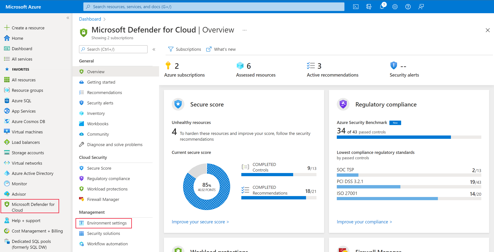
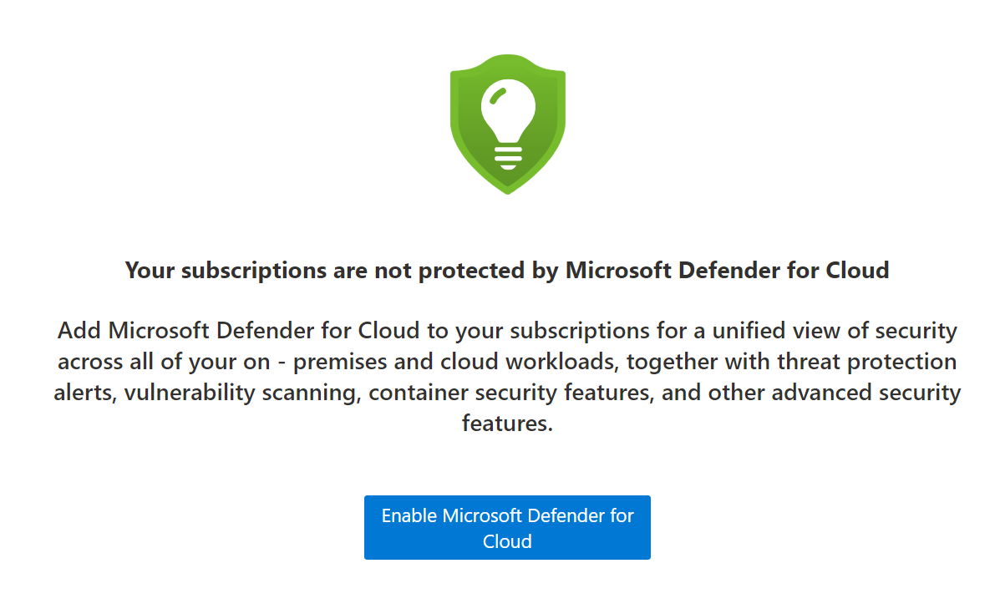
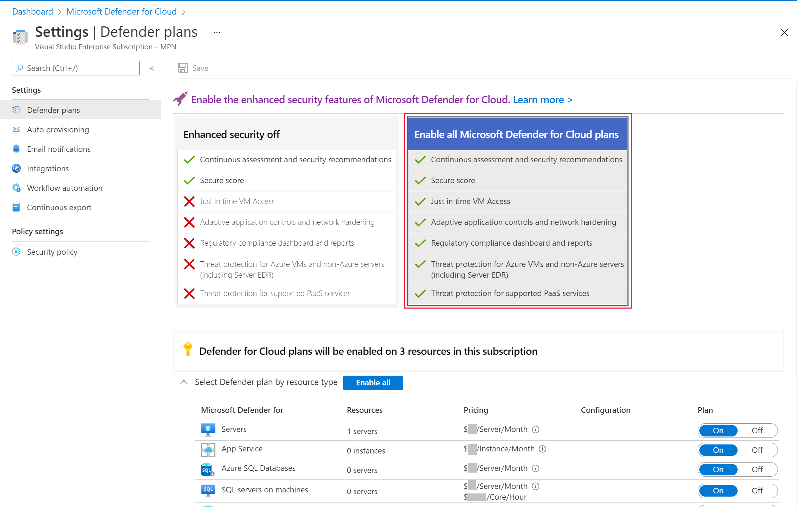

Unlike Azure Bastion, there are only two high-level issues you might need to troubleshoot with just-in-time VM access.

## Availability

JIT VM access is one of the enhanced security features of Microsoft Defender for Cloud. Your organization has to have enhanced security enabled at the subscription level. To check this, go to the Azure portal, select **Microsoft Defender for Cloud**, and under **Management**, select **Environment settings**.

If you haven’t enabled Microsoft Defender for Cloud on your subscription, you’ll see the error below:

Select **Enable Microsoft Defender for Cloud** to be taken to a page that allows you to select your subscription.

If you have multiple subscriptions, select the one with the resources you are troubleshooting. Then select the large **Enable all Microsoft Defender for Cloud plans** box.

Choose the services you’d like to protect; at a minimum, you need to select **Server** to enable JIT VM access.

You can enable JIT access from the VM connection pane, from Workload protections inside Microsoft Defender for Cloud, or by using Azure CLI commands. For example, to use Workload protections, follow these steps:

1. In the Azure portal, select **Microsoft Defender for Cloud**.

1. Under Cloud Security, select **Workload protections**.

1. Select **Just-in-time VM** access.

You can then select the **Not Configured** tab to show all the VMs in your subscription that don’t have JIT access enabled.

Select the check next to the VM you want to protect.

Select **Enable JIT** on 1 VM.

This page can also help you diagnose your VMs that aren’t supported by JIT VM access. The VMs having problems will likely have been deployed without using the Azure Resource Manager (ARM). Only VMs deployed through ARM are supported by JIT access.

## Access

With JIT VM access enabled on your machines, users might still have issues when they request access to a specific protected VMs. You request access to a VM using the Azure portal as follows:

- From inside the Connect options for a VM.

- From inside the Workload protections section of Microsoft Defender for Cloud.

- Using Azure CLI commands.

If your users are unable to request JIT access, check that their role has these actions, at a minimum:

- Microsoft.Security/locations/jitNetworkAccessPolicies/*/read

- Microsoft.Security/locations/jitNetworkAccessPolicies/initiate/action

- Microsoft.Compute/virtualMachines/read

- Microsoft.Network/*/read

You use Access control (IAM) to check which users have been granted access to a VM. In the Azure portal, select Virtual machine, and then select Access control (IAM).

You can review the currently enabled and used JIT VM access in the Microsoft Defender for Cloud advanced protection section.

