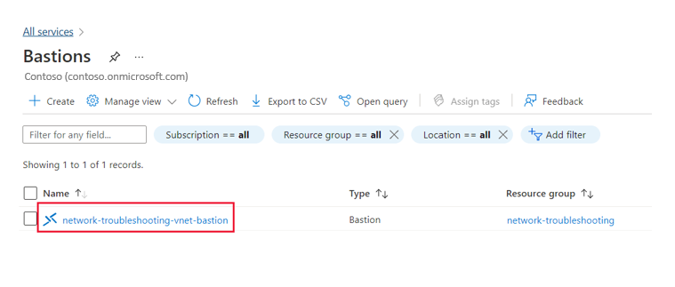
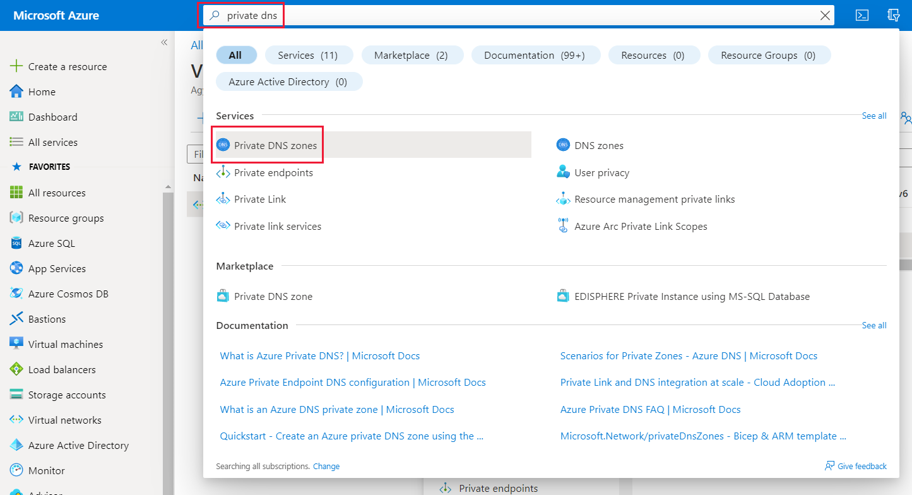
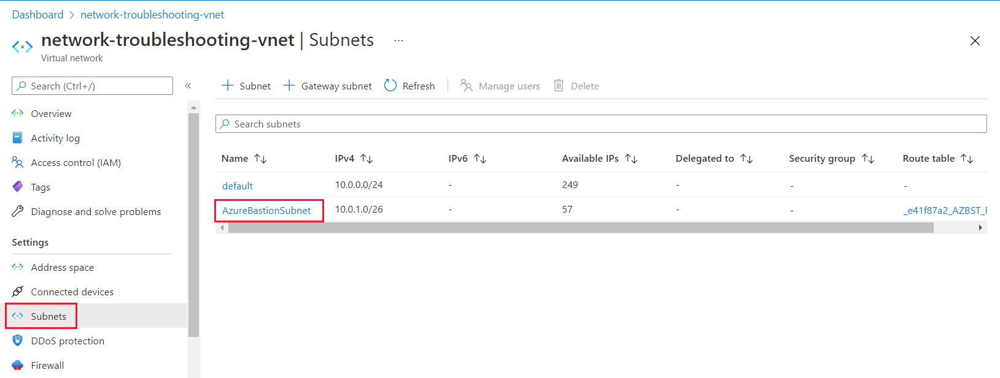
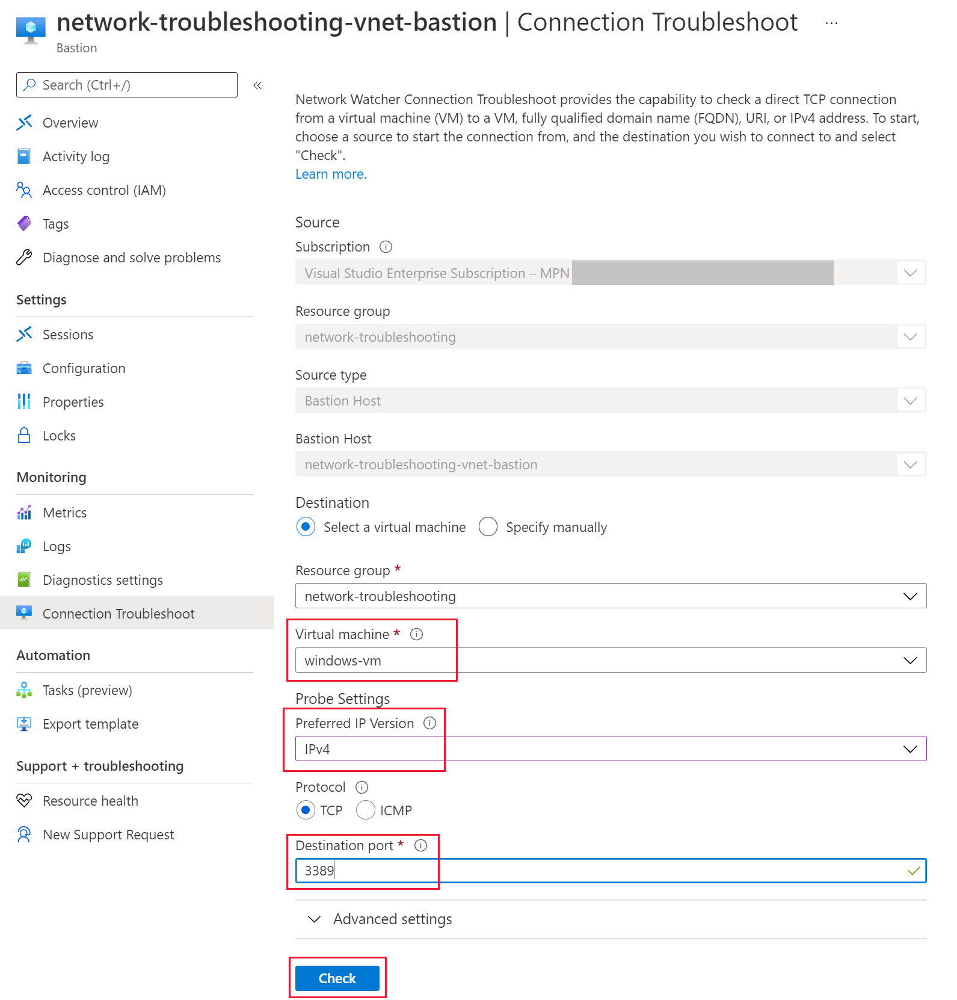
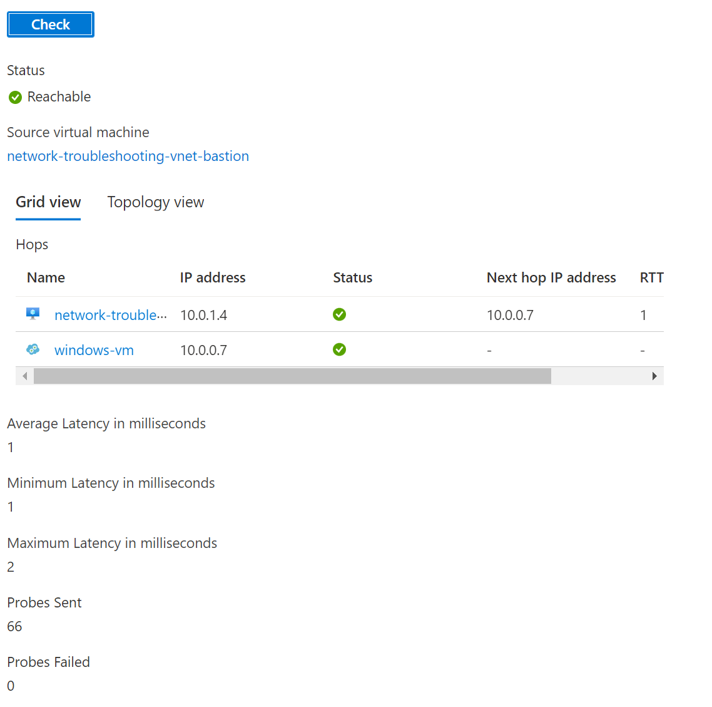

You’ve been contacted by one of the teams you support. The team is having problems connecting to their VM using Bastion. In this exercise you'll see how to troubleshoot the Azure Bastion Service.

Bastion is not supported in the Learn sandbox environment. Watch the video at the end to view this exercise. If you'd like to follow along in your own subscription, you can use the following steps.

## Check that Bastion has been deployed

1. In the Azure portal, in the search box, type **Bastions**.

    

1. From the results, under **Services**, click **Bastions**.

1. You should see the Bastion service listed.

    

    > **NOTE**:
    > If there isn’t any Bastion services listed, create one.

## Check if there’s a private DNS zone

1. In the Azure portal, in the search box, type **private dns**.

    

1. From the results, under **Services**, click **Private DNS zones**.

    

1. You shouldn’t see any private DNS zones.

1. If there are any zones listed, check that they don’t end in **azure.com** or **core.windows.net**.

    

## Check if AzureBastionSubnet is using a Network Security Group correctly

1. In the Azure portal, in the search box, type **Bastions**.

1. From the results, under **Services**, click **Bastions**.

1. Select the Bastion you are troubleshooting.

    

1. In the top right, click the **Virtual network/subnet** link.

    

1. Under **Settings**, click **Subnets**, and then click **AzureBastionSubnet**.

    

    > **NOTE**:
    > If Azure Bastion has a **Network security group** associated with the subnet, you need to check that it has all the inbound and outbound rules created.

## Run the Connection Troubleshoot tool to check for issues

1. In the Azure portal, in the search box, type **Bastions**.

1. From the results, under **Services**, click **Bastions**.

1. Select the Bastion you are troubleshooting.

1. Under **Monitoring**, click **Connection Troubleshoot**.

1. Under **Virtual machine**, select the VM you are trying to connect to.

1. Select your **Preferred IP Version**.

1. In the **Destination port**, if you want to use **RDP**, enter **3389**, if you want to use **SSH**, enter **22**.

1. Click **Check**.

    

    If you’ve resolved all the possible connection issues, the connection troubleshoot wizard should return a status of reachable.

    

You can watch the following video to see all the steps above:

> [!VIDEO https://www.microsoft.com/videoplayer/embed/RE4RYRS]
