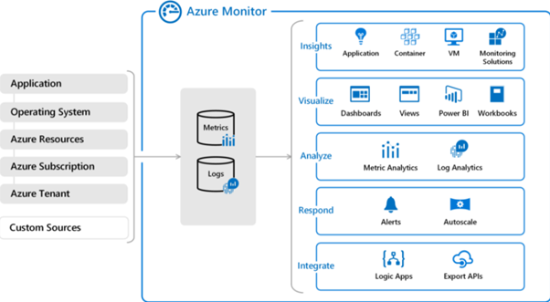
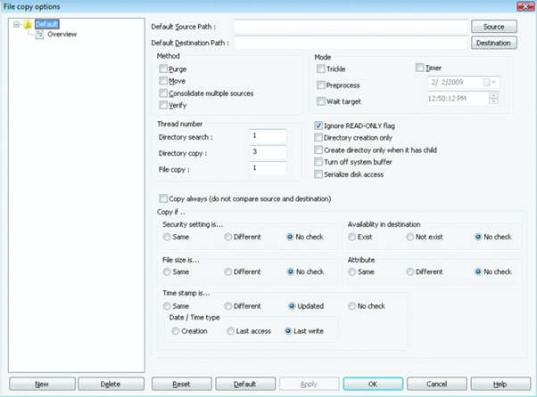
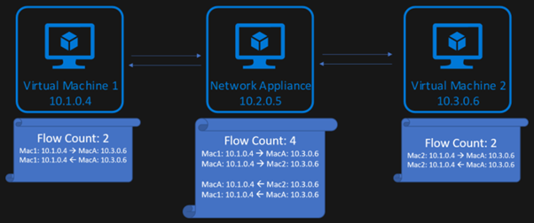
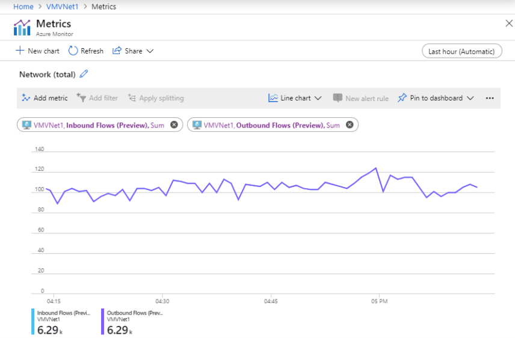
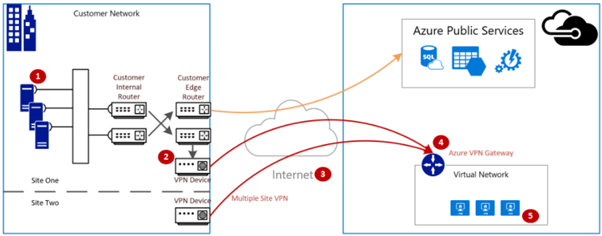

## Troubleshoot latency issues within a virtual network

The following [Tutorial: Diagnose a VM network traffic filter problem - Azure portal - Azure Network Watcher](/azure/network-watcher/diagnose-vm-network-traffic-filtering-problem) can help you determine the cause of a communication failure and how you can resolve it.

### Azure Network Watcher

Azure Network Watcher comprises of tools to monitor, diagnose, and gain insight in your Azure virtual network. Network Watcher is designed to monitor and repair the network performance and health of Virtual Machines, Virtual Networks, Application Gateways, Load balancers, etc. through metrics and enabling or disabling logs for resources in a virtual environment.

Connection monitor enables you to monitor the latency, reachability, and network topology changes between a virtual machine (VM) and the endpoint. It also provides the minimum, average, and maximum latency observed over time.

Network performance monitor is a cloud-based hybrid network monitoring solution, that enables you to monitor network performance in Azure and on-premises resources using VPN or ExpressRoute. The advanced detection ability in Network performance monitor helps detect network issues like traffic blackholing, routing errors, and other issues that escape detection through conventional monitoring methods.

### Troubleshoot using packet capture in Azure Network Watcher

Packet capture is one the network diagnostic tools that allows to create packet capture sessions to track traffic to and from a virtual machine. Packet capture diagnose network anomalies, gather network statistics, provide information on network intrusions to debug client-server communications.

Packet capture can be launched through the Network Watcher portal, PowerShell, CLI, or REST API. Packet capture comprises of filters that are based on 5-tuple (protocol, local IP address, remote IP address, local port, and remote port) information. Advanced filters and fine-tuned controls for the capture session ensures you capture traffic you want to monitor. You can store the captured data on the VM's disk or a storage blob or both. You can then analyze the capture file using network capture analysis tools.

Keep in mind the following options when performing a packet capture session:

Capture configuration

| Property| Description|
| :--- | :--- |
| Maximum bytes per packet (bytes)| The number of bytes from each packet that are captured, all bytes are captured if left blank. The number of bytes from each packet that are captured, all bytes are captured if left blank. If you need only the IPv4 header – indicate 34 here|
| Maximum bytes per session (bytes)| Total number of bytes in that are captured, once the value is reached the session ends.|
| Time limit (seconds)| Sets a time constraint on the packet capture session. The default value is 18000 seconds or 5 hours.|

Filtering (optional)

| Property| Description|
| :--- | :--- |
| Protocol| The protocol to filter for the packet capture. The available values are TCP, UDP, and All.|
| Local IP address| This value filters the packet capture to packets where the local IP address matches this filter value.|
| Local port| This value filters the packet capture to packets where the local port matches this filter value.|
| Remote IP address| This value filters the packet capture to packets where the remote IP matches this filter value.|
| Remote port| This value filters the packet capture to packets where the remote port matches this filter value.|

### Azure Monitor

Azure Monitor is a service that can be used to monitor the performance of your applications and services across subscriptions and regions from a centralized location. It collects, analyze, and act on telemetry from your cloud and on-premises environments. It also provides an insight on how your applications are performing, identify issues affecting them, and the resources they rely on.

The following diagram gives a high-level view of Azure Monitor. At the center of the diagram are the data stores for metrics and logs, which are the two fundamental types of data used by Azure Monitor. On the left are the sources of monitoring data that populate these data stores. On the right are the different functions that Azure Monitor performs with this collected data. This includes such actions as analysis, alerting, and streaming to external systems.

|||
| :--- | :--- |
| | Watch this video to learn more about Azure Monitoring Tutorial|

>[!VIDEO https://www.microsoft.com/videoplayer/embed/RE4qXeL?postJsllMsg=true]

## Identify the root cause for latency issues connecting to Azure VMs

You can measure your Azure virtual machine (VM) network latency with a tool. The tools, SockPerf (for Linux) and latte.exe (for Windows) can isolate and measure network latency. These tools exclude other types of latency, such as application latency and focus on the kind of network traffic that affects application performance (for example, Transmission Control Protocol [TCP] and User Datagram Protocol [UDP] traffic).

Other tools, such as Ping, is not recommended to measure latency as it employs the Internet Control Message Protocol (ICMP). The results of which doesn’t represent the network traffic that's used in real workloads, for example, TCP and UDP payload delivery times.

To test Azure virtual machine network latency in an Azure virtual network, refer to [Test VM network latency](/azure/virtual-network/virtual-network-test-latency).

For testing Azure VM network throughput, refer to [Bandwidth/Throughput testing (NTTTCP)](/azure/virtual-network/virtual-network-bandwidth-testing).

### RichCopy

RichCopy is a free utility multithreaded copying tool. It enables you to open multiple threads simultaneously, allowing many files to be copied in parallel. It also provides the ability to pause and resume file copy operations.

The following image shows features of RichCopy. You can customize various aspects of file copying, such as filtering files, saving attributes, adjusting cache size, and so on.

> [!NOTE]
> Note: RichCopy is provided as-is, and it's not supported by Microsoft.
## Determine whether resource response time is within an allowable range

Response time is a key element to monitor the performance of VMs. In Azure, there is a range of different VM sizes and types, each with a different mix of capabilities and features. One capability is network throughput (or bandwidth), measured in megabits per second (Mbps). The network capacity is shared within the virtual machines, hosted on a shared hardware. So larger virtual machines are allocated relatively more bandwidth than smaller virtual machines.

The allocated bandwidth is the total limit of all network traffic leaving the virtual machine, irrespective of destination. For example, if a virtual machine has a 1,000 Mbps limit, that limit applies whether the outbound traffic is destined for another virtual machine in the same virtual network, or outside of Azure. The network bandwidth of each virtual machine is metered on egress (outbound) traffic from the virtual machine.

Another feature is accelerated networking which is designed to improve network performance, including latency, throughput, and CPU utilization. Accelerated networking improves a virtual machine’s throughput, but only up to the virtual machine’s allocated bandwidth.

Azure virtual machines can have one or several network interfaces attached to them.

### Expected network throughput

The throughput limit applies to the virtual machine. Throughput remains unaffected by the following factors:

- **Number of network interfaces**: The bandwidth limit is increased for all outbound traffic from the virtual machine.

- **Accelerated networking**: This feature can be helpful in achieving the published limit, but it doesn’t change the limit.

- **Traffic destination**: All destinations count toward the outbound limit.

- **Protocol**: All outbound traffic over all protocols counts towards the limit.

To learn about expected outbound throughput and the number of network interfaces supported by each VM size, see Azure [Windows](/azure/virtual-machines/sizes?toc=/azure/virtual-network/toc.json) and [Linux](/azure/virtual-machines/sizes?toc=/azure/virtual-network/toc.json) VM sizes.

### Network Flow Limits

Apart from bandwidth, another factor that can affect network performance is the number of network connections active on a VM at any given time. For each direction of a TCP/UDP connection in data structures, Azure networking stack maintains state which is referred to as ‘flows’. A typical TCP/UDP connection have 2 flows created, one for the inbound and another for the outbound direction.

When data transfer happens between endpoints, several flows are required in addition to those that perform the data transfer. For example, flows created for DNS resolution and flows created for load balancer health probes.

Also, network virtual appliances (NVAs) such as gateways, proxies, firewalls, consider flows that are created for connections terminated at the appliance and originated by the appliance.

### Flow Limits and Active Connections Recommendations

The Azure networking stack supports 1M total flows (500k inbound and 500k outbound) for a VM. Following are the different scenarios of total active connections that can be handled by a VM:

- VMs that belongs to VNET can handle 500k active connections for all VM sizes with 500k active flows in each direction.

- VMs with network virtual appliances (NVAs) such as gateway, proxy, firewall can handle 250k active connections with 500k active flows in each direction due to the forwarding and additional new flow creation on new connection setup to the next hop as shown in the above diagram.

When it hits the limit, additional connections are dropped. Connection establishment and termination rates can also affect network performance. This is so because connection establishment and termination shares CPU with packet processing routines. It’s recommended to benchmark workloads against expected traffic patterns and scale out workloads appropriately to match your performance needs.

You can track the number of network flows and the flow creation rate on your VM or VMSS instances with the help of Metric, available in Azure Monitor.

## Determine root cause for throttling at VM level

Log Analytics in Azure Monitor can reduce end-to-end run time in a virtual network. To achieve this, you need to first upload the Disk and VM Throttling limits to a custom log in Log Analytics. To configure Log Analytics, consider the following steps: For detailed steps, refer to [Azure VM and Disk Throttling](https://devblogs.microsoft.com/premier-developer/azure-vm-and-disk-throttling/)

- List all the VMs and Disks in a subscription.

- Configure Azure Compute capabilities for each SKU using Azure REST API.

- Match Disks to each corresponding VM.

- Add in the VM IOPS, and Disk Bytes Limit.

- Post Disk\VM data to Log Analytics.

- Run a log analytics query that will output Disks and VMs that were throttled.

- Output results displayed.

> [!NOTE]
> Note: It is quicker to run the throttling queries in Log Analytics as compared to doing it locally.
## Determine root cause for throttling between sources and targets

A VPN gateway connection establishes a secure, cross-premises connectivity between your Virtual Network within Azure and on-premises IT infrastructure.

The VPN gateway connection comprises of the following components:

- On-premises VPN device (View a list of validated VPN devices.)

- Public internet

- Azure VPN gateway

- Azure VM

The following diagram shows the logical connectivity of an on-premises network to an Azure virtual network through VPN.

### Calculate the maximum expected ingress/egress

- Determine your application's baseline throughput requirements.

- Determine your Azure VPN gateway throughput limits. For help, see the "Gateway SKUs" section of [About VPN Gateway](/azure/vpn-gateway/vpn-gateway-about-vpngateways).

- Determine the [Azure VM throughput guidance](/azure/virtual-machines/sizes?toc=/azure/virtual-network/toc.json) for your VM size.

- Determine your Internet Service Provider (ISP) bandwidth.

- Calculate your expected throughput by taking the least bandwidth of either the VM, VPN Gateway, or ISP, which is measured in Megabits-per-second (/) divided by eight (8).

If the calculated throughput doesn’t meet the application's baseline throughput requirements, you can increase the bandwidth of the resource identified as the bottleneck. To resize an Azure VPN Gateway, refer to [Changing a gateway SKU](/azure/vpn-gateway/vpn-gateway-about-vpn-gateway-settings). To resize a virtual machine, see [Resize a VM](/azure/virtual-machines/resize-vm?tabs=portal). If you are not experiencing the expected Internet bandwidth, you may also contact your ISP.

## Validate network throughput by using performance tools

To validate network throughput, the tool used is iPerf. iPerf works on both Windows and Linux and has both client and server modes. It is limited to 3Gbps for Windows VMs.

However, Iperf is not the only tool. NTTTCP is an alternative solution for testing.

To learn more, refer to [iPerf tool](/azure/vpn-gateway/vpn-gateway-validate-throughput-to-vnet).

## Troubleshoot bandwidth availability issues

Distributed denial of service (DDoS) attacks are the biggest security concerns for cloud-based applications. A DDoS attack is when the attackers employ multiple servers to attack your web services. This type of attack aims to exhaust an application's resources so that it becomes unavailable to legitimate users.

Azure DDoS Protection Standard, filters out the malicious traffic and let the legitimate users continue using the services without any disruption. Combined with application design best practices, Azure DDoS Protection Standard provides enhanced DDoS mitigation features to defend against DDoS attacks.

