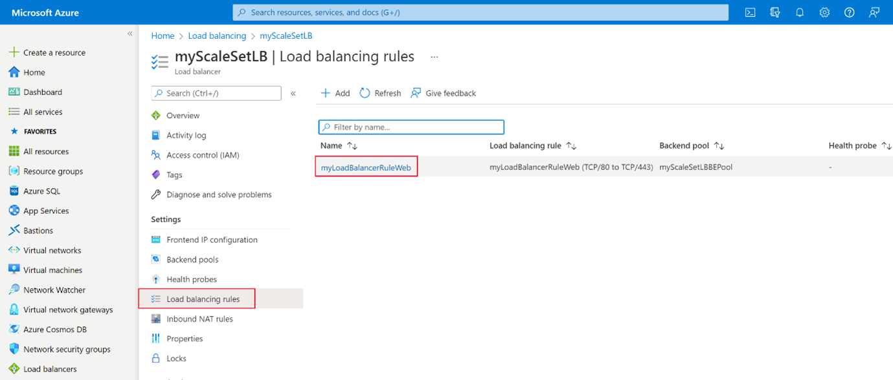

After investigating the connection issues to your website, you’ve found an issue with the load balancer rule user by the virtual machine scale set.

In this exercise, you’ll resolve the issue and check that the website can now be accessed.

## Validate load balancer rules

1. In the Azure portal, search for **load balancers**, and then under **Services**, click **Load balancers**.

    

1. Click the **myScaleSetLB** load balancer.

1. Under **Settings**, click **Load balancing rules**.

    

1. From the list of rules, click **myLoadBalancerRuleWeb**.

    

1. To resolve the backend issue, change the **Backend port** from **443** to **80**, and then click **Save**.

    > **NOTE**:
    > The front and backend in this environment need to be the same to get a response from the webserver to http requests.

1. Wait until the rule has been deployed successfully.

    

## Verify that the website can now be reached

1. Refresh the tab you opened to test the public IP address.

    > **NOTE**:
    > If you have closed the previous browser tab, run this command to get the public IP address:
    > ```
    > az network public-ip show \
    > --resource-group cloud-shell-storage-westeurope \
    > --name myScaleSetLBPublicIP \
    > --query '[ipAddress]' \
    > --output tsv
    > ```

    If the website is online, you’ll see a page with a **Hello World** message from the backend instance.

    
