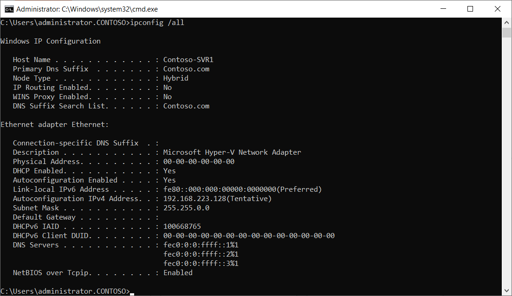
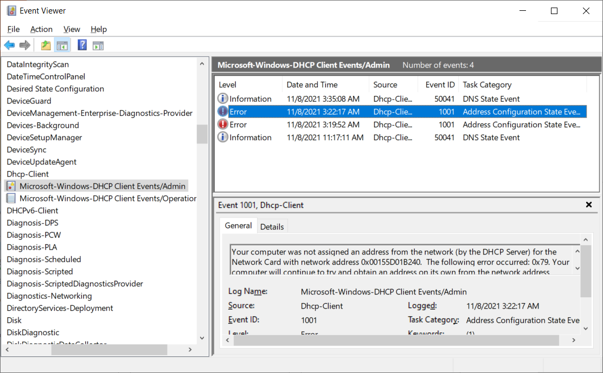

All network clients must have unique IP addresses assigned to their network interfaces. Manually assigning addresses and tracking the information can be arduous, even in small networks. DHCP plays an important role in a typical network infrastructure, and provides:

- An automated means of distributing important network configuration information to network clients.

- Configuration information to other network enabled services.

To support and troubleshoot an IP-based network infrastructure, it's vital that you understand how to troubleshoot the DHCP server role.

## Troubleshoot the DHCP server role

It's worth considering that after DHCP is configured and working, unless someone makes some configuration changes to DHCP scopes or server settings, there's very little that can go wrong. However, if you're experiencing problems that you think relate to DHCP, you should:

- Ensure that the DHCP server is authorized in AD DS.

- Verify that the DHCP server service is running.

    > [!TIP]
    > This is only likely to be an issue for newly deployed DHCP servers when the configuration is incomplete.

- Check that there are addresses available in the DHCP server scope for the appropriate subnet.

- Ensure that there are no devices with static IP addresses that haven't been excluded from your scopes.

- Check that any required DHCP relays are operational for subnets without a DHCP server.

- Ensure that no other services are listening on UDP 67 and 68.

    > [!NOTE]
    > Windows Deployment Services also uses these ports.

- Review any DHCP policies and filters.

- Examine DHCP-related logs

### Examine logs

Start by reviewing events recorded in the event logs. Check the following logs:

- System log

- DHCP Server service logs

The contents of the Microsoft-Windows-DHCP Server Events/Operational log is displayed in the following screenshot. A number of informational events is displayed. The administrator has selected an event with the ID 76 which relates to scope reconfiguration.

> [!TIP]
> These logs are located in Applications and Services Logs > Microsoft > Windows > DHCP-Server.

In addition, the DHCP Server service records debug logs. These logs can provide additional information about:

- IP address lease assignment

- DNS dynamic updates

You'll find the logs in the `%windir%\System32\Dhcp` folder.

## Troubleshoot the DHCP client

It's always possible, perhaps more likely, that the problem lies with the DHCP client. When troubleshooting, remember that if a DHCP client fails to contact a DHCP server to lease a configuration, it will likely failover to use an Automatic Private IP Addressing (APIPA) address. If the client device has an APIPA address, communications is limited to the local subnet.

> [!TIP]
> Addresses used by APIPA have the following prefix: 169.254.0.0/16

The following screenshot displays the output from IPConfig. The device is shown with an APIPA address.

If you think the issue lies with the client, then you should:

- Verify cabling.

- Check that the network adapter is not disabled.

- Consider updating the NIC driver, or, if recently updated, consider rolling back the driver.

- Ensure that the DHCP Client service is running.

- Verify that no firewall is blocking UDP ports 67 and 68.

If multiple client devices are impacted, then the problem is more likely to relate to infrastructure components, such as hubs and routers. It might also be indicative of a failure at the DHCP Server.

### Examine logs

As with the DHCP Server service, you can check the event logs for DHCP client issues. Examine the `Microsoft-Windows-DHCP Client Events/Operational` and `Microsoft-Windows-DHCP Client Events/Admin` event logs.

> [!TIP]
> These are located in Applications and Services Logs > Microsoft > Windows > Dhcp-Client.

The following screenshot displays the Admin log for Dhcp-Client. The administrator is reviewing an event with the ID of 1001 which indicates the failure to obtain an IP configuration.

### IPConfig command

On the DHCP client, you can use the `IPConfig.exe` command-line tool to verify and test IP configuration. The following table describes the available options.

| Command| Description|
| :--- | :--- |
| ipconfig /all| View detailed configuration information.|
| ipconfig /release| Release the leased configuration back to the DHCP server.|
| ipconfig /renew| Renew the leased configuration.|
| ipconfig /displaydns| View the DNS resolver cache entries.|
| ipconfig /flushdns| Purge the DNS resolve cache.|

You could use `IPConfig` in conjunction with a network analyzer that can capture network frames for analysis. Start your frame capture, and then release and renew the DHCP client's IP configuration.

> [!TIP]
> You'll be looking in the capture data for datagrams using UDP ports 67 and 68; these ports are used for communications with the DHCP Server. 

Analysis of frames carrying these datagrams might yield up clues as to the issue.

