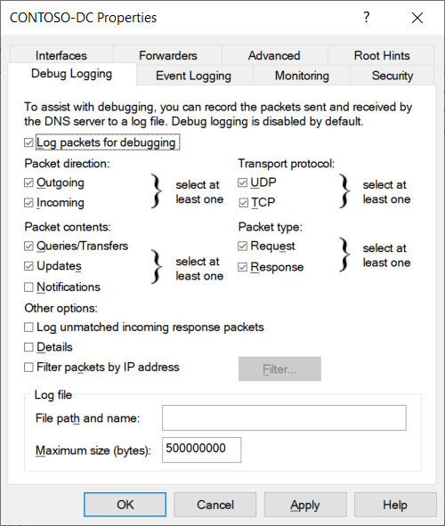

DNS is the foundation name service in the Windows Server operating system. The DNS server role in Windows Server:

- Provides name resolution services.

- Enables DNS clients to locate network services, such as:

  - Active Directory Domain Services (AD DS) domain controllers.

  - Global catalog servers.

  - Messaging servers.

If you configure your DNS infrastructure poorly or it doesn't work correctly, these important network services might be inaccessible. Therefore, it's vital that you understand how to troubleshoot this critical service.

## Check the fundamentals

Before you begin troubleshooting client name resolution, it's worth checking that high-level components, like DNS servers and their zones, are running and available. If you're experiencing name resolution problems that you think relate to the DNS server, you should:

- Verify that the DNS server service is running.

- Check the event logs for errors recorded that relate to DNS.

- Determine whether an incorrect response is from an authoritative server. If it is, then the problem might be caused by:

  - An administrative error when the data was entered into the zone. Check the zone data for errors.

  - A problem that affects Active Directory replication or a dynamic update. Review AD DS replication.

- If the server is not authoritative, then the problem might be caused by synchronization (zone transfer) problems from the configured master.

  > [!TIP]
  > Check whether the primary server DNS zone data is correct. If it is, then resync the secondary server. If not, then correct the record and sync the secondary.

If the DNS server is running, and zone data appears to be correct, then consider investigating name resolution from the client end.

## Review DNS server logs

By default, DNS maintains a DNS server log, which you can view in the Event Viewer. This event log is located in the Applications and Services Logs folder in Event Viewer. It records common events such as:

- Starting and stopping of the DNS service.

- Background loading and zone signing events.

- Changes to DNS configuration settings.

- Various warnings and error events.

### Configure DNS logging

For more verbose logging, you can enable debug logging. Debug logging options are disabled by default, but you can enable them as needed. Debug logging options include the following:

- Direction of packets.

- Contents of packets.

- Transport protocol.

- Type of request.

- Filtering based on IP address.

- Specifying the name and location of the log file, which is in the `%windir%\System32\DNS` directory.

- Log file maximum size limit.

Debug logging can be resource intensive, and can affect overall server performance and consume disk space. So, you should enable it only temporarily when you require detailed information about server performance. To enable debug logging on the DNS server, do the following:

1. Open the DNS Manager console, right-click the applicable DNS server, and then select **Properties**.

1. In the **Properties** dialog box, select the **Debug Logging** tab, as displayed in the following screenshot.

1. Select **Log packets for debugging**, and then select the events for which you want the DNS server to record debug logging.

  

## What are the tools and techniques for troubleshooting name resolution?

Name resolution, like most other technologies, sometimes requires troubleshooting. Issues can occur when the DNS server, its zones, and its resource records are not configured properly. When resource records are causing issues, it can sometimes be difficult to identify the issue because configuration problems are not always obvious. You have several tools available to configure, manage, and troubleshoot DNS server and name resolution issues.

You can use a number of command-line tools and PowerShell cmdlets to troubleshoot and test the DNS infrastructure in your environment. These tools are described in the following tables.

| Command| Description|
| :--- | :--- |
| Nslookup| Use this tool to query DNS information. The tool is flexible and can provide valuable information about DNS server status. You also can use it to look up resource records and validate their configuration. Additionally, you can test zone transfers, security options, and MX record resolution.|
| DNSCmd| Use this command-line tool to manage the DNS server role. This tool is useful in scripting batch files to help automate routine DNS management tasks or to perform simple unattended setup and configuration of new DNS servers on your network.|
| DNSlint| Use this tool to diagnose common DNS issues. This tool diagnoses configuration issues in DNS quickly, and can generate a report in HTML format regarding the status of the domain that you are testing.|
| IPConfig| Use this command to view and modify IP configuration details that the computer uses. This command includes additional command-line options that you can use to troubleshoot and support DNS clients. You can view the local DNS cache for the client computer by using the command `ipconfig /displaydns`, and you can clear the local DNS cache using the `ipconfig /flushdns` command. If you want to reregister a host in DNS, you can use the `ipconfig /registerdns` command.|

In Windows Server, there's a collection of Windows PowerShell cmdlets that you can use for DNS client and server management. Some of the most commonly used cmdlets are described in the following table.

| Cmdlet| Description|
| :--- | :--- |
| Clear-DNSClientCache| This cmdlet clears the client cache, similar to the `ipconfig /flushdns` command.|
| Get-DNSClient| This cmdlet displays the details of the network interfaces.|
| Get-DNSClientCache| This cmdlet displays the content of the local DNS client cache, similar to the `ipconfig /displaydns` command.|
| Register-DNSClient| This cmdlet registers all the IP addresses on the computer onto the configured DNS server.|
| Resolve-DNSName| This cmdlet performs a DNS name resolution for a specific name, similar to the way `nslookup` works.|
| Set-DNSClient| This cmdlet sets the interface-specific DNS client configurations on the computer.|
| Test-DNSServer| This cmdlet tests that a specified computer is a functioning DNS server.|

## Perform a typical name resolution test

When you troubleshoot name resolution, you must understand the name resolution methods that the computer uses, and the order in which the computer uses them.

> [!IMPORTANT]
> Be sure to clear the DNS resolver cache between resolution attempts.

If you can't connect to a remote host and suspect a name resolution problem, you can troubleshoot the name resolution by performing the following steps:

1. Open an elevated command prompt, and then clear the DNS resolver cache by running `ipconfig /flushdns`.

    > [!TIP]
    > You can also use the PowerShell cmdlet: `Clear-DNSClientCache`.

1. Attempt to `ping` the remote host by its IP address. This helps identify whether the issue is related to name resolution.

1. Then attempt to `ping` the remote host by using its host name. For example, if you were working at Contoso, Ltd., you would run the following: `Ping LON-DC1.contoso.com`.

    > [!TIP]
    > If the ping succeeds using the IP address, but fails by using a host name, then the problem is related to name resolution.

1. At the command prompt, run `Nslookup.exe  d LON DC1.contoso.com. > filename.txt`.

1. Examine the contents of the filename.txt file to identify the failed stage in name resolution.

