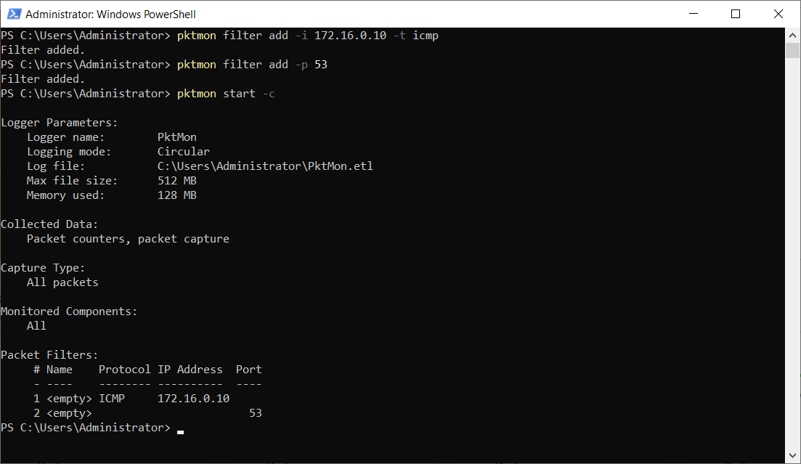

Sometimes, network-related problems can elude even the most experienced IT admins. In these situations, it can be helpful to capture network frames and then review their content to try to isolate the problem.

> [!NOTE]
> It can be especially hard to isolate the cause of problems with today's more complex virtualized networks, with routing and switching integrated into endpoints. 

## What is Packet Monitor?

Microsoft provide a tool called Packet Monitor for just these situations. Packet Monitor can intercept network packets at various points in the network stack, displayed in the following graphic.

Packet Monitor provides many capabilities, including the following:

- Packet monitoring and counting at multiple locations within the network stack

- Detection of packets drop throughout various levels in the stack

- Flexible runtime packet filtering with encapsulation support

- General logging and tracing support

- TXT log analysis based on TcpDump packet parsing

- Multiple logging modes, including: real-time, high volume in-memory, multi-file, circular

- Support for ethernet, Wi-Fi, and mobile broadband media types

You can use Packet Monitor in a number of ways, including:

- With the `pktmon.exe` command-line tool

- With Windows Admin Center's Packet Monitoring extension

The following screenshot displays the Windows Admin Center Packet Monitoring extension. The administrator has defined two IP addresses and selected ICMP from the transport protocol list. The captured data is displayed, and shows ICMP communications between the two host IP addresses.

> [!NOTE]
> Packet Monitor is installed in Windows Server by default.

## Use the Pktmon.exe command-line tool

Use the following procedure to capture and analyze packets with Pktmon.exe:

1. Choose the types of packets you want to capture. Select by IP address, ports, protocols and so on.

1. Apply capture filters based on your requirements: `pktmon filter add <filters>`.

    > [!TIP]
    > For example, to capture any ICMP traffic to or from the IP address 172.16.0.10, as well as any traffic on port 53, you'd run: `pktmon filter add -i 172.16.0.10 -t icmp` and `pktmon filter add -p 53`.

1. Start the capture and enable packet logging: `pktmon start -c`.

1. Reproduce the network-related problem you're having.

1. Check the counters to verify presence of required traffic: `pktmon counters`.

1. Stop the capture: `pktmon stop'.

1. Retrieve the logs in a suitable format: `pktmon etl2txt <filename>`.

The following screenshot displays the output from steps 2 and 3.

