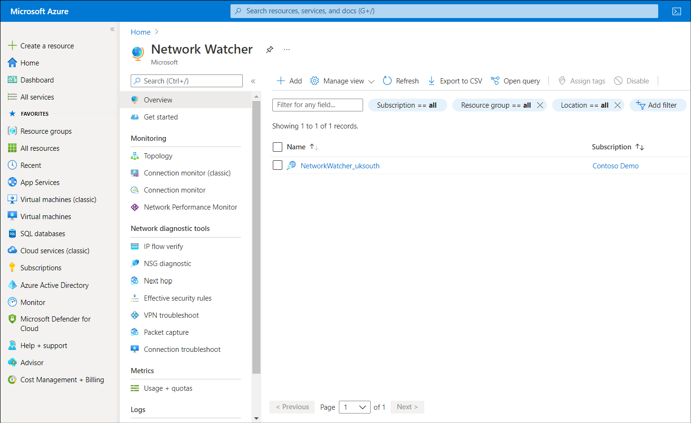

So far, this module has discussed issues that relate to on-premises network problems. However, you'll also need to know how to address problems with Azure virtual networks.

## What is Azure Network Watcher?

Azure Network Watcher provides tools to monitor, view, diagnose, review metrics, and enable or disable logs for resources in an Azure virtual network. Network Watcher can monitor and repair the network health of the various IaaS products, including:

- Virtual machines

- Virtual networks

- Application gateways

- Load balancers

  > [!IMPORTANT]
  > When you create or update a virtual network in your subscription, Network Watcher is enabled automatically in your virtual network's region.

Using Azure Network Watcher, you can:

- Monitor resources and communications

- Diagnose problems with resources and communications

- Generate and review logs

The following sections discuss these capabilities in more detail.

## Monitor with Azure Network Watcher

You can use Azure Network Monitor to monitor communications and resources. For example, you can monitor communications between an Azure VM and an endpoint.

> [!TIP]
> Endpoints can be another VM, an FQDN, a URI, or an IP address.

Network Watcher's connection monitor capability monitors communication at a regular interval. It informs you of the following between the VM and the endpoints:

- Reachability. If an endpoint is unreachable, connection monitor states the reason. This might include:

  - DNS name resolution issues

  - CPU, memory, or firewall within the operating system of a VM

  - Hop type of a custom route

  - Security rule for the VM or subnet of the outbound connection

- Latency. Connection monitor provides the minimum, average, and maximum latency measured over time.

- Network topology changes. It's important to understand how configuration changes can affect performance.

## Review resources

The more resources you connect to a virtual network, the more difficult it can become to manage that virtual network. The Topology capability enables you easily review the resources in your virtual networks. A visual topology is generated and displayed in the Azure portal. You can then select specific resources to review their configuration.

The following screenshot displays the output from the Topology tool. Within the ContosoResourceGroup are displayed a default subnet object, to which are connected two network interfaces (one in each of two VMs). To each network interface, a VM, a network security group, and a public IP address are connected.

## Diagnose problems with Azure Network Watcher

Network Watcher provides a number of diagnostics capabilities. These are described in the following table.

| Capability| Description|
| :--- | :--- |
| Diagnose network traffic filtering problems| When you deploy a VM, Azure applies default security rules that allow or deny traffic to or from the VM. You can choose to override these defaults. If a VM becomes unable to communicate with other resources, you can use the *IP flow verify* capability. This enables you to test communications and determine success or failure. If the communications fails, IP flow verify identifies which security rule allowed or denied the communication. You can then resolve the issue.|
| Diagnose network routing problems| When you create a virtual network, Azure creates default outbound routes for network traffic. You can choose to override Azure's default routes. Later, if a VM can no longer communicate with other resources, you can use the *next hop* capability. This enables you to test communications. If communications fails, next hop capability identifies what type of next hop is used to route the traffic. You can then resolve the routing problem.|
| Diagnose outbound connections from a VM| The *connection troubleshoot* capability enables you to test a connection between a VM and another resource. The test returns a point in time results which is similar to the output returned by the *connection monitor* capability.|
| Capture packets| You can capture packets in your Azure virtual network. You can store the capture in Azure Storage, on the VM's disk, or both. You can then analyze the capture file using standard network capture analysis tools.|
| Diagnose problems with an Azure Virtual network gateway and connections| Virtual network gateways provide connectivity between Azure virtual networks and your on-premises resources. Therefore, monitoring these gateways and their connections is critical. The *VPN diagnostics* capability  provides diagnostics for these gateways and connections. It diagnoses the health of the gateway, or gateway connection. If a gateway or connection isn't available, VPN diagnostics states why, enabling you to resolve the issue.|
| Determine relative latencies| You can query Network Watcher for latency information between Azure regions and across ISPs. When you know latencies between Azure regions and across ISPs, you can deploy Azure resources to optimize network response time.|
| View security rules| The *security group view* capability displays all security rules applied to the network interface, the subnet the network interface is in, and the aggregate of both. If you understand which rules are applied to a network interface, if necessary, you can make changes to properly allow or deny traffic, as required.|

The following screenshot displays the Network Watcher in the Azure portal. The navigation pane displays a list of the capabilities just discussed.

## Analyze traffic to or from a network security group

A network security group (NSG) allows or denies inbound and outbound network traffic to a network interface in a VM. You can use the *NSG flow log* capability to log:

- The source and destination IP address

- Port

- Protocol

- Whether traffic was allowed or denied by an NSG.

You can then analyze logs using a variety of tools.

