## What are point-to-site VPN gateways?

If you have individuals working remotely then a point-to-site connection is a secure way of allowing those individuals to connect to Azure resources using either Windows, Linux or macOS.

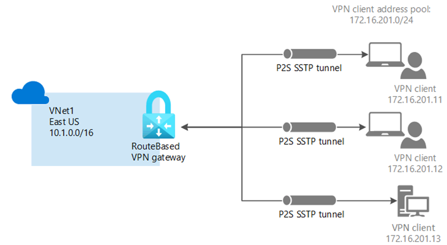

The key steps to deploy a site-to-site VPN gateway are:

- Create the virtual network that will connect to the on-premises network

- Create a gateway subnet on your virtual network

- Create a VPN gateway

- Generate a root certificate.

- Generate client certificates.

- Add VPN a client address pool.

- Specify the tunnel type and authentication type.

- Upload the root certificate public key information.

- Install the exported client certificate.

- Configure settings for VPN clients.

- Connect to Azure.

This unit will help to troubleshoot the various steps outlined above.

There are various ways of connecting point-to-site VPNs and this guide will outline the key problems within the different set-ups:

- Certificate-based VPNs

- RADIUS authentication

- Azure AD authentication

- OpenVPN connectivity

## Describe supported protocols for point-to-site VPNS

Point-to-site VPNs support three protocols:

- OpenVPN ® is an SSL/TLS based VPN protocol and can be used to connect from Android, IOS (version11.0 and above), Windows, Linux, and Mac devices (macOS versions10.13 and above)

- Secure Socket Tunnelling Protocol (SSTP) is a proprietary TLS based VPN protocol that’s only supported on Windows devices.

- IKEv2 VPN is a standards-based IPsec VPN solution used to connect from Mac devices (macOS 10.11 and above).

## What tools that can be used to troubleshoot point-to-site VPN gateways

Troubleshooting a point-to-site VPN can be difficult, but there are tools available that can help to highlight areas before they become a problem.

Microsoft Sentinel helps to prevent cyber-attacks. It detects threats and uses Artificial Intelligence (AI) to investigate and respond. It keeps you informed by creating incidents that you can then investigate and resolve.

### Azure Activity Log events

The activity log is accessible from most menus within the Azure portal and will display different information depending on what part of the network you have selected. If you select a virtual network gateway you will see activity logs about that gateway. Activity logs can be downloaded as csv files for further analysis.

### Azure Monitor

Another tool available to identify issues before they become a problem is Azure Monitor. Azure Monitor monitors and diagnoses networking issues without having to log into your virtual machine. Azure Monitor enables you to:

- Trigger package capture.

- Diagnose routing issues.

- Analyse network security group flow logs.

- Gain visibility and control over your Azure network.

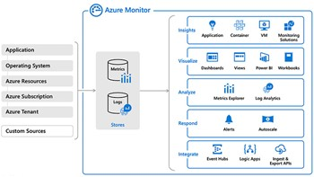

## Network Watcher

Network Watcher is an area where a range of monitoring and diagnostic tools are available.

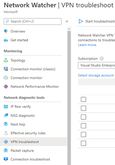

## Troubleshoot issues with certificate-based connections

This section looks at key areas to troubleshoot when creating a certificate-based VPN connection.

### Creating a VNet

If you amended the address range from the default, did you manually add the subnet. The subnet range is auto populated from the default address space. If you then amend the default address space, you must manually change the subnet.

### Gateway Issues

Typical Gateway related error messages or problems are:

- File download error: Target URI is not specified

- The connection is established, but you cannot connect to Azure resources.

Typical troubleshooting solutions are:

- Check your VNet address range as you may not have enough IP addresses in the range you created in the virtual network.

- Have you specified the correct VPN type? Most configurations use a gateway type of VPN and a VPN type of Route-based rather than Policy-based.

- Does the SKU selected support the features you need to us? For instance, if you have Mac clients connecting to your network then you cannot have a basic SKU. Is the SKU big enough for the bandwidth and CPU required?

- Have you selected the correct virtual network? If you cannot see the network, then check you have entered the correct subscription and region.

- Have you reset the gateway?

### Certificates

Typical errors likely to be certificate-based are:

- A certificate could not be found that can be used with this Extensible Authentication Protocol. (Error 798)

- A certificate chain processed but terminated in a root certificate which is not trusted by the trust provider

- Failed to save virtual network gateway <gateway name>. Data for certificate <certificate ID> is invalid.

The message received was unexpected or badly formatted. (Error 0x80090326)

- Cannot install the VPN client

- No point-to-site clients are suddenly unable to connect.

For any errors relating to certificates, it is worth checking the following:

- Have you obtained the trusted.cer file for the root certificate?

- Have you exported the public certificate data (not the public keys) as a Base4 encoded X.509.cer file?

- Check the status of the root certificate in Azure Portal to see if it has been revoked. If ok, then delete and reinstall the certificate.

- Have you removed any carriage returns from the text file as the file must be one continuous line?

- Have you only copied the information between Begin Certificate and End Certificate?

- Have you installed the certificate on each client computer?

- Has the certificate rolled over? if so, download and deploy the point-to-site package on all clients again.

### VPN client configuration

Typical client-side messages or problems are:

- Custom script (to update your routing table) failed. (Error 8007026f)

- Failed to download the file. Error details: error 503. The server is busy.

- VPN clients cannot access network file shares

- VPN Client Error: The remote connection was not made because the attempted VPN tunnels failed. (Error 800)

Some key areas to investigate are:

- The connection may be a temporary network problem, so try downloading the VPN package again after a short period of time.

- Did you export the client certificate as a .pfx file?

- Delete any shortcuts and open the VPN package directly.

- Check the certificate is installed by opening Manage user certificates and selecting Trusted Root Certification Authorities\Certificates and ensuring that the correct certificate is listed.

- Update Network Interface drivers

- Disable the caching of domain credentials from the following key.

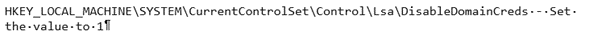

- Check the VPN is active by opening an elevated command prompt and running:

Command prompt

ipconfig/all.

The results should contain an IP address contained within the Client Address Pool as specified in your configuration.

### Connection Problems

Common Errors messages are:

- The network connection between your computer and the VPN server could not be established because the remote server is not responding

- The message received was unexpected or badly formatted. (Error 0x80090326)

- Custom script (to update your routing table) failed. (Error 8007026f)

Typical solutions are:

- Are you using the correct protocol? Windows only supports IKEv2 if updates are installed, and a registry key locally set.

- Check the user-defined routes (UDR) are set up properly

## Troubleshoot issues with RADIUS authentication

A RADIUS server integrates with the Active Directory (AD) Server to allow users to sign in using their organization domain credentials. For point-to-site connections using [RADIUS authentication](/azure/vpn-gateway/point-to-site-how-to-radius-ps) you require the following:

- A Route-based VPN gateway.

- A RADIUS server, either deployed on the Azure VNet or on-premises or two servers for high availability.

- A VPN client configuration package for the Windows devices that will connect to the VNET.

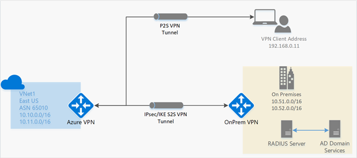

Although many of the principles are like site-to-site there are some important differences:

### Virtual Network

- Have you set up three subnet configurations? Some setups use names such as FrontEnd, BackEnd and GatewaySubnet. You can change the names of FrontEnd and BackEnd, but you must not change the name of GatewaySubnet.

- Have you requested a dynamically assigned Public IP address for the VPN Gateway?

### RADIUS Server

- Have you checked the settings on the RADIUS server before creating and configuring the virtual network gateway? Common problems are incorrect settings on the RADIUS server.

- Have you configured the VPN Gateway as a RADIUS client on the RADIUS and specified the virtual network GatewaySubnet?

- Have you obtained the RADIUS server’s IP address and the shared secret that RADIUS clients should use to talk to the server?

- VPN

### VPN Gateway

- Have you set up the Gateway as VPN and the VPN type as RouteBased?

- Have you set up a [client configuration package](/azure/vpn-gateway/point-to-site-vpn-client-configuration-radius)?

### RADIUS Server and client address pool information

- Have you entered the Radius secret correctly?

- Check you have run the [correct configuration](/azure/vpn-gateway/point-to-site-how-to-radius-ps) for the connection you require.

- SSTP

- OpenVPN

- IKEv2

- SSTP and IKEv2

## Troubleshoot Azure AD authentication issues

When using Azure AD for authentication, you must use the OpenVPN protocol, and you can’t use a Basic SKU.

To set up an Azure authentication you need to set up two user accounts, a Global Admin account for setting up the gateway and a User account for everyday servicing of the account.

The following checklist can assist you in troubleshooting VPN connections using point to site and Azure Active Directory authentication:

Have you opened the Azure VPN client screen and viewed the status log for any error messages?

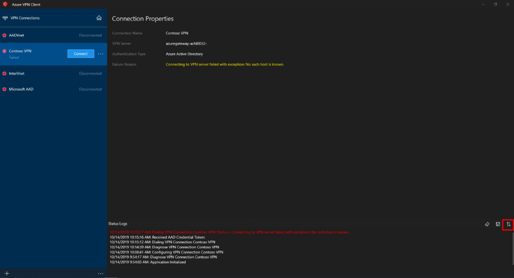

- Have you cleared the signed in information and tried to connect?

- Have you run diagnostics on the connection?

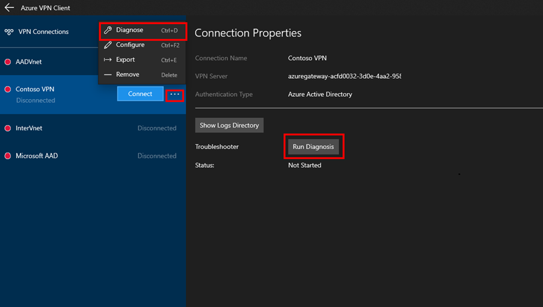

- Have you viewed the client log files?

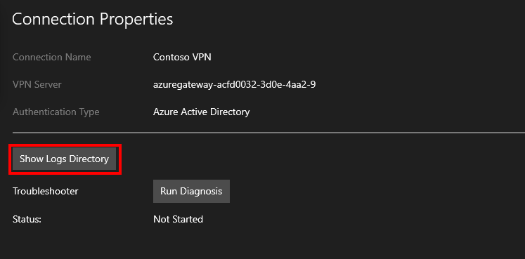

## Troubleshoot OpenVPN connectivity issues

If the Open VPN tunnel is failing to connect to an OpenVPN Access Server, then the following pointers below can help:

- Have you checked the OpenVPN Access Server log files? If you experience trouble starting the server, then stop the server, remove the logs, and then start and stop the log immediately to remove unnecessary information. The following commands should be used to obtain the log file.

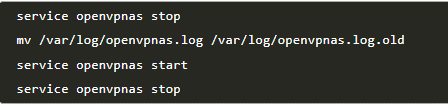

- Check the client log files:

- For Windows use - C:\Program Files (x86)\OpenVPN Technologies\OpenVPN Client\etc\log\openvpn_(unique_name).log.

- For Mac use - /Library/Application Support/OpenVPN/log/openvpn_(unique_name).log

- Have you opened the required three ports? TCP 443, TCP 943, and UDP 1194.

If the OpenVPN tunnel is established, but you can’t reach a specific end point, then these tools may help you to visualise the traffic to test which path the traffic follows:

- TCPdump - a Linux command line tool that can visualise network packets

- WireShark - a Windows GUI tool to visualise network packets

- Ping - a testing tool to determine if a message can be sent back and forth between a source and destination

- Traceroute - displays every hop between a source and destination address

## Using alerts to troubleshoot

Alerts can be set-up in the Azure Portal or PowerShell to monitor VPN gateway metrics and tunnel resource logs to quickly detect issues.

**To view the metrics and create alerts**

Navigate to the virtual gateway resource within Azure Portal. Select **Overview** to see the Total tunnel ingress and egress metrics. Other metrics for [monitoring VPN gateways](/azure/vpn-gateway/monitor-vpn-gateway) can be viewed by clicking on the Metrics sections and selecting the required metric from the drop-down list. Alerts can be created for any metric by selecting **Alerts** from the **Monitoring** tab, or for a resource alert by selecting Create from the **Log Analytics** page.

## Troubleshoot MacOS point-to-site issues

Are you using the correct version? Point-to-site only uses OS version 10.11 or higher.

1. Navigate to Network Setting, by press Command + Shift, type VPN and check the following:

  - Server Address – Have you entered the server address as a complete Fully Qualified Domain Name (FQDN)?

  - Remote ID - Is the remote ID the same as the Server Address (Gateway FQDN)?

  - Local ID – Is the local ID the same as the Subject of the client certificate?

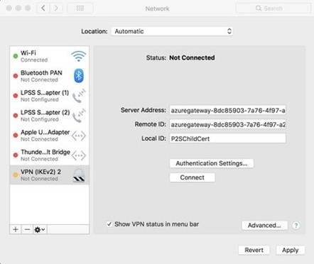

1. Select Authentication Settings – Select Certificate from the drop-down list and then check you have the correct certificate.

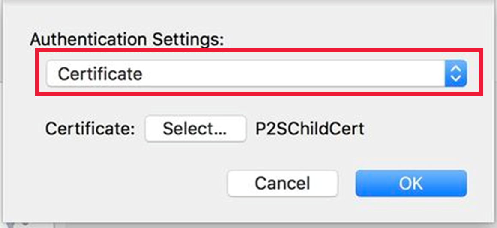

1. Still In Authentication Settings, change the drop-down to show Username and check the credentials are correct.

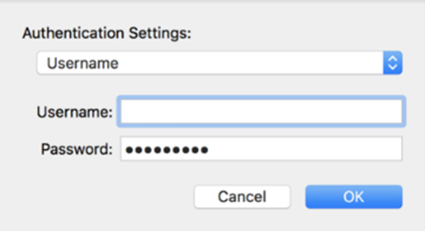

1. If you still experience problems, then download Wireshark and run a packet capture.

   1. Filter on **isakmp**, Check the **SA proposal** under **Payload: Security Association** and then check that the source and corresponding destination IP addresses match.

## Troubleshoot client configuration issues

Gateway Issues

Examples of possible gateway issues related to certificate are:

- Have you uploaded an Azureclient.pfx certificate without enabling strong private key protection?

- Have you uploaded the AzureRoot.cer certificate?

- Have you checked to see if the certificate has been revoked as this happens if the certificate becomes corrupted?

- Can some people connect whilst others cannot? You might need to install another certificate to trust the affected gateway.

- Are you unable to save the certificate? Check whether there are any spaces in the name or whether it starts with a number.

Routing

- Are you using non BGP Transit Routing? It isn’t supported as BGP is the recommended model.

- Are you running multiple VNets and connecting using an S2S VPN, but some clients cannot access particular VNets? You need to use BGP for clients to access the additional VNets.

- If you make changes to the topology of the network, you need to download the VPN client package for Windows again for the changes to be applied.

Split tunnelling

Split tunnelling can help to reduce high loads and is recommended when you have a lot of remote users or cloud-based services. Different models can be adopted depending on the volume of remote users that have and/or the number of services that you have that are cloud based.

You have five options to improve the efficiency of your network:

- VPN Forced Tunnel - 100% of traffic goes into VPN tunnel, including on-premises, Internet, and all O365/M365. Where a lot of employees work remotely, this can hinder performance of corporate traffic as a high load is being put onto the infrastructure.

- VPN Forced Tunnel with exceptions - The VPN tunnel is used by default, and a few scenarios are allowed to go direct to the Microsoft 365 service. This ensure that the traffic that requires the tunnel has a lower contention for resources.

- VPN Forced Tunnel with broad exceptions – The VPN tunnel is used by default with broad exceptions that are allowed to go direct such as all Microsoft 365, All Salesforce, All Zoom further reducing the load on the corporate VPN infrastructure

- VPN Selective Tunnel - traffic with a corporate IP address is sent through the VPN tunnel and the Internet path is used for all other services. If your services are largely stored in the cloud, then this option is the main model to work towards although your corporation does need to be adopting the Zero Trust model.

- No VPN - uses modern security approaches like Zscaler ZPA, Azure Active Directory (Azure AD) Proxy/MCAS instead of a VPN.

